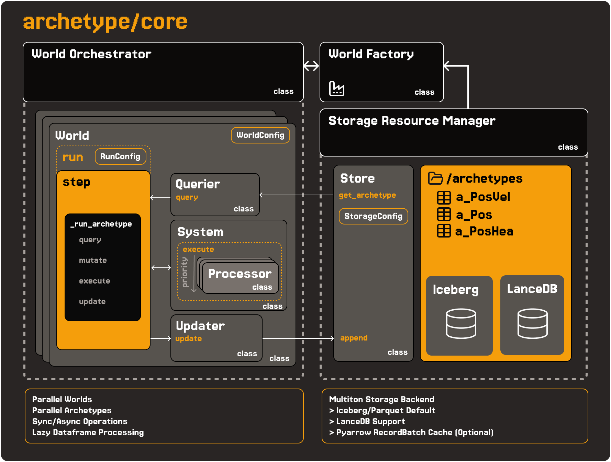

<div align="center">

# Archetype

**An opinion about what data engineering should be:
composable, declarative, and data-centric.**

[](https://github.com/VangelisTech/archetype/actions/workflows/python-tests.yml)
[](https://python.org)
[](LICENSE)

</div>



Archetype is a state machine that uses big-data technology to run itself,
built for the AI-native world.

- **Composable** — two primitives only: components (data) and processors
  (behavior). Archetypes, worlds, and forks are compositions of them.
- **Declarative** — you declare shapes and transforms; the engine derives
  what a data stack normally makes you build by hand: schemas, columnar
  tables, partitioning, dispatch, queries, history, audit.
- **Data-centric** — nothing is deleted. State, history, and the engine's
  own operation are rows in the same store.

```python
class Position(Component):        # a component is a schema
    x: float = 0.0
    y: float = 0.0


class MovementProcessor(AsyncProcessor):   # a processor is a transform
    components = (Position, Velocity)

    async def process(self, df: DataFrame, **kwargs) -> DataFrame:
        return df.with_columns(
            {"position__x": col("position__x") + col("velocity__dx")}
        )
```

Entities that share an exact component set share an **archetype**: a
canonical signature that *is* an Arrow schema that *is* a columnar table.
Processors are [Daft](https://daft.ai) DataFrame transforms over whole
archetypes at once — one pass over the entire matching population, not a
loop over objects. That collapse — component set → signature → schema →
table → query — is the core of the system. Everything below is consequence.

Big data's founding move was decoupling storage from compute — that is
where Iceberg and Daft come from. The decoupling bought scale but severed
provenance: the code that produces a table and the knowledge of how to
read it became separate artifacts. Archetype keeps the physical decoupling
and restores the connection where it belongs, in the declaration: whatever
you process — a simulation, a training run, an agent population — the
results are managed for you and queryable **with the same code that
created them**. The component that wrote the rows is the schema you filter
on; the processor that transformed them is the lineage. Provenance is
derivation, not a catalog.

## Data is the point

Nothing is deleted. There is no update path and no delete path in the
storage layer; every tick appends rows keyed `(world_id, run_id, tick)`.
The one-off run you were about to throw away — leave it. Deletion is an
inductive bias.

What you get for keeping everything:

- **Time travel** — `df.where(col("tick") == t)` is the world at tick `t`
- **Forking** — branch any moment of any run; forks read pre-fork history
  through lineage and diverge from there
- **Experiments over runs** — runs, results, and trajectories are
  components too (`archetype.experiments`); comparing branches is a query,
  which is the statistical, experiment-based mindset an AI-native data
  engine asks of you
- **The engine's own operation is data** — every gated command lands in an
  append-only audit table on the same substrate that stores world state:
  consistent, partitioned, queryable, trainable

## Built for agents

The intended user of this system is an agent.

Everything is arranged so that an agent can build here and a human can
trust the result by reviewing code, not by re-running it:

- **Code is the source of truth.** The contracts live in
  `docs/guide/specification.md` and the focused spec pages, and each one is
  pinned by named tests. What the spec says, a test enforces.
- **The primitives are safe to extend.** New capability means a new
  `Component` or a new `Processor` — small, local, reviewable diffs whose
  behavior is determined by component presence, not by control flow
  threaded through a framework.
- **The invariants will not move under you.** Append-only stores. Canonical
  archetype signatures. All mutation through one gate. A tick either
  commits or it didn't happen — failed persistence raises, a failed
  processor fails its tick.
- **Recursive operation stays governed.** Agents running simulations
  inside simulations go through the same gate: authorized, audited,
  applied at deterministic tick boundaries in `(tick, priority, sequence)`
  order. The audit trail this produces is the raw material for
  auto-research loops — the engine improving things that run on the
  engine.

The design is meant to scale with its user. The more capable the model,
the more it can do with two orthogonal primitives — richer components,
sharper processors, deeper experiment loops. Frameworks built as
scaffolding depreciate as models improve; primitives appreciate.

## Quickstart

```bash
pip install archetype-ecs
```

```python
import asyncio

from daft import DataFrame, col

from archetype import ArchetypeRuntime, AsyncProcessor, Component


class Position(Component):
    x: float = 0.0
    y: float = 0.0


class Velocity(Component):
    dx: float = 0.0
    dy: float = 0.0


class MovementProcessor(AsyncProcessor):
    components = (Position, Velocity)
    priority = 10

    async def process(self, df: DataFrame, **kwargs) -> DataFrame:
        return df.with_columns(
            {
                "position__x": col("position__x") + col("velocity__dx"),
                "position__y": col("position__y") + col("velocity__dy"),
            }
        )


async def main():
    async with ArchetypeRuntime() as runtime:
        world = runtime.world("demo", processors=[MovementProcessor()])

        await world.spawn(Position(x=0, y=0), Velocity(dx=1, dy=2))
        await world.run(steps=3)

        df = await world.query(Position)  # full append-only history
        print(df.collect().to_pylist())


asyncio.run(main())
```

Fork-and-diff:

```python
fork = await world.fork("counterfactual")  # inherits the source's store
await fork.step()                          # continues from the source's last tick

source_df = await world.query(Position)
fork_df = await fork.query(Position)       # pre-fork history + its own branch
```

For sync scripts, use `with ArchetypeRuntime.sync() as runtime:` and drop
the `await`s. Component columns are prefixed `componentname__field`
(e.g. `position__x`). `ArchetypeRuntime` is the script boundary; drop to
`ServiceContainer` only for custom command routing or a non-script host.

## How it's organized

| Layer | What it is |
|---|---|
| `src/archetype/core` | The engine: components, archetypes, worlds, the tick loop, append-only stores |
| `src/archetype/app` | The gate: every operation authorized, audited, and applied at tick boundaries |
| `src/archetype/runtime` | `ArchetypeRuntime` — the recommended script boundary |
| `src/archetype/api` + `src/archetype/cli` | Reference deployment of the gate over HTTP, plus a thin CLI |
| `src/archetype/experiments` | Runs, results, trajectories, branch heads — as components |

## Status

- the engine — append-only write path, tick loop, time travel, fork
  lineage — is the most mature part and the most heavily contract-tested
- the auto-research loop runs on the ledger: each experiment is a lab
  world whose ticks are the loop's iterations, resumable from its own rows
- the FastAPI layer runs developer-mode auth (a default admin `ActorCtx`)
- a Rust core implementing the same engine semantics is in progress on a
  separate branch

## Examples

```bash
uv run python examples/01_world_mutations.py
uv run python examples/02_fork_counterfactual.py
uv run python examples/03_time_travel.py      # historical reads + fork-and-diff
uv run python examples/04_messaging.py
uv run python examples/05_llm_agents.py
uv run python examples/06_trajectory_analysis.py
uv run python examples/07_hooks.py
```

`examples/05_llm_agents.py` and parts of `examples/06_trajectory_analysis.py`
require `OPENAI_API_KEY`.

## Observability

[Logfire](https://pydantic.dev/logfire) spans on every gated call and every
tick phase (query / materialize / execute / update), plus opt-in
per-tick/per-entity hooks:

```python
from archetype.contrib.logfire_observer import logfire_hooks

world = runtime.world("demo", processors=[...], hooks=logfire_hooks())
```

## Development

```bash
make test        # fast test suite
make check       # format + lint
make ci          # CI gate
make docs        # build docs
```

## Documentation

- Docs site: `https://archetype-docs.pages.dev`
- Examples index: `examples/README.md`
- Architecture notes: `LEARNINGS.md`
- Specifications: `docs/guide/specification.md` and the focused pages it
  links (runtime, service protocols, command gate, execution hierarchy,
  world lifecycle, audit log)

## License

Apache 2.0 — `LICENSE`
