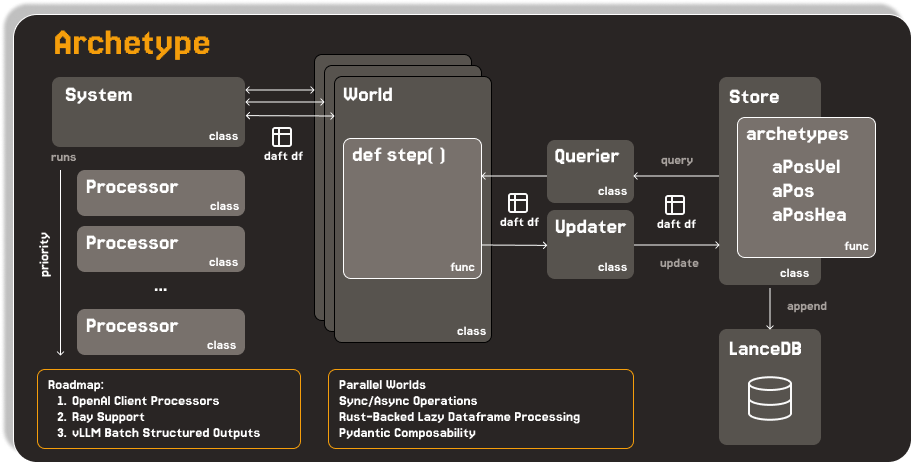

# Archetype

**A high-performance Entity Component System (ECS) for large scale simulation**



Archetype is an ECS simulation engine designed for scalability from local development to distributed Ray clusters. It leverages incredible performance of daft dataframes and lancedb to provide big data scalability for Multi-modal AI processors.


## References and Prior Art
- [Esper](https://github.com/benmoran56/esper) - was the ECS system I initially cloned and evolved from.
- The [archetype pattern](https://ajmmertens.medium.com/building-an-ecs-2-archetypes-and-vectorization-fe21690805f9), as described by AJ Mertens helped me understand how the archetype pattern leverages entity creation definitions based on exact combinations of components for powerful data processing isolation and decoupling.
- [This Daft Article on Scaling LLM inference](https://blog.getdaft.io/p/we-cloned-over-15000-repos-to-find?subscribe_prompt=free) and accompanying repository [Sashimi4Talent](https://github.com/everettVT/Sashimi4Talent/tree/main) introduced me to semaphore usage patterns for the async module.


## Quick Start

### Installation

```bash
# Clone the repository
git clone <repository-url>
cd archetype

# Install with uv (recommended)
uv sync

# Or with pip
pip install -e .
```

### Basic Usage

```python
from archetype.core import Component, processor, Processor, make_simple_world
from daft import DataFrame, col

# Define components
class Position(Component):
    x: float
    y: float

class Velocity(Component):
    vx: float
    vy: float

# Define processors
@processor(Position, Velocity, priority=1)
class MovementProcessor(Processor):
    def process(self, df: DataFrame, dt: float) -> DataFrame:
        return df.with_columns({
            "position__x": col("position__x") + col("velocity__vx") * dt,
            "position__y": col("position__y") + col("velocity__vy") * dt,
        })

# Create and run simulation
world = make_simple_world("./data")
world.system.add_processor(MovementProcessor())

# Spawn entities
world.spawn(Position(x=0, y=0), Velocity(vx=1, vy=1))
world.spawn(Position(x=10, y=10), Velocity(vx=-1, vy=-1))

# Run simulation
for step in range(100):
    world.step(dt=0.1)
```

### Async Usage

```python
from archetype.core import Component, processor
from archetype.core.aio import AsyncProcessor, make_async_world
from daft import DataFrame, col

# Define components
class Position(Component):
    x: float
    y: float

class Velocity(Component):
    vx: float
    vy: float

# Define processors
@processor(Position, Velocity, priority=1)
class MovementProcessor(AsyncProcessor):
    async def process(self, df: DataFrame, dt: float) -> DataFrame:
        return df.with_columns({
            "position__x": col("position__x") + col("velocity__vx") * dt,
            "position__y": col("position__y") + col("velocity__vy") * dt,
        })

# Create and run simulation
uri = "path/to/my/catalog/or/data"
async_world = await make_async_world(uri)
async_world.add_processor(MovementProcessor())

# Spawn entities
world.spawn(Position(x=0, y=0), Velocity(vx=1, vy=1))
world.spawn(Position(x=10, y=10), Velocity(vx=-1, vy=-1))

# Run simulation
for step in range(100):
    await world.step(dt=0.1) # Accepts any *Args, **Kwargs that Processors might need. 
```


