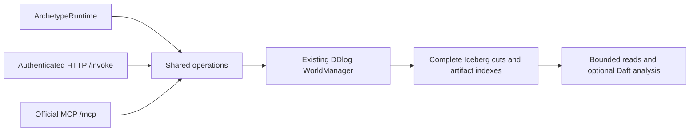

# Archetype

ECS simulations with DDlog execution and typed Iceberg history. Python, HTTP and
MCP share one operation contract. Daft analyzes durable results outside live
execution. Archetype remains active with limited investment.

This tree implements the **0.7 release candidate**. Publication and release
acceptance must be recorded before calling it a released version. The 0.6 Daft
runtime is an explicit compatibility line; 0.7 changes its execution contract.


```mermaid
flowchart LR
  Python[ArchetypeRuntime] --> Operations[Shared operations]
  HTTP[Authenticated HTTP /invoke] --> Operations
  MCP[Official MCP /mcp] --> Operations
  Operations --> Native[Existing DDlog WorldManager]
  Native --> Storage[Complete Iceberg cuts and artifact indexes]
  Storage --> Analysis[Bounded reads and optional Daft analysis]
```

Install matching built wheels for `archetype-native==0.7.0` and
`archetype-ecs==0.7.0`. Add `archetype-transports==0.7.0` for HTTP/MCP and
`archetype-ecs[analysis]` for file ingestion, media indexes or Daft analysis.
The default Python live surface does not install Daft. These candidate wheels
are not claimed to exist on a public package index yet.

From this checkout, `uv sync --all-packages --all-extras --group dev` installs
the development environment. `uv build --all-packages` builds ECS, private
native infrastructure, optional transports and independent Smol. Research stays
on matched 0.6 source/wheels; it is not silently installed into 0.7.

The private native library is a separate, matched build prerequisite:

```sh
cargo +1.95.0 build --locked -p archetype-ddlog-python
export ARCHETYPE_NATIVE_LIBRARY="$PWD/target/debug/libarchetype_ddlog_python.dylib"
# Linux uses target/debug/libarchetype_ddlog_python.so.
export ARCHETYPE_STORE=/absolute/path/to/storage
export ARCHETYPE_REGISTRY=/absolute/path/to/registry
export ARCHETYPE_BUILDS=/absolute/path/to/builds
export ARCHETYPE_NATIVE_DRIVER=/absolute/path/to/pinned-ddlog-runtime/scripts/build-ddlog.sh
uv run python examples/native_simulation.py
```

The driver needs the DDlog toolchain configured by the pinned upstream runtime.
Use Rust 1.95.0 for the Archetype C ABI. The compiled-program driver follows its
own toolchain contract. The package loader requires ABI 1 and pure contract 3
before opening storage, registry or worlds. Supported lock platforms are macOS
and Linux. See [installation and native ownership](docs/guide/runtime.md).

The [quickstart](docs/guide/quickstart.md) composes two immutable programs,
creates a world, submits exact Bool/Float64 values, publishes a complete cut and
reads its typed values. World handles are lazy and world-local. Closing the
runtime drains its owned work. Cancellation ends the caller's wait while the
runtime continues supervising the underlying call.

[Artifacts](docs/guide/artifacts.md) support hosted contexts, cutless occurrences,
artifact-only collections, exact cut attribution, retained batch publication
retries and cold common/typed facts. [History and forks](docs/guide/history-and-forks.md)
select complete cuts, including empty outputs after retractions.

Limits are explicit: 64 KiB requests, 16 KiB responses, at most 32 rows per public
page, 32 KiB inline uploads, and 1–16 retained in-flight calls. Local file batches
use the existing analytical graph and native publication budgets: 32 occurrences,
64 MiB per content file and 256 MiB aggregate admitted file reads. These limits
do not bound live execution time or Daft scan memory. Distributed fencing,
administrative resolution and garbage collection are not promised.

Use [HTTP/MCP](docs/guide/transports.md) with real configured principals and exact
resource grants. `archetype serve` owns the same native runtime; other CLI
commands are HTTP clients. Removed `spawn`, `run` and `step` commands do not
fall back to a second tick engine.

[Migration](docs/guide/migration-0.7.md) records breaking changes and consumer
version decisions. Research, Smol and generic Biome/inference teaching material
retain their stated roles. Missions and Physical AI evaluation products are
outside the active package and documentation surface.

`make ci` validates the current source and package contract. `make verify-full`
and `make verify-release` require installed real-native evidence in addition to
routine tests; simulated compiler fixtures are labelled separately. Production
docs deployment is a separate explicit manual action.
