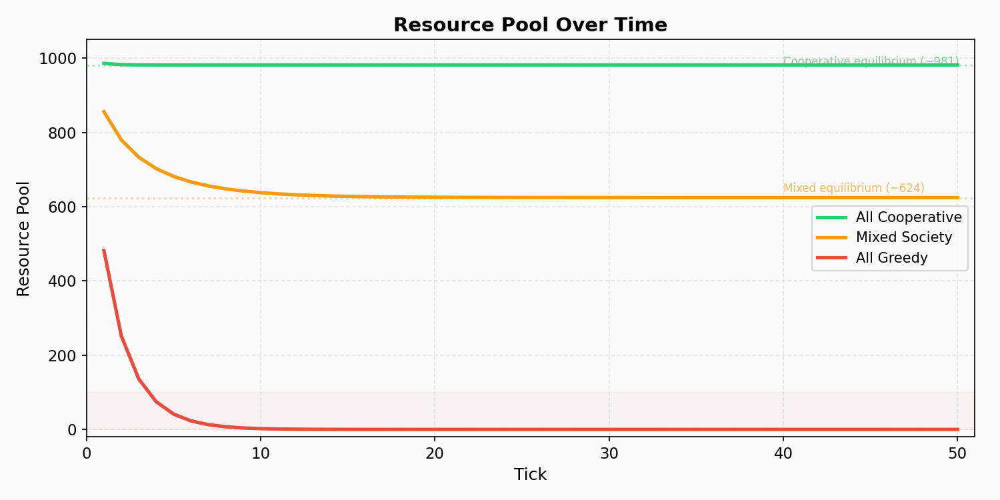
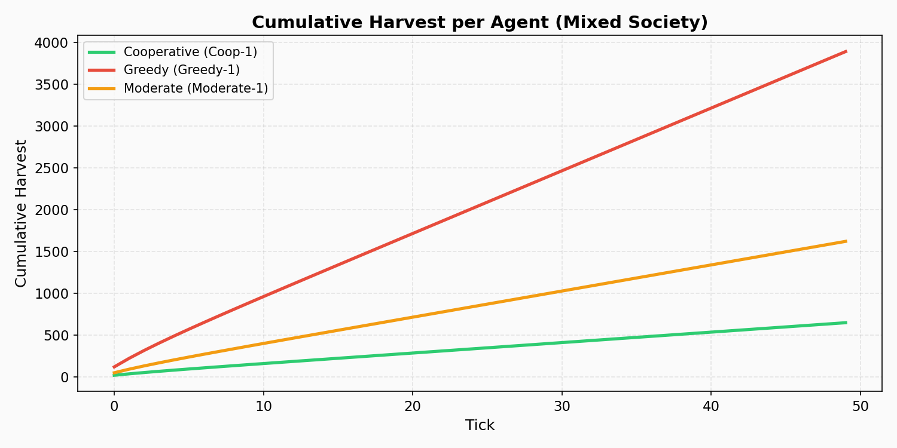
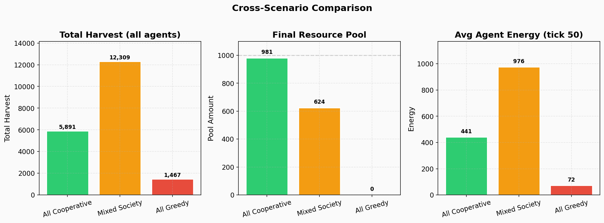
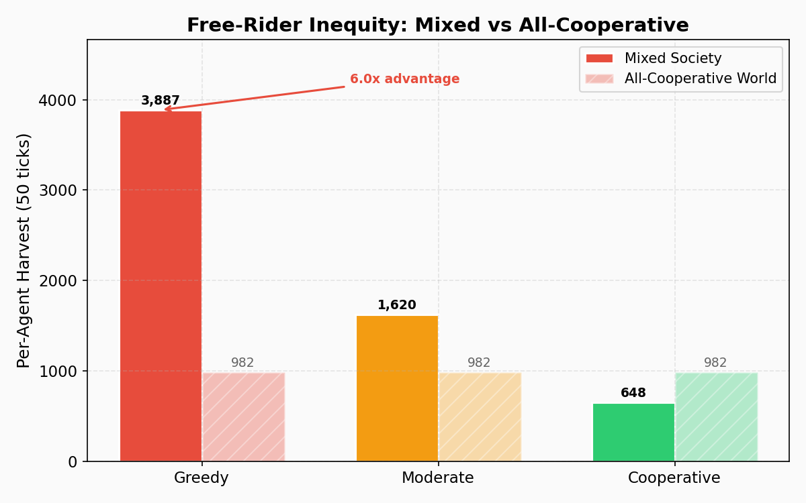

# Tragedy of the Commons

A multi-agent simulation exploring how greedy, moderate, and cooperative
harvesting strategies affect a shared renewable resource.

!!! abstract "Key Result"
    Cooperation yields **4x** more total harvest than universal greed — but mixed
    populations produce the **most** overall harvest due to free-rider dynamics,
    where greedy agents exploit a pool kept alive by cooperators.

```bash
# Run the simulation
uv run python experiments/tragedy_of_the_commons.py

# Generate figures
uv run python experiments/generate_figures.py
```

Source: [`experiments/tragedy_of_the_commons.py`](https://github.com/VangelisTech/archetype/blob/main/experiments/tragedy_of_the_commons.py)

---

## 1. Introduction

Garrett Hardin's 1968 essay "The Tragedy of the Commons" posed a fundamental
question: when individuals share a finite, renewable resource, do rational
self-interest and collective welfare inevitably conflict?

We revisit this question computationally using **Archetype**, a data-centric
ECS engine for multi-agent simulations. Our approach models the commons as a
logistically regenerating resource pool shared by six agents, each following a
fixed harvesting strategy. By comparing three population compositions — all
cooperative, all greedy, and mixed — we observe not only the expected collapse
under universal greed but also a subtler free-rider dynamic that emerges in
heterogeneous populations.

## 2. Model

### 2.1 Resource Dynamics

The commons is a single resource pool with carrying capacity `K = 1000` and
logistic regeneration:

```
growth = r * R_t * (1 - R_t / K)
```

where `r = 1.0` is the intrinsic growth rate, yielding a maximum regeneration of
`r*K/4 = 250` units per tick at half capacity. The pool is initialized at full
capacity (`R_0 = 1000`).

### 2.2 Agent Strategies

Each agent harvests a fixed fraction of the *current* pool each tick:

| Strategy    | Harvest Rate | Interpretation                   |
|-------------|:------------:|----------------------------------|
| Greedy      | 12%          | Maximize short-term extraction   |
| Moderate    | 5%           | Balance extraction and restraint |
| Cooperative | 2%           | Prioritize long-term sustainability |

Agents gain energy proportional to their harvest (`+0.5 * harvest`) and
lose a fixed metabolic cost (`-2.0`) each tick. Energy is floored at zero.

### 2.3 Scenarios

| Scenario         | Composition                          | Total Take Rate |
|------------------|--------------------------------------|:---------------:|
| All Cooperative  | 6 cooperative                        | 12%             |
| Mixed Society    | 2 greedy + 2 moderate + 2 cooperative| 38%             |
| All Greedy       | 6 greedy                             | 72%             |

### 2.4 Tick Lifecycle

Each tick proceeds in two phases:

1. **Harvest** (priority 10): All agents simultaneously attempt to harvest their
   desired fraction. If total demand exceeds the available pool, allocations are
   scaled proportionally.
2. **Regeneration** (priority 20): Logistic regrowth is applied to the
   post-harvest pool.

This ordering — harvest before regeneration — creates a discrete-time dynamic
where sustainability depends not just on total extraction rate but on whether
the post-harvest pool retains enough biomass for meaningful regrowth.

### 2.5 Equilibrium Analysis

For a given total take rate `alpha`, the post-harvest pool is `R * (1 - alpha)`.
Setting `R_{t+1} = R_t` and solving for the fixed point yields a positive
equilibrium only when `(1 - alpha) * (1 + r) > 1`, i.e., `alpha < r / (1 + r)`.

With `r = 1.0`, the critical threshold is **alpha_max = 0.50** (50%).

- **All Cooperative** (`alpha = 0.12`): Well below threshold. Equilibrium at `R* ~ 981`.
- **Mixed** (`alpha = 0.38`): Below threshold. Equilibrium at `R* ~ 624`.
- **All Greedy** (`alpha = 0.72`): Above threshold. No equilibrium — collapse is inevitable.

## 3. Results

### 3.1 Pool Dynamics



*Figure 1. Resource pool trajectory across 50 ticks for each scenario.*

The cooperative scenario stabilizes almost immediately near `R* = 981`, with
the small 12% total extraction easily replenished by logistic growth near
capacity. The mixed scenario undergoes a transient decline — dropping to roughly
400 by tick 8 — before converging to its stressed equilibrium around 624. The
all-greedy scenario collapses catastrophically: the pool drops below 1 by tick 4
and never recovers.

### 3.2 Harvest Accumulation



*Figure 2. Cumulative per-agent harvest in the mixed scenario, illustrating the
divergence between strategies sharing the same pool.*

In the mixed scenario, greedy agents accumulate harvest at roughly 6x the rate
of cooperative agents. The curves are approximately linear after the transient
period (ticks 1-10), reflecting steady-state harvesting from a stabilized
(if stressed) pool.

### 3.3 Cross-Scenario Comparison



*Figure 3. Aggregate metrics across all three scenarios: total harvest, final
pool level, and average agent energy.*

The most striking result is the **center panel**: the mixed society's total
harvest (12,309) exceeds both the all-cooperative (5,891) and all-greedy (1,467)
outcomes. This is not because mixing is "better" in any normative sense — it is
because greedy agents more aggressively extract from a pool that cooperative
agents help sustain. The mixed pool stabilizes at a lower level (624 vs 981),
reducing per-unit regeneration, but greedy agents compensate by taking a larger
absolute share.

### 3.4 The Free-Rider Effect



*Figure 4. Per-agent harvest by strategy in the mixed scenario (solid bars) vs.
the all-cooperative baseline (hatched bars).*

The free-rider dynamics are stark:

| Metric | Greedy (mixed) | Cooperative (mixed) | Cooperative (coop-only) |
|--------|:--------------:|:-------------------:|:-----------------------:|
| Per-agent harvest | 3,887 | 648 | 982 |
| Energy at tick 50 | 1,894 | 274 | 441 |

!!! warning "Free-Rider Inequity"
    Greedy agents in a mixed world harvest **3.96x** what cooperative agents would
    earn in their own cooperative world, and **6.0x** what cooperative agents earn
    in the mixed world itself. Meanwhile, cooperative agents in the mixed world earn
    **34% less** than they would in a purely cooperative society.

## 4. Discussion

### 4.1 Three Regimes of the Commons

The simulation reveals three qualitatively distinct regimes:

1. **Sustainable commons** (`alpha < 0.50`): The pool reaches a positive
   equilibrium. Both the cooperative and mixed scenarios fall here, though at
   very different equilibrium levels.

2. **Collapse** (`alpha > 0.50`): Total extraction exceeds the regeneration
   capacity at any pool level. The resource depletes to zero in a few ticks.

3. **Free-rider zone** (sustainable `alpha` with heterogeneous agents): The
   aggregate take rate is sustainable, but individual outcomes are deeply
   inequitable. Greedy agents capture disproportionate value.

### 4.2 The Paradox of Mixed Efficiency

The mixed society produces the highest total harvest — a seemingly paradoxical
result. This occurs because:

- In the all-cooperative world, agents collectively under-harvest relative to the
  maximum sustainable yield. The pool sits near capacity where regeneration is
  *minimal* (logistic growth approaches zero near `K`).
- In the mixed world, higher extraction pushes the pool toward mid-range values
  where regeneration is *maximal*. The stressed pool regenerates more per tick,
  supporting a higher sustained harvest flow.

This mirrors the concept of **Maximum Sustainable Yield** (MSY) in fisheries
science: the optimal extraction rate is not zero, but the rate that maintains the
population at the point of maximum growth (`K/2`). The mixed society, almost by
accident, operates closer to MSY than the cooperative one.

However, this "efficiency" is hollow from an equity perspective. The gains flow
disproportionately to defectors, and the system is fragile — adding one more
greedy agent could push `alpha` above the critical threshold.

### 4.3 Implications for Multi-Agent System Design

For designers of multi-agent systems, these results suggest:

- **Mechanism design matters more than agent intentions.** Even well-meaning
  cooperative agents fare poorly when the system permits free-riding. Governance
  mechanisms (quotas, penalties, reputation) are needed to align individual and
  collective incentives.
- **Monitoring sustainability requires more than aggregate metrics.** The mixed
  scenario looks "efficient" by total harvest but is inequitable and fragile.
  Per-agent and distributional metrics are essential.
- **Critical thresholds exist and are sharp.** The transition from stressed
  sustainability to collapse occurs at a well-defined point (`alpha = 0.50`).
  Systems operating near this boundary are vulnerable to small perturbations.

## 5. Implementation

The simulation uses core Archetype patterns:

- **Component**: `Gatherer` stores per-agent state (strategy, harvest rate,
  energy, cumulative harvest) as Arrow-serializable fields.
- **Shared state**: `CommonPool` is injected via the type-safe `Resources` DI
  container, accessible to all processors without polluting entity data.
- **Processors**: `HarvestProcessor` (priority 10) and `RegenerationProcessor`
  (priority 20) implement the tick lifecycle. The harvest processor performs a
  justified `collect()` for cross-entity coordination of the shared pool.
- **Scenarios**: Each scenario runs as an independent `AsyncWorld` with its own
  `CommonPool` resource instance.

```python
class Gatherer(Component):
    name: str = ""
    strategy: str = "cooperative"
    harvest_rate: float = 0.02
    energy: float = 50.0
    total_harvested: float = 0.0

class HarvestProcessor(AsyncProcessor):
    components = (Gatherer,)
    priority = 10

    async def process(self, df, tick=0, resources=None, **kwargs):
        pool = resources.require(CommonPool)
        # ... harvest logic with proportional allocation
        return updated_df

class RegenerationProcessor(AsyncProcessor):
    components = (Gatherer,)
    priority = 20

    async def process(self, df, resources=None, **kwargs):
        pool = resources.require(CommonPool)
        pool.regenerate()
        return df
```

The full experiment — all three scenarios at 50 ticks — executes in under
2 seconds.

!!! tip "Reproduce"
    ```bash
    uv run python experiments/tragedy_of_the_commons.py
    uv run python experiments/generate_figures.py
    ```

## 6. Conclusion

Even in this minimal model — six agents, one resource, fixed strategies — the
tragedy of the commons manifests with striking clarity. Universal greed leads to
swift collapse. Universal cooperation achieves sustainability but under-harvests.
Mixed populations find a stressed middle ground that is collectively productive
but individually inequitable, with cooperators subsidizing greedy free-riders.

The sharpest lesson is quantitative: cooperation yields **4x** the total harvest
of universal greed, but a single greedy agent in a mixed world harvests **6x**
what a cooperator earns. This asymmetry — where defection is individually
rational but collectively destructive — is precisely the dilemma Hardin
identified. This simulation makes it measurable.
