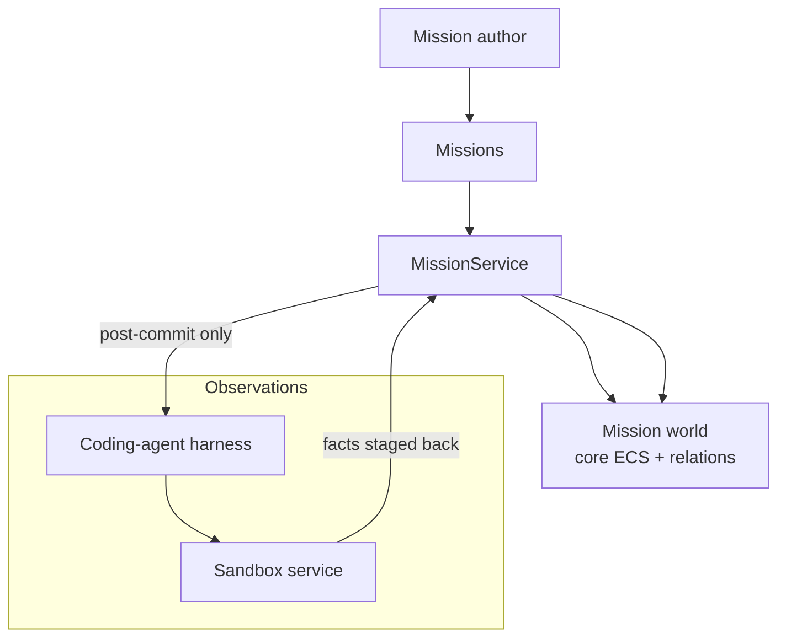
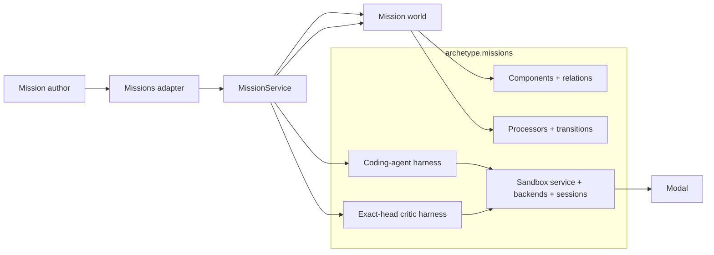
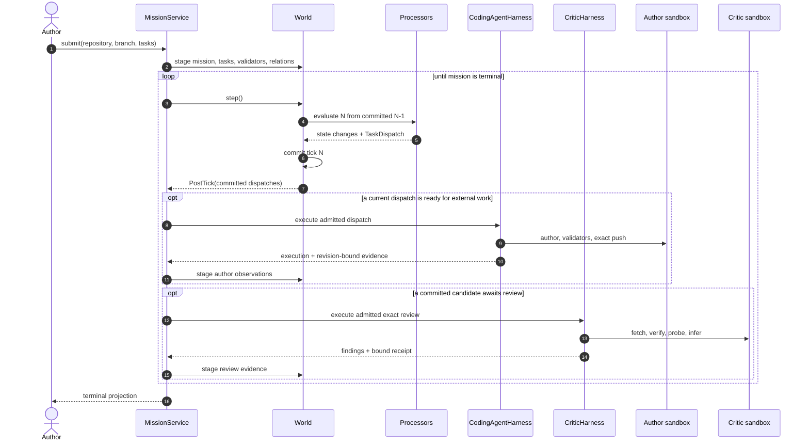
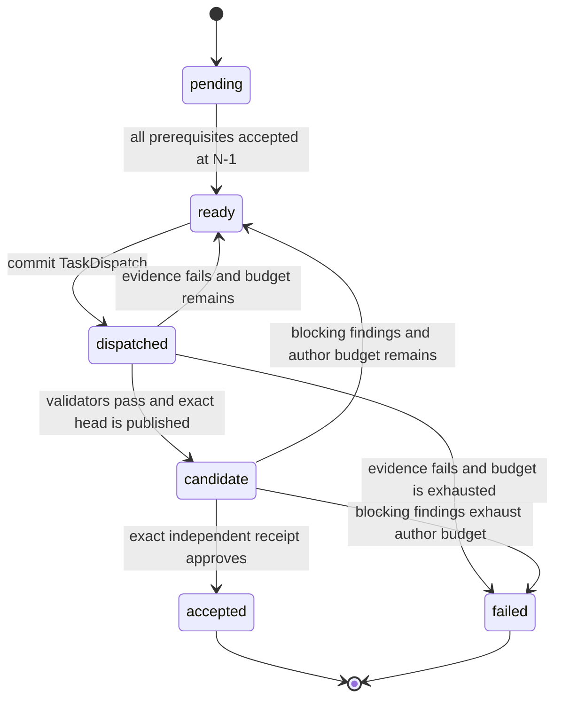

# Agent Missions V1

**Document type:** Normative V1 contract.

**Status:** Implemented.

## Purpose and Scope

Agent Missions is Archetype's software factory. An author submits a repository,
a branch, and a graph of coding tasks guarded by the repository's own
validators. Archetype records the graph, commits every decision as world
state, and advances work only when current evidence permits the transition.

It sits **above** the [core engine](core-architecture.md): the mission world is
still components, processors, and append-only ticks. The family adds graph
materialization, committed-intent dispatch, sandbox I/O, and projections.

Archetype does not own how an agent writes code. It owns **when work may
start, which observations may advance it, and why every transition occurred**.



> **The V1 contract**
>
> Tasks and validators are entities. Dependencies are relations. Processors
> are the transition authority. A dispatch is committed intent. Agent, critic,
> and sandbox activity are observations. Validator-green publication creates
> an immutable candidate; only a complete independent critic receipt bound to
> that exact candidate can accept a task.

## Key Capabilities

| Capability | Implementation |
|---|---|
| **Task graph as data** | Tasks, validators, and dependencies are entities and relations |
| **Processor authority** | Readiness, dispatch, retry, failure, acceptance, mission rollup |
| **Committed intent** | `TaskDispatch` is permission recorded on the ledger, not a live job object |
| **Post-commit I/O** | Sandboxes see work only after the tick that dispatched it commits |
| **Harness vs acceptance** | Agent/sandbox observations never accept a task; validator-green publication creates a candidate, and processors accept it only after complete independent critic evidence is bound to that exact candidate |

## 1. The contract in one view

| Primitive | Responsibility |
|---|---|
| World | The durable state machine for missions, tasks, relations, dispatches, executions, and outputs. |
| Mission | Names one repository objective, persists its canonical `episode_id`, and rolls its task graph into one result. |
| Task | Holds one atomic goal, workflow state, retry policy, and repository coordinates. |
| Validator | Describes one executable acceptance check; `Guards` relates it to a task. |
| Candidate | Binds authored-green validation and publication evidence to one immutable base/head/diff and critic policy. |
| Critic | Reviews the exact candidate in a separate sandbox and returns typed findings plus a provider-neutral receipt. |
| Relations | Express membership, dependencies, execution placement, and provenance without serialized plans. |
| Processors | Decide readiness, dispatch, retry, failure, acceptance, and mission rollup. |
| `TaskDispatch` | Records committed permission to perform a particular task revision. It is intent, not an attempt object. |
| `AgentExecution` | Records what an agent process did for a dispatch. It never says whether the task was accepted. |
| Sandbox | Records the lifecycle of an isolated filesystem and process container. It never says whether the task was accepted. |
| Outputs | Record validator results, commits, candidates, critic executions/findings/receipts, checkpoints, manifests, friction, and published artifacts. |
| Sandbox service | Owns backend selection and live session lifetime; it has no workflow authority. |
| Application service | Materializes the graph, crosses committed I/O boundaries, stages observations, and returns projections. |

The governing separation is:

```text
Archetype owns transitions as data.
The sandbox owns isolated filesystem and process capabilities.
The agent execution records what happened.
The repository harness owns authored-green validation and publication.
The independent critic produces exact-head evidence.
Processors alone own candidate promotion, repair, and acceptance.
```

Daft evaluates state transforms and joins. It does not keep an agent process
alive or schedule a provider sandbox. External work begins only after the tick
containing its dispatch has committed.

## 2. Public authoring surface

Configuration happens once. Authors submit typed values; they do not construct
Components, wire processors, manage `GraphView`, or serialize a plan.
Install the library and its supported Modal provider with
`uv add "archetype-missions[modal]"` (or the equivalent `pip install` command).

```python
import asyncio

from archetype import ArchetypeRuntime
from archetype.missions import (
    AgentMissionConfig,
    AgentTask,
    CommandValidator,
    CriticPolicy,
    Missions,
)
from archetype.missions.sandboxes import (
    MODAL_ACTIVITY_PROTOCOL_EPOCH,
    ModalSandboxBackend,
    ModalSandboxConfig,
)


backend = ModalSandboxBackend(
    ModalSandboxConfig(
        workspace_name="my-workspace",
        environment_name="main",
        operation_protocol_epoch=MODAL_ACTIVITY_PROTOCOL_EPOCH,
    )
)
MISSION_CONFIG = AgentMissionConfig(
    sandbox_backend=backend,
    sandbox_environment=backend.environment,
    max_ticks=40,
)

TASKS = (
    AgentTask(
        name="regression",
        prompt="Add a deterministic regression test. Do not change production code.",
        validators=(
            CommandValidator(
                name="regression_is_red",
                command=("uv", "run", "pytest", "-q", "tests/app/test_bug.py"),
                expected_returncode=1,
            ),
        ),
        critic_policy=CriticPolicy(max_reviews=2),
    ),
    AgentTask(
        name="implementation",
        prompt="Make the regression pass with the smallest layer-correct fix.",
        validators=(
            CommandValidator(
                name="focused_contract",
                command=("uv", "run", "pytest", "-q", "tests/app/test_bug.py"),
            ),
            CommandValidator(
                name="architecture",
                command=("uv", "run", "python", "scripts/check_architecture.py"),
            ),
        ),
        depends_on=("regression",),
        critic_policy=CriticPolicy(max_reviews=2),
    ),
)


async def main() -> None:
    async with ArchetypeRuntime() as runtime:
        async with Missions(
            runtime,
            "fix-bug",
            config=MISSION_CONFIG,
            storage=".context/agent-missions/data",
        ) as missions:
            mission = await missions.submit(
                repository="VangelisTech/archetype",
                branch="agent/fix-bug",
                tasks=TASKS,
            )
            result = await missions.run(mission)

    print(result.episode_id)
    print(result.status)
    for task in result.tasks:
        print(task.name, task.status, task.dispatches, task.commit_shas)


asyncio.run(main())
```

Initialize the Modal backend's Codex subscription volume once before the
first live run with `await backend.login_codex()`. This device login is not an
OpenAI API key and cannot implicitly reuse the credential of the Codex process
running on the host. The complete backend-selectable setup, including Modal
attach monitoring, is executable in
[`examples/11_coding_agent_mission.py`](https://github.com/VangelisTech/archetype/blob/main/examples/11_coding_agent_mission.py).

For a live `sb-...` identity, the example's `--spectate` action mints a
read-only browser grant and `--takeover` mints a separately writable grant.
Both lanes require a port-scoped Modal Sandbox Connect Token. The resulting
URL and bearer token are transient operator capabilities: they are printed
once, excluded from Activity results, ECS rows, checkpoints, and trace
evidence, and must not be logged or persisted. These grant actions are a
trusted-maintainer CLI surface only. An untrusted or remote caller requires a
future actor-authenticated exact API operation before it may receive either
capability.

`CommandValidator` and `AgentTask` are authoring values. Submission compiles
them into Validator and Task entities plus relations. The convenient surface
does not turn validator definitions or task dependencies back into JSON blobs.

### Authenticated execution profiles

An untrusted mission client selects only a `profile_id` plus repository, base
ref, and branch coordinates. The host composes immutable profile bindings with
`MissionsExtensionConfig` through the existing `world_library_configs` wiring
input. A binding contains a canonical, secret-free policy document and a
trusted factory for the live `AgentMissionConfig`; provider objects and secret
values never enter a request model.

The canonical profile owns repository/ref allowlists, a branch namespace,
sandbox environment, agent and critic identities, model, timeout/tick/retry/
concurrency/cost ceilings, validator and publication bounds, checkpoint policy,
secret/provider-credential names, and interactive capability flags. Profile
id, version, and SHA-256 digest form the durable identity copied into an
accepted MissionRun. Current versions are selected explicitly, and historical
versions remain resolvable; file order never silently chooses authority.

The installer retains the validated `MissionsExtensionConfig` on the
installed library record, so the catalog stays reachable through the existing
world-library seam rather than a parallel service locator:
`RuntimeResources.world_library("missions")` resolves the installed record,
`archetype.missions.installed_execution_profiles(installed)` returns the
`ExecutionProfileCatalog`, and `catalog.resolve(profile_id)` yields the
`ExecutionProfileBinding` whose `build_config()` materializes the live
`AgentMissionConfig`. REST handlers use the
`archetype.missions.api.get_execution_profiles` dependency, which performs the
same resolution from lifespan-owned state.

Authentication and profile authorization do not create a run. Missions policy
checks the authenticated principal, requested capability, explicit ownership,
the pinned profile digest, and the profile's capability flag. The Temporal
client mints the stable `run_id`/workflow ID and starts exactly one workflow.
HTTP, MCP, and interactive adapters remain thin consumers of that control
surface. Run status and listing come from Temporal queries and Visibility,
not from a parallel SQLite MissionRun catalog.

### Submission contract

`missions.submit(...)` accepts `list[AgentTask]` or any finite sequence of
tasks. V1 requires:

- non-empty repository, branch, base ref, and task sequence;
- unique, non-empty task and validator names;
- non-empty prompts and at least one validator per task;
- positive dispatch budgets;
- dependencies that name tasks in the same submission;
- an acyclic dependency graph;
- a pinned sandbox environment plus an explicit publication policy; and
- one valid, digestible critic policy with positive review, time, schema, and
  output budgets per task.

The sequence is already the planner seam. A later planner may take one large
task and emit many tasks and relationships. Task decomposition is not part of
V1.

Every task in one Mission publishes to the same branch. The dispatch processor
therefore admits at most one outstanding author task per Mission: dependency
edges determine eligibility, repairs take precedence over fresh eligible
tasks, and otherwise entity identity supplies the deterministic order. A fresh
task hydrates from the latest accepted candidate on that serialized branch; a
rejected candidate remains available only to its own repair. This preserves
arbitrary acyclic task graphs without creating sibling commits or allowing an
unreviewed head to become another task's base.

Submission derives one world-scoped, persistent `episode_id`, stores it on the
Mission entity, and returns it in both `SubmittedMission` and `MissionResult`.
That is the join key for Mission episode evidence; a trajectory remains only a
derived view.

## 3. Architecture and ownership



`archetype.missions` owns the reusable family:

- mission, task, validator, candidate, critic, sandbox, execution, and output Components;
- relations and pure DataFrame transition logic;
- built-in processors and projections;
- coding-agent and independent-critic protocols and harness behavior;
- sandbox Service, Backend, and Session contracts; and
- capability-scoped provider adapters such as Modal.

`archetype.missions` also owns the family workflow:

- reserve identities and materialize submitted graphs;
- configure a world with the built-in mission behavior;
- step the state machine;
- project author and critic requests from exact committed snapshots;
- execute or reconcile both repository harnesses through one Activity binding;
- stage observations through the mutation path;
- compose mission trajectory reads and evaluation; and
- return supported mission projections.

The family service does not decide readiness, retry, acceptance, or
mission success. Those decisions remain visible in processors and persisted
state.

### World topology is not sandbox topology

A world is a state machine, not a sandbox. The same contract permits one world
with many sandboxes, many worktrees in one sandbox, several agents in separate
worktrees, or cooperating agents in one worktree. Placement policy may change
without changing task readiness.

V1 uses one retained author repository session per mission and a fresh critic
session per candidate. The critic session may reuse the same backend and pinned
environment, but it has a distinct sandbox identity, receives no Git
publication secret, is never checkpointed, and closes after its evidence is
durable.

## 4. State and transition protocol



The committed-tick boundary establishes one safety property: no sandbox sees
speculative work. If tick persistence fails, its dispatch cannot leak an
external side effect. The [Activity](activities.md) contract carries delivery
after that boundary with exact-receipt projection, durable admission, and
later-receipt settlement.

### Task state



The built-in pipeline has four concerns:

| Order | Processor | Authority |
|---:|---|---|
| 10 | Task decision | Turn authored-green publication into a candidate, then consume exact critic evidence to accept, repair, or exhaust. |
| 20 | Task readiness | Make a task ready only when every prerequisite was accepted in the previous committed tick. |
| 30 | Task dispatch | Convert ready state into one durable dispatch identity. |
| 40 | Mission rollup | Succeed only when every member task is accepted; fail when a member task is terminally failed. |

There is no durable `Attempt` aggregate. Retrying produces a new
`TaskDispatch`; history preserves every prior dispatch and observation.
Temporal Activity executions are orchestration history, not Mission
Components or task retries, so they do not change this semantic model.

### Intent, observation, decision

These concepts never collapse into one status field:

| Kind | Examples | May decide task state? |
|---|---|---:|
| Intent | `TaskDispatch` | No |
| Runtime observation | `Sandbox`, `AgentExecution`, `CriticExecution` | No |
| Review subject/evidence | `Candidate`, `CriticFinding`, `CriticReceipt` | No |
| Work output | `ValidationResult`, `Commit`, `FrictionLog`; reusable checkpoint, manifest, and artifact-reference Components | No |
| Decision | `TaskState` written by the task decision processor | Yes |

`TaskDispatch` identifies the committed dispatch and sequence. Together with
the task's workspace and policy Components, it projects the requested
repository base and publication policy. `AgentExecution` records process lifecycle such as
`starting`, `running`, `exited`, `errored`, or `interrupted`.

`Candidate` binds the mission, task, dispatch, author execution and sandbox,
repository/base/head, binary-diff digest, validator-bundle digest, and critic
policy digest. `CriticReceipt` binds its conclusion back to the same subject.
Neither value is a decision; the task processor verifies the full binding and
that author and critic sandbox identities differ.

Sandbox lifecycle is separate: `provisioning`, `ready`, `errored`,
`interrupted`, or `closed`. A sandbox is never `accepted`, `rejected`, or
`completed`; it is a container that may host zero or many executions.

### Relations and previous-tick visibility

At minimum, V1 materializes:

```text
PartOfMission(source=task, target=mission)
DependsOn(source=task, target=prerequisite)
Guards(source=validator, target=task)
Executes(source=execution, target=task)
RunsIn(source=execution, target=sandbox)
ProducedBy(source=output, target=execution)
CandidateFor(source=candidate, target=task)
AuthoredBy(source=candidate, target=author_execution)
Reviews(source=critic_execution, target=candidate)
Supersedes(source=new_candidate, target=prior_candidate)
```

Readiness and rollup use `GraphView`, which is strictly previous-tick. If task
A is accepted at N, dependent task B may become ready no earlier than N+1.
Edges are temporal entities, so dependency, provenance, and fork inheritance
remain queryable without decoding a plan blob.

## 5. Sandbox and validator protocol

The sandbox vocabulary describes a resource, not a workflow:

```python
class SandboxBackend(Protocol):
    async def create(self, spec: SandboxSpec) -> SandboxSession: ...
    async def restore(
        self, spec: SandboxSpec, checkpoint: CheckpointRef
    ) -> SandboxSession: ...


class SandboxSession(Protocol):
    @property
    def identity(self) -> SandboxIdentity: ...

    @property
    def capabilities(self) -> SandboxCapabilities: ...

    async def status(self) -> SandboxStatus: ...
    async def exec(self, request: ProcessRequest) -> ProcessResult: ...
    async def checkpoint(self) -> CheckpointRef: ...
    async def close(self) -> None: ...


class SandboxService:
    async def acquire(self, key: SandboxKey, spec: SandboxSpec) -> SandboxSession: ...
    async def restore(
        self, key: SandboxKey, spec: SandboxSpec, checkpoint: CheckpointRef
    ) -> SandboxSession: ...
    async def close(self, key: SandboxKey) -> None: ...
    async def shutdown(self) -> None: ...
```

- Backend creates or restores provider resources.
- Session is the live handle for process and snapshot capabilities.
- Service selects a backend, reuses sessions according to policy, and owns
  shutdown.

Execution and checkpoint capabilities require a `READY` session. An
`ERRORED` or `INTERRUPTED` handle cannot run more work or capture another
checkpoint. The service keeps it registered until teardown succeeds: a later
acquisition may close and replace it, while a teardown failure retains the
handle for explicit restore or close retry instead of silently evicting a
possibly live provider resource. Close is single-flight per sandbox key and
continues if its caller is cancelled; concurrent acquisition waits for that
teardown and never receives the closing handle. A provider session returned
while shutdown is winning the race remains cleanup-owned until close succeeds,
and failed shutdown cleanup is reported and retryable. The runtime mission
handle becomes closed only after that cleanup and durable reconciliation
succeed, so a failed public `close()` can be retried while its mission world is
still available. If runtime-owned cleanup fails, public runtime admission stays
closed and a later serialized `runtime.shutdown()` retries the retained mission
before world handles or shared services are finalized. The runtime keeps a
strong ownership reference to that handle until cleanup succeeds, so dropping
the caller's reference cannot discard a still-live provider resource. Public
and runtime-owned close calls are single-flight on the handle; a public close
already in progress retains cleanup authority for its exact mission world while
runtime shutdown waits. That authority cannot admit operations against a
sibling world on the same runtime.

Durable lifecycle evidence follows physical ownership. A failed author or
critic close projects the retained session's non-ready status and teardown
friction before the error returns. The service retains pending critic cleanup
across `run()` calls, so cancellation propagates without becoming failure
evidence and a later run joins or retries the same single-flight close. Once
replacement or cleanup has closed a sandbox, staging an earlier same-tick
execution cannot move its durable status backward from `closed`. A critic
acquisition failure records its synthetic unavailable identity as `errored`;
because no provider resource was acquired, later no-op cleanup cannot promote
that evidence to `closed`.

The coding-agent harness works through `SandboxSession`. It owns clone and
branch preparation, agent invocation, validator execution, Git publication,
and translation into factual Components. Provider adapters do not know task
state and do not return an acceptance verdict.

### Independent exact-head critic

Every `AgentTask` carries one `CriticPolicy`. Its canonical digest fixes the
policy identity/version, perspective, information view, driver/model,
sampling description, review/time/output budgets, and schema version. The
perspective is included in the critic prompt. V1 supports only the
`task-diff-validators` information view and `provider-default` sampling;
unsupported values fail during policy construction instead of becoming inert
digest metadata. A configured critic driver declares its own `driver_id`;
every task policy must match that identity, and `CriticExecution.driver`
records the configured identity rather than echoing an unchecked label.

When an author dispatch commits, `MissionService` starts provisioning a critic
sandbox and hydrates the public base repository while the author works. After
authored-green publication, the critic harness:

1. fetches the configured remote branch without requesting a Git secret;
2. verifies that the candidate head remains reachable from the fetched remote
   ref, even if that ref has advanced to a later descendant;
3. verifies and detach-checks out the exact base/head commits;
4. recomputes the binary diff digest;
5. invokes a fresh critic process with only its model credential;
6. normalizes bounded structured findings and a receipt; and
7. stages that evidence before closing the never-checkpointed critic sandbox.

A `CriticReceipt` row exists only after the harness has completed and verified
the exact subject. Promotion then requires that row to be policy- and
candidate-digest bound, revision/diff/validator-bundle bound, and produced in a
sandbox distinct from the author. Missing, malformed, timed-out, errored,
stale, wrong-head, or same-author evidence cannot accept. Reviewer
infrastructure failures consume only the critic review budget; they never
consume an author dispatch. When that bounded budget is exhausted,
`missions.run()` reports the candidate as still pending review instead of
turning reviewer failure into task failure or implicit approval.

The Activity-backed critic path makes that post-commit boundary durable. It
projects the exact current candidate, admits `kind="missions.critic"` under the
stable `review_id`, and executes or reconciles outside the world lock. The admitted
value contains no diff bytes; the provider binds the recomputed binary diff
through a bounded provider-owned file or stdin and cleans temporary subject
storage on success and failure.

The returned observation is one atomic bundle: a fresh critic `Sandbox`,
`CriticExecution`, `Reviews`/`RunsIn`, findings and provenance, an optional
existing-v1 `CriticReceipt`, and a `CompleteCriticActivityObservation` marker
staged last. The marker, rather than a process-local queue or the receipt row
alone, binds the exact durable result and full subject evidence to the later
committed tick. Generic Activity retries never increment Mission review
attempts; only committed `CriticExecution` observations do.

Modal first-result envelopes also bind cleanup ownership for the exact mission
and auth sandbox object IDs plus their cohort. Author or critic recovery retries
that exact teardown before returning a recovered result; a failed close can
therefore neither settle the Activity nor strand a paid pair merely because the
worker process restarted.

A blocking receipt moves the task back to `READY` only after its findings are
durable. The next author request contains those findings. Any repair produces
a new head, candidate identity, and receipt subject; evidence for the old head
cannot be reused.

The recorded phase times distinguish provision, base hydration, exact-head
readiness, critic start, inference, and receipt staging. On the warm path,
candidate publication to critic start performs only fetch, verification, and
checkout. Rows whose base-hydrated time precedes candidate publication are the
warm cohort; operators derive cold and warm p50/p95 phase latency from these
durable timestamps rather than a process-local metric buffer. V1 supports
public repositories; a future private-repository adapter requires a separate
read-only Git capability, never the publication secret.

Checkpointing is optional resumability. A checkpoint is a lightweight,
provider-native reference to the session-owned writable filesystem, excluding
external and credential mounts. A filesystem manifest is a content-addressed,
queryable observation of selected state. Neither is required to accept a task.
After every dispatch, the application first persists execution, validation,
and commit evidence and commits the task decision. Only then does it ask a
checkpoint-capable session for a bounded, best-effort snapshot and record
either its reference or a `FrictionLog`. A slow or failed snapshot cannot delay
or change the valid task decision, and rejected work is still checkpointed.

Checkpoint restore is not supported by the current v0.6 Modal Activity execution path.
`restore_sandbox(...)` fails explicitly before provider I/O; accepting a
checkpoint while the Activity executor starts a different operation-scoped
sandbox would silently discard the restored filesystem. Checkpoint references
remain durable evidence and the backend-level restore capability remains
independently tested. A future workflow restore slice must bind the checkpoint
into the immutable Activity request before re-enabling the public operation.

### Supported sandbox backends

| Backend | Role | Checkpoint / restore | Credential capabilities |
|---|---|---|---|
| Apple Container | Backend-capability and parity adapter; not admitted by the v0.6 Mission workflow. | Stops, exports the session root filesystem to an atomic content-addressed host-local archive, restarts in `finally`, verifies integrity, and rebuilds a restore image. | None. The parity adapter exposes no Codex OAuth, auth-volume, login, or process-secret capability. |
| Docker | Linux/CI backend-capability reference; not admitted by the v0.6 Mission workflow. | `docker commit`, followed by immutable image-ID inspection and same-provider restore. | None. The parity adapter exposes no Codex OAuth, auth-volume, login, or process-secret capability. |
| Modal | The sole v0.6 Mission Activity backend. | Captures `snapshot_filesystem` as durable evidence. Backend-level restore accepts exact `im-...` image IDs, but workflow restore is disabled until checkpoint identity is part of Activity admission. | Required named Modal Volume plus a separate broker sandbox. |

#### Authentication paths by provider

Codex is the only coding-agent provider in v0.6, and Modal is the sole backend
that brokers its subscription device credential. Apple Container and Docker
exercise lifecycle and checkpoint parity only; they expose no Codex
authentication or provider-secret surface. Four Modal authorities remain
separate: the sandbox provider control plane, Codex model access, GitHub
publication, and any live viewport grant.

| Backend | Sandbox control-plane authentication | Codex authentication | GitHub publication | Live viewport |
|---|---|---|---|---|
| Apple Container | The local `container` CLI and its running VM service inherit the host user's local authority. Archetype accepts no Apple cloud token; `container system status` must succeed after `container system start`. | Unsupported. The parity adapter has no `login_codex()`, auth-volume configuration, or `codex_oauth` execution capability. | Unsupported. The parity adapter exposes no GitHub or generic process-secret capability. | Not implemented. |
| Docker | The local Docker context/daemon authenticates the host operation; `docker info` must succeed. Archetype neither runs `docker login` nor owns registry credentials for the default locally built image. | Unsupported. The parity adapter has no `login_codex()`, auth-volume configuration, or `codex_oauth` execution capability. | Unsupported. The parity adapter exposes no GitHub or generic process-secret capability. | Not implemented. |
| Modal | The Modal SDK uses the selected authenticated profile or `MODAL_TOKEN_ID` plus `MODAL_TOKEN_SECRET`. The workspace, Environment, App, Volume, Dict, Secret, and Sandbox identities are explicit configuration. Ordinary create/restore and login verify the configured workspace and Environment against the ambient SDK context before mutation. Named provider work verifies the ambient workspace, then scopes every provider object lookup and mutation explicitly to the configured Environment. A typical workstation setup uses `modal token set`; in Actions, repository variable `CODING_AGENT_MODAL_PROFILE` is exported as the SDK selector `MODAL_PROFILE`, and `CODING_AGENT_MODAL_ENVIRONMENT` is exported as both the Archetype selector and SDK selector `MODAL_ENVIRONMENT`. | `ModalSandboxBackend.login_codex()` runs `codex login --device-auth` in a temporary login sandbox and persists only `auth.json` in `ModalSandboxConfig.auth_volume_name` (default `archetype-codex-auth`). The admitted app-server path copies that file into its mission sandbox only through app-server `thread/start`; an awaited barrier deletes and verifies absence of the exact file before `turn/start`, TUI attachment, or model-driven tool execution. Mission execution never writes its copy back to the Volume, and generic mission `exec` rejects `codex_oauth`. | `ModalSandboxConfig.github_secret_name` (default `archetype-github`) resolves a Modal Secret containing `GITHUB_TOKEN`. The controller streams the exact validated Git object bundle through a hard byte cap into the separate non-agent broker, verifies its size, digest, and Git object identity there, and attaches the Secret only to its final push process. Generic mission `exec` rejects `github`. | `issue_spectate_grant()` and `issue_takeover_grant()` mint distinct, port-scoped Modal Sandbox Connect Tokens after Modal control-plane authentication. The bearer URLs are transient trusted-maintainer capabilities. |

Release parity for Apple Container runs only on a one-job ephemeral,
bare-metal Apple Silicon macOS 26 runner. No separate macOS login is required;
the runner may use the operator's current account and provisions Python through
`uv` in that account's cache. The organization
runner group is restricted to the exact tag-qualified release workflow, the
release actor and rerun actor must both be `everettVT`, and the protected Apple
environment requires that operator's approval. A GitHub-hosted arm64 macOS
runner is not an authentication or execution substitute: Apple Container
requires local Virtualization.framework VM support. That lane inherits only
the selected runner account's local host authority plus the workflow-scoped,
read-only GitHub token needed for checkout and artifact transfer. It receives
no Modal, Codex, or Apple cloud credentials.

For a live Mission, install the Modal extra, then set up Modal, Codex, and
GitHub independently:

```bash
uv add "archetype-missions[modal]"

# Interactive workstation authentication. CI may instead provide
# MODAL_TOKEN_ID and MODAL_TOKEN_SECRET directly to the process.
modal token set  # prompts without placing the token secret in argv
modal profile current
modal environment list

export CODING_AGENT_MODAL_WORKSPACE="your-workspace-slug"
export CODING_AGENT_MODAL_ENVIRONMENT="main"
export MODAL_ENVIRONMENT="$CODING_AGENT_MODAL_ENVIRONMENT"
export CODING_AGENT_MODAL_APP="archetype-agent-missions"
export CODEX_AUTH_VOLUME="archetype-codex-auth-your-runner"
export CODING_AGENT_GITHUB_SECRET="archetype-github"

# The single dash opens an editor, keeping the token out of this command's
# argument list. Create the Secret in the same Modal Environment.
modal secret create -e "$CODING_AGENT_MODAL_ENVIRONMENT" \
  "$CODING_AGENT_GITHUB_SECRET" GITHUB_TOKEN=-

# Create the v2 auth Volume if it does not already exist. The lookup also
# verifies that an existing Volume has the required version.
if ! uv run python -c \
  'import modal, sys; modal.Volume.from_name(sys.argv[1], environment_name=sys.argv[2], version=2).hydrate()' \
  "$CODEX_AUTH_VOLUME" "$CODING_AGENT_MODAL_ENVIRONMENT"; then
  modal volume create -e "$CODING_AGENT_MODAL_ENVIRONMENT" \
    "$CODEX_AUTH_VOLUME" --version 2
fi

# One-time Codex subscription device login into the named broker Volume.
uv run python examples/11_coding_agent_mission.py --login

# Run, publish, and stream the live mission.
uv run python examples/11_coding_agent_mission.py --follow
```

The configured Modal workspace and Environment are checked against the SDK's
authenticated context before ordinary create/restore and device login. Named
provider work checks the ambient workspace and explicitly binds App, Volume,
Dict, Secret, and Sandbox operations to the configured Environment. When using
a non-default Modal Environment, bind `MODAL_ENVIRONMENT` to the same value as
`CODING_AGENT_MODAL_ENVIRONMENT`; the release workflow does this explicitly.
In Actions, optional repository variable `CODING_AGENT_MODAL_PROFILE` becomes
the SDK's `MODAL_PROFILE`. The interactive login
operation owns writes to the Codex auth Volume; an admitted mission reads one
copy for thread admission and never writes a refresh back. Give each
concurrently active runtime its own Volume because v0.6 does not claim
cross-runtime compare-and-swap over the mutable login credential.

The GitHub Secret should contain a fine-grained, expiring token scoped to the
one destination repository, with Metadata read and Contents read/write only.
Do not grant Actions/Workflows, administration, or organization permissions.
Local `gh` login, SSH agents, Git credential helpers, and a host Codex session
are not inherited by a Mission.

An `OPENAI_API_KEY` is not an Agent Missions Codex authentication path. It is
used by other OpenAI-backed examples, but Mission author/critic execution
requires the explicit subscription device-login broker described above and
does not reuse the host's current Codex session. Apple Container and Docker
are credential-free parity adapters: they have no `codex_oauth` capability,
auth-volume configuration, device-login method, or provider-secret injection.
Modal's admitted path exposes neither OAuth nor GitHub as a generic process
secret. Provider-specific values never enter a mission request, command
argument, Activity result, ECS row, or checkpoint. The admitted Modal path
removes the exact staged file before the model turn, TUI, tools, and
trace-producing agent work begin.

Repository hydration and critic fetch are credential-free for the v0.6 public
repository path. The GitHub capability is leased only for author publication,
from a clean Git repository in the separate provider-owned auth broker with
inherited Git configuration, hooks, URL rewrites, and credential helpers
disabled, after authored-green validation. No agent-controlled process shares
the GitHub token's execution boundary. A
private-repository read path requires a future distinct read-only capability;
the publication token must not be widened to cover it.

Apple Container and Docker share one digest-pinned Linux base recipe. The
Codex tarball is fetched from the version inventory, verified against its
SHA-512 integrity value, and then installed. Startup fails closed unless the
running user, home, parent workdir, Codex version, and recipe digest match the
declared environment. Modal's generated image performs the same package check
and runtime attestation; a configured Modal image is selected only by its
provider-issued immutable `im-...` ID. The local adapters do not share host
directories with mission containers and never receive Codex authentication or
publication secrets; they provide lifecycle and checkpoint parity only. Modal
removes the exact mission copy immediately after app-server thread admission
and does not persist a mission refresh. GitHub publication is a typed provider
capability, not a generic process secret; its value reaches only the broker
push environment and is never placed in provider command arguments.

Modal additionally records heartbeat, event, stdout, and stderr files under
the session-owned `/tmp/archetype-agent-missions/live/` spool, outside the
target repository. `on_sandbox_event` receives bounded `SandboxEvent` values
and exposes the provider identity as soon as acquisition completes, while
`ModalSandboxSession.monitor("sb-...")` can attach from another process with
byte-offset reads and bounded disconnect recovery.
That recovery covers a viewer disconnect. It does not claim that loss of the
mission controller process or its host before a durable provider result turns
the sandbox into an independently completing server-side Mission; recovery
then follows the Activity's fail-closed `Unknown` contract.

Steerable author execution uses the Codex app-server as the process and
conversation authority. Its exact thread/turn protocol decides completion and
interruption; terminal bytes never do. The app-server first creates the exact
thread and admits `turn/start`, which materializes the rollout required by
Codex's remote-resume protocol. The real Codex TUI then resumes that thread
inside a sandbox-owned tmux PTY and must render the active-turn interrupt
footer stably before the read-only spectate and single-client writable
takeover lanes open. While that exact turn is active, normal Codex input steers
it. Both views attach to the same server-owned TUI, which stays
alive independently of viewers. The dedicated tmux server has both command
prefixes and its prefix key table disabled, so writable TUI input cannot open
an unrecorded tmux shell or another window. The app-server controller closes
the TUI and both lanes as soon as the exact mission turn completes; validator
execution begins only after that teardown.

tmux, ttyd, and the Codex TUI are viewport substrate only. They do not decide
task state, validation, publication, Activity settlement, or Mission
transitions. Both ttyd ports are reached through distinct port-scoped Modal
Sandbox Connect Tokens minted by the same trusted-maintainer Modal authority,
including the spectate lane; neither lane is an unauthenticated public tunnel.
There is no application-actor authorization, durable grant audit, explicit
revocation API, or user-selected TTL in v0.6. The displayed bearer may remain
in browser history, and sandbox teardown is its practical revocation boundary.
Takeover is intentionally a trusted-maintainer capability over an externally
isolated sandbox: the TUI uses the mission's `never` approval and
`danger-full-access` policy, while subsequent repository validators and the
independent critic remain authoritative.

Each operation-scoped Activity sandbox starts a new app-server thread. A prior
`agent_session_id` is durable provenance, not a promise that local Codex rollout
files survived in the next fresh sandbox. Repair continuity comes from the
published repository branch plus the bounded validator and critic evidence in
the next committed request.

The app-server/TUI session is scoped to the author invocation and is closed
before repository validators run. Operator input can steer that invocation,
but cannot bypass the subsequent validator, critic, or processor-owned
decisions. Each successfully captured agent invocation is also copied to an
execution-scoped spool path; only that per-call success returns the exact
`trace_uri` persisted on `AgentExecution`; static live-output capability alone
never proves a trace exists. A failed best-effort trace setup leaves the URI
empty instead of advertising a missing or stale file. Raw trace URIs are
ephemeral operational evidence: checkpoint sanitization or teardown can make
them unavailable, and snapshots remove both current and execution-scoped raw
output. The authoritative ECS copy of execution and validator output is
bounded and redacted before persistence.
Provider-native snapshots are recovery objects, not portable or sanitized
artifact bundles. The artifacts family accepts explicit file sources through
its registered operation, but V1 intentionally does not crawl or publish
arbitrary sandbox outputs as hidden mission post-processing. A later
provider-export handoff may select declared files, sanitize or copy them into a
valid `ArtifactSource`, call `world.ingest_artifacts()`, and only then stage
`FilesystemManifest` or `AgentArtifact` provenance. Provider checkpoints and
live spools remain operational recovery objects until that explicit handoff
occurs.

### Repository validators are authority

Submission materializes each `CommandValidator` as an entity related to its
task. Every execution emits one `ValidationResult` per guard containing:

- validator, task, dispatch, execution, and repository-revision identity;
- the expected and observed return codes;
- bounded stdout and stderr observations.

`passed` is derived from `actual_returncode == expected_returncode`. It is
never trusted from a sandbox or agent response. Expected nonzero codes are
valid—for example, a predecessor can prove a regression test is red.

The task decision processor creates a candidate only when all guards have a
passing result for the **current dispatch and exact final repository
revision**, and exactly one published final commit names that revision.
Evidence from a prior dispatch or pre-repair tree is stale by construction.
Acceptance additionally requires the independent critic receipt described
above; critic approval cannot override a failed or incomplete validator bundle.

Every validator process receives the harness-reserved
`ARCHETYPE_TASK_BASE_REVISION` environment variable. The harness resolves it
from `HEAD` immediately before the task's first agent turn and preserves that
same SHA across retries. This lets repository policy inspect the complete task
delta even when the agent created commits before validation. The variable is
context, not authority: candidate creation still requires revision-bound
validator and publication evidence.

### Git and publication

Git is part of the coding contract:

1. the harness records the task's starting revision and preserves it across retries;
2. the agent may create commits during its work;
3. validators run against the final working tree;
4. if validated work remains dirty, the publisher creates one final commit;
5. every commit created during the dispatch is recorded; and
6. the configured branch policy publishes the validated final revision.

The publisher never resets valid agent-authored commits merely to manufacture
one synthetic result. Candidate identity binds validation and publication
evidence to the same final revision; acceptance then binds independent review
to that immutable subject.

### Friction and artifacts

`FrictionLog` is one timestamped observation entity, not an append-only JSON
field. It may reference a task, dispatch, execution, validator, path, or commit
so later analysis can group failure modes across sessions.

Large outputs use content-addressed artifact references: digest, media type,
size, and a storage hint. A Missions-owned family workflow may compose the
Artifacts family to persist or ingest them; the sandbox protocol does not
become a storage system.

## 6. Prefabs and planning

V1 submission directly materializes tasks, validators, and relations. That is
enough for correct execution order and remains the simplest dogfood surface.

A later mission prefab may author the same graph. Prefab instantiation does not
decide readiness or replace the processors. Registration code installs
Components and behavior; durable prefab library data describes the graph.
Manifests may declare allowlisted behavior-module requirements but never
auto-import executable code.

A planner will have the same output boundary: `list[AgentTask]` plus
relationships. HTN decomposition is useful, but is not a V1 correctness gate.

## 7. V1 boundary

### Included

- explicit task and validator entities;
- temporal membership, dependency, guard, placement, and provenance relations;
- previous-tick readiness joins;
- processor-owned candidate promotion, acceptance, repair, exhaustion, and rollup;
- post-commit dispatch;
- separate author and critic sandbox/process lifecycles;
- repository validators with expected nonzero support;
- revision-bound validation and Git publication evidence;
- immutable candidate identity plus policy-digest-bound critic executions,
  typed findings, and exact-subject receipts;
- bounded infrastructure-only review retry and durable findings before author
  repair;
- first-class commits, friction, and post-decision checkpoint evidence plus
  reusable manifest and artifact-reference schemas;
- Modal author and critic execution with exact restart recovery;
- deterministic pre-admission rejection for Apple Container and Docker
  end-to-end Missions;
- immediate sandbox identity observation, direct Modal live monitoring, and
  authenticated read-only spectate plus writable takeover viewports;
- best-effort post-dispatch checkpoint evidence, with workflow restore rejected
  until the checkpoint is bound into Activity admission; and
- terminal result projection and cleanup.

### Deliberately not included

- task decomposition or HTN planning;
- prefab-driven readiness;
- claims, leases, fences, command settlement, or a mission-specific control catalog;
- a second sandbox workflow kernel;
- an `Attempt` aggregate;
- PR creation, CI watching, hosted review, merge, or deployment;
- private-repository critic Git credentials, critic sandbox pools, egress
  attestation, or OS-level read-only mounts;
- an untrusted/API viewport-grant endpoint before exact actor authorization is
  specified;
- a general relationship-to-sandbox placement scheduler; and
- a requirement that checkpoints or manifests gate acceptance.

The retired claim, lease, fence, attempt, and MissionRun subsystems are not
compatibility layers for this contract. Their code and SQLite tables are
deleted. Temporal is the sole orchestration authority; the slim Activity
settlement index retains only ECS evidence.

### Current hardening gaps

| Gap | V1 treatment | Later seam |
|---|---|---|
| Cold process resume | Modal author and critic paths use exact-receipt Activity admission, provider reconciliation, complete atomic ECS staging, and no-op redelivery after world reconstruction. | Add another backend only with the same fail-closed Activity adapter. |
| Private-repository critic materialization | V1 proves public repositories and gives critic processes no Git publication secret. | Add a distinct read-only Git capability without widening critic publication authority. |
| Sandbox placement | Use a simple configured policy. | Add a scheduler only when multiple topologies require one. |
| Task decomposition | Authors submit the graph. | Planner emits the same typed graph. |
| Remote viewport authorization | Modal spectate and takeover grants are authenticated, transient trusted-maintainer capabilities; they never enter durable Mission state. | Add exact actor-authenticated API operations before exposing grants to untrusted callers. |
| Trace/artifact ingestion | Keep bounded redacted tails in ECS. Use the registered artifacts-family operation explicitly for caller-selected file sources; do not auto-emit `AgentArtifact` or `FilesystemManifest` from sandbox contents. | Add a provider-export adapter that selects declared files, sanitizes them, ingests them, and stages provenance as one explicit application workflow. |
| Snapshot sanitization | Credentials are removed before capture; provider snapshots remain trusted recovery objects rather than published artifacts. | Quarantine/scan before any cross-provider or R2 publication. |
| Prefab mission libraries | Direct materialization remains authoritative. | Author reusable graphs after generic prefab registry contracts settle. |

`SubmittedMission.world_id` is the ECS coordinate for a materialized mission.
The public `run_id` is also the Temporal workflow ID. After process loss, a
replacement client queries or signals that workflow and Temporal resumes its
history. Stable provider call identity prevents recovery from creating a
second World, Mission, Modal job, or publication.

### Temporal control-plane contract

This subsection is normative. The supported Modal author and exact-head critic
run as Temporal Activities and use the slim ECS settlement contract.

Agent Missions has three cooperating concerns with distinct authority:

- live sandboxes, provider processes, repository workspaces, checkpoints,
  artifact publication, supervision, and cleanup belong to explicit process
  owners; live handles never become Components;
- mission, task, policy, dependency, dispatch, execution, validation,
  candidate, critic, finding, receipt, checkpoint, and artifact-reference
  Components form the durable workflow record; processors alone decide
  readiness, priority, repair, acceptance, exhaustion, and mission rollup; and
- the Activity settlement index binds committed intent and a later committed
  observation without coordinating execution or becoming transition authority.

The bridge is a required committed-tick projector outside the public hook bus.
After manifest publication it reads the exact pinned visibility snapshot and
writes one durable author-dispatch or critic-review settlement intent keyed by
the processor-created identity. `dispatch_id` is world-local, so its identity
is `(world_id, kind, activity_id)` with immutable source run and receipt
binding. The Temporal workflow namespaces provider operation identity with the
world and kind. Recovery reuses the same identity, preserves the original task
base, and selects repair input from durable blocking findings. Projection
failure is workflow failure; it never reruns the committed tick.

Only after durable settlement intent exists may the Temporal workflow start
provider work using a stable call identity. Failure after start reattaches to
that identity. Provider results are bounded factual observations staged for a
later tick, and settlement occurs only when that tick contains Mission-owned
completeness evidence bound to the exact result reference and digest. Neither
a callback nor settlement-index state directly advances task state.

For author results, that completeness evidence is schema v2. One atomic
mutation-cache batch stages sandbox identity and optional mission membership,
execution/task/sandbox provenance, every output and its producer edge, and
exactly one immutable candidate only when the durable result is authored-green.
The digest-bound completion marker is last. A failed hook or cancellation
restores the entire world mutation prefix; hook side effects are advisory and
cannot own task-state correctness. Fresh stager instances inspect that pending
world mutation state directly, including schema-identical resumed signatures,
and the committed `TaskDispatchRequest.prior_candidate_entity_id` fixes the
exact predecessor before either result is delivered. Delivery order therefore
cannot change or omit the new candidate's `Supersedes` edge.

Mission V1 does not fork or destroy through an in-flight author or critic
Activity. Once this bridge is wired, the application lifecycle path holds the
source exact-world lock, reconciles required projection, and refuses either
operation until every source Activity has an exact later-receipt settlement.
Public destroy rolls back only its provisional close on this refusal so the
Activity worker can commit that observation; pre-owned cleanup remains sticky.
The eventual fork inherits the complete committed Mission observation through
ordinary lineage; it does not inherit, adopt, or recreate the source Activity.
This is distinct from the normal lineage visibility of already-committed
Mission graph edges.

The review subject has an explicit byte budget bound into critic policy. The
binary diff digest always identifies the complete subject, but large content is
transported through a sandbox-local file or standard input rather than an
unbounded command-line argument. An over-budget subject fails closed with
bounded digest and size evidence; truncation can never become approval.

Every review intent materializes a candidate-scoped clean workspace. A critic
workspace is not reused as ambient state for a later candidate, and logical
sandbox identity alone is insufficient proof of isolation. The workflow
verifies the expected base/head in the clean workspace before inference; files
left by a prior critic cannot be observed by the next review.

A planner is a provider-neutral proposal capability. It may return a typed task
graph with dependencies, priorities, validators, critic policy, and artifact
policy. Submission validates and commits that proposal through the normal
mission boundary. The planner receives no sandbox/session handle and has no
direct world mutation, publication, or acceptance capability.

Checkpoints, artifacts, transcripts, episodes, and other outputs are
first-class durable evidence and recovery references. Their existence alone
does not approve work or override the validator/candidate/critic chain. An
explicit typed task or mission policy may require successful publication before
a transition; otherwise these evidence extensions remain optional.

Runtime ownership is reserved before any mission handle, provider session, or
supervised task can become active. Shutdown retains author and critic resources
until cleanup succeeds, keeps their world and shared dependencies alive after
a failed phase, rejects new admission, and retries the retained phase before
finalization. This replaces ambient cleanup authority without weakening the
landed create/replace/close race guarantees.

That reservation covers each entire `Missions` operation — `submit`,
`accept`, `get_run`, `cancel_run`, `run`, explicitly rejected `restore_sandbox`,
and `query` — not only individual world
steps or provider subprocesses. The run enters through the registered
dispatcher operation before it may construct or schedule work and remains
counted as admitted until its resource ownership is either registered or
released. Shutdown waits for a run admitted before closure; a run arriving
afterward is rejected before task, sandbox, Activity, or provider side
effects. A drained run returns its factual terminal result; teardown never
replaces it with a generic runtime-closed error. Retryable cleanup receives
only a narrow exact-world capability and cannot use inherited task context to
admit another mission or touch a sibling world. This whole-operation barrier
was introduced in v0.5 to resolve the admission race tracked in issue #627 and
remains part of the v0.6 contract.

### Mission recovery

Temporal owns orchestration recovery while Missions owns provider semantics
and ECS completeness evidence. See
[Mission recovery](../missions/recovery.md) for author and critic identities,
provider reconciliation, and completeness evidence.

## 8. File and responsibility map

The implementation follows this layout:

| File | Owns |
|---|---|
| `archetype/missions/contracts.py` | Supported authoring, configuration, and result values. |
| `archetype/missions/run_contracts.py` | Public run values, request digest, profile identity, and API status vocabulary. |
| `archetype/missions/temporal/client.py` | Stable workflow admission, queries, signals, and Visibility-backed listing. |
| `archetype/missions/temporal/workflow.py` | Durable Mission lifecycle and author/critic orchestration. |
| `archetype/missions/temporal/activities.py` | Bounded provider and ECS integration Activities. |
| `archetype/missions/components.py` | Mission, task, validator, candidate, critic, sandbox, execution, and output Components. |
| `archetype/missions/relations.py` | Membership, dependency, guard, placement, candidate/review, and provenance Relations. |
| `archetype/missions/transitions.py` | Small persisted status vocabularies and transition tables. |
| `archetype/missions/processors.py` | Task decision, readiness, dispatch, and mission rollup authority. |
| `archetype/missions/projections.py` | Supported mission/task/execution result projections. |
| `archetype/missions/coding_agents/contracts.py` | Coding-agent request and driver protocols. |
| `archetype/missions/coding_agents/app_server.py` | Exact Codex app-server thread/turn control and steering authority. |
| `archetype/missions/coding_agents/harness.py` | Repository preparation, agent invocation, validation, Git publication, and observation translation. |
| `archetype/missions/critics/contracts.py` | Candidate review requests, critic driver protocol, normalized findings, receipts, and stable digests. |
| `archetype/missions/critics/harness.py` | Public-base prewarming, exact-head verification, critic invocation, and structured fail-closed normalization. |
| `archetype/missions/sandboxes/contracts.py` | Sandbox Backend, Session, process, status, and snapshot value contracts. |
| `archetype/missions/sandboxes/service.py` | Backend registry and live-session lifetime. |
| `archetype/missions/sandboxes/apple_container.py` | macOS sandbox-capability backend (rejected for end-to-end admission) and atomic root-filesystem archive restore. |
| `archetype/missions/sandboxes/docker.py` | Linux/CI sandbox-capability backend (rejected for end-to-end admission) and immutable image restore. |
| `archetype/missions/sandboxes/modal.py` | Supported end-to-end remote backend, device login, snapshots, and direct live monitor. |
| `archetype/missions/transcript_service.py` | Redact-before-durability transcript ingestion over framework artifact and storage capabilities. |
| `archetype/missions/trajectory_service.py` | Durable trajectory queries and composition with the evaluation grader runner. |
| `archetype/missions/service.py` | Graph materialization, tick/I/O composition, family workflow, and projections. |
| `packages/archetype-missions/src/archetype/missions/_extension.py` | Private manifest adapter, exact operation registration, family-internal construction, and binding into `RuntimeResources`. |
| `packages/archetype-missions/src/archetype/missions/runtime.py` | `Missions` and `MissionWorld` typed adapters and workflow-handle lifecycle. |
| `examples/11_coding_agent_mission.py` | Real typed dogfood script. |
| `tests/missions/test_temporal_mission_workflow.py` | Temporal Mission lifecycle, identity, query, and cancellation contract. |
| `tests/integration/test_temporal_activity_world.py` | Exact committed admission and settlement integration. |
| `tests/missions/test_temporal_modal_job_values.py` | Durable Modal author and critic provider identity and result contract. |
| `tests/missions/test_modal_durable_jobs_process.py` | Modal process recovery and reattachment integration. |
| `tests/integration/test_mission_runtime_drain.py` | Issue #627 whole-operation shutdown/close drain oracle for admitted mission operations. |

No author imports a Component, processor, `GraphView`, application service, or
provider SDK to run the built-in workflow.

## 9. Family direction after V1

Agent Missions establishes the repository convention: reusable state, pure
behavior, capability-scoped resources, and family-owned workflows live in the
named family. `archetype.wiring` composes the domain-free framework and runs the
enclosing manifest-installation transaction; the private
`archetype.missions._extension` adapter constructs Missions internals and
registers only its declared operations over the bounded framework context.

```text
archetype.missions
├── components.py
├── relations.py
├── transitions.py
├── processors.py
├── projections.py
├── coding_agents/
├── critics/
├── sandboxes/
├── planning/
├── trajectories/
└── service.py
```

The orphan cleanup follows the same rule:

| Capability | Owner |
|---|---|
| Planning / former HTN | `archetype.missions.planning` |
| Mission trajectories | `archetype.missions.trajectories` with family-owned query/evaluation composition |
| Artifact ingestion and transcript composition | `archetype.artifacts` owns file ingestion; `archetype.missions` composes transcript redaction and typed rows over its handler |
| Physical-AI state, models, views, and free workflows | `archetype.physical_ai` |
| Research state, values, views, decoding, and AutoResearch workflow | `archetype.research` |
| Vendor-neutral observability vocabulary | `archetype._obs` |

Datasets, Experiments, Contrib, and a production RTS vocabulary are not
families. The Biome prefab remains an example; its reusable pattern belongs in
generic prefab machinery.

## 10. Verification

The credential-free contract lane must prove:

- graph materialization and cycle rejection;
- previous-tick dependency ordering;
- post-commit-only dispatch;
- retry with a new dispatch identity;
- stale-revision evidence rejection;
- validator-green publication remaining a candidate until independent review;
- author/critic sandbox identity separation and a negative Git-secret matrix;
- blocking findings persisted before repair and old receipts invalidated by a
  repaired head;
- missing, malformed, stale, wrong-subject, same-author, and exhausted-review
  evidence failing closed without consuming another author dispatch;
- expected-nonzero validator derivation;
- agent-authored and publisher-authored commit preservation;
- validators running after a nonzero agent exit when repository evidence exists;
- exact Git recovery returning the originally published canonical observation
  without rerunning nondeterministic validators;
- local and Modal executors satisfying the same Mission author Activity
  contract;
- tracked, untracked, and `.context` filesystem state across checkpoint/restore;
- sandbox/agent/task lifecycle separation;
- terminal cleanup; and
- example dry-run execution.

The dedicated Docker parity lane builds the shared image and proves real
session-filesystem checkpoint/restore only when the dogfood example changes or
an operator dispatches it manually; it is not part of ordinary CI.

The mandatory paid Modal release lane uses the full `CodingAgentHarness`. It
prepares a real provider-local bare Git remote, clones and branches through the
harness, runs the Codex app-server and attached TUI, reads the durable spool
through `ModalSandboxSession.monitor(...)`, and performs authenticated HTTP
requests through both the spectate and takeover Connect Token URLs. The test
then opens both authenticated ttyd WebSockets, reads the spectate lane, and
injects the operator steer through the takeover lane into that same tmux-owned
Codex TUI. Deterministic topology contracts complement the live transport by
proving that ttyd port 7681 starts read-only and port 7682 starts writable.
Terminal bytes prove operator reachability only; the app-server protocol
remains completion authority. The turn's first tool command verifies that
`/root/.codex/auth.json` is already absent, and the post-completion validator
checks the same boundary again.

After the exact app-server turn completes and all interactive tmux sessions are
gone, the harness runs an exact validator, commits the resulting change, and
pushes that exact revision to the provider-local bare branch. It verifies the
remote ref, unchanged base branch, clean worktree, credential removal, and
sandbox teardown. The live lane intentionally does not mutate GitHub.
Credential-free broker contracts complement it by proving that the exact
validated Git bundle crosses into a separate Modal auth sandbox and that only
the final GitHub push process receives `GITHUB_TOKEN`. Checkpoint/restore
remains a separate sandbox-capability lane; the Activity author result closes
its execution sandbox after publishing exact evidence. Modal is paid and
credentialed, so it remains an explicit release operation rather than ordinary
CI.

## 11. Mission MCP server

Archetype ships a native agent-facing MCP server (issue #810) as the
`archetype-missions-mcp` console entry point (equivalently
`python -m archetype.missions.mcp`), implemented in
`archetype.missions.mcp`. It is a thin typed stdio adapter over the
supported MissionRun REST contract (issue #809): Archetype remains mission
and policy authority, and the MCP process is replaceable transport.

Tool surface — exactly six asynchronous tools: `mission_submit` (returns
immediately with `run_id` and status coordinates), `mission_get`,
`mission_events` (opaque cursor plus clamped limit), `mission_result`,
`mission_cancel`, and `mission_list` (scoped to the authenticated
principal). Interactive attachment tools belong to issue #811 and are
absent, never stubbed.

Boundaries:

- Trusted host configuration only: `ARCHETYPE_MISSIONS_MCP_URL`,
  `ARCHETYPE_MISSIONS_MCP_CREDENTIAL` (or `..._CREDENTIAL_FILE`),
  `ARCHETYPE_MISSIONS_MCP_TIMEOUT_SECONDS`,
  `ARCHETYPE_MISSIONS_MCP_MAX_EVENTS_PAGE`, and
  `ARCHETYPE_MISSIONS_MCP_MAX_RESULT_BYTES` (minimum 256, so the
  truncation envelope always fits) are read once at process
  start; input caps (32 tasks, 64 KiB prompt bytes) are fixed module
  constants. Tool arguments carry domain inputs and opaque ids only; a model
  can never supply a URL, bearer token, REST path or method, execution
  backend, secret, or configuration override, and the client never
  follows redirects.
- `mission_submit` requires an explicit call and a caller-owned
  `idempotency_key` forwarded as the `Idempotency-Key` header, so submit
  retries — including from a fresh process after a crash — converge on
  the original run and cancellation stays idempotent by `run_id`.
- JSON-RPC stdout carries protocol frames only; diagnostics go to
  bounded stderr with credential redaction. Tool results are bounded by
  the host byte limit and say explicitly when content is truncated.
- MCP conformance: `initialize`, the `initialized` notification,
  `tools/list`, `tools/call`, and `ping` work on the supported protocol
  versions; unsupported request methods return `-32601`.

Contract binding (issue #833): the submit body mirrors
`archetype.missions.api.MissionRunSubmitRequest` field for field —
`branch`, `base_ref`, `name`, and `tasks[]` with `command`-shaped
validators — and optional fields the REST model defaults are omitted from
the wire so the server owns every default. The offline fake server in
`tests/missions/mcp/conftest.py` validates each submit body against that
real pydantic model, and
`tests/missions/mcp/test_mission_mcp_rest_contract.py` additionally
validates the adapter's serialized body against the model directly, so
schema drift between the adapter and the shipped REST surface fails CI.
`tests/missions/mcp/test_mission_mcp_live_loopback.py` enforces route-set
agreement unconditionally and keeps the live loopback proof as an
environment-gated test against a served host.

## Companion contracts

- [Runtime](runtime.md)
- [Application Architecture](application-architecture.md)
- [Service Protocols](service-protocols.md)
- [Repository Harness](repository-harness.md)
- [Prefab Libraries](prefab-libraries.md)
- [Graph system design](../design/graph-system.md)
