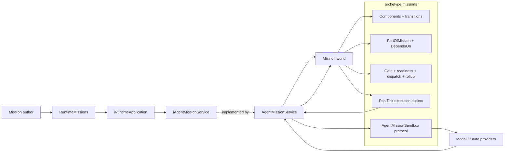
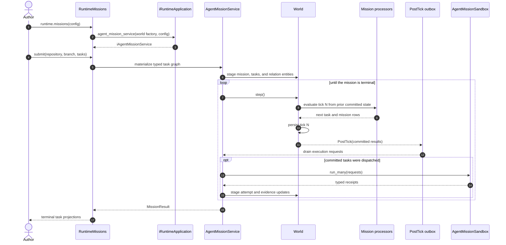

# Agent Missions V1

**Document type:** Normative V1 contract with measured dogfood evidence.

**Status:** Implemented and dogfooded. The explicit V1 gaps on this page are
not production guarantees.

Agent Missions turns a repository, a branch, an explicit task graph, and the
repository's own validators into a small software factory.

Archetype does not decide how an agent writes code. It decides **when work may
start, which evidence may advance it, and what state is committed at every
boundary**. The world is the state machine. Tasks and relationships are data.
Processors are the transition authority. A sandbox is an execution resource.

> **The V1 contract**
>
> Submit typed tasks and validators. Archetype persists the task graph,
> dispatches only committed work, retries failed validation with the prior
> evidence, and succeeds only when every task is accepted by the repository
> harness.

## 1. The contract in one view

| Primitive | Responsibility |
|---|---|
| World | Persists every mission, task, edge, attempt, and transition by tick. |
| Mission entity | Names the repository work and rolls related task state into one terminal result. |
| Task entity | Holds one atomic goal, validators, attempt and publication policy, current state, and latest evidence. |
| `DependsOn` edge | Says that the source task may run only after the target task was accepted. |
| `PartOfMission` edge | Relates a task to the mission whose result includes it. |
| Processors | Decide readiness, dispatch, acceptance, retry, exhaustion, and mission rollup. |
| Post-tick outbox | Converts a **committed** `dispatched` row into an execution request. |
| Sandbox resource | Runs the agent and validators, then returns typed observations. It never advances task state. |
| Validators | Define acceptance using the repository's executable harness. |
| Application service | Materializes the graph, crosses the post-commit I/O boundary, stages receipts, and returns projections. |
| Runtime handle | Gives mission authors one configured, batteries-included entry point. |

The important separation is simple:

```text
Archetype owns transition authority as data.
The sandbox owns isolated execution as a resource.
The repository harness owns acceptance.
```

Daft evaluates the world-state transforms and relationship joins. It does not
schedule a Modal sandbox or keep an agent process alive. External execution
begins only after the tick containing its intent has committed.

## 2. Public authoring surface

Configuration happens once, near the top of the script. Mission submission is
typed; authors do not construct ECS Components, wire processors, or pass a raw
JSON plan.

```python
import asyncio

from archetype import ArchetypeRuntime
from archetype.missions import AgentMissionConfig, AgentTask, CommandValidator
from archetype.missions.sandboxes import (
    ModalAgentMissionSandbox,
    ModalAgentSandboxConfig,
)


MISSION_CONFIG = AgentMissionConfig(
    sandbox=ModalAgentMissionSandbox(
        ModalAgentSandboxConfig(
            auth_volume_name="archetype-codex-auth",
            github_secret_name="archetype-github",
        )
    ),
    max_ticks=40,
)

TASKS = (
    AgentTask(
        name="regression",
        prompt="Add a deterministic regression test. Do not change production code.",
        validators=(
            CommandValidator(
                name="regression_is_red",
                command=("uv", "run", "pytest", "-q", "tests/app/test_bug.py"),
                expected_returncode=1,
            ),
        ),
    ),
    AgentTask(
        name="implementation",
        prompt="Make the regression pass with the smallest layer-correct fix.",
        validators=(
            CommandValidator(
                name="focused_contract",
                command=("uv", "run", "pytest", "-q", "tests/app/test_bug.py"),
            ),
            CommandValidator(
                name="architecture",
                command=("uv", "run", "python", "scripts/check_architecture.py"),
            ),
        ),
        depends_on=("regression",),
    ),
)


async def main() -> None:
    async with ArchetypeRuntime() as runtime:
        async with runtime.missions(
            "fix-bug",
            config=MISSION_CONFIG,
            storage=".context/agent-missions/data",
        ) as missions:
            submitted = await missions.submit(
                repository="VangelisTech/archetype",
                branch="agent/fix-bug",
                tasks=TASKS,
            )
            result = await missions.run(submitted)

    print(result.status)
    for task in result.tasks:
        print(task.name, task.status, task.attempts, task.commit_sha)


asyncio.run(main())
```

The complete live example is
[`examples/11_coding_agent_mission.py`](https://github.com/VangelisTech/archetype/blob/main/examples/11_coding_agent_mission.py).
Inspect its authored graph without creating external resources:

```bash
uv run --extra coding-agent python examples/11_coding_agent_mission.py --dry-run
```

### Submission contract

`missions.submit(...)` accepts a sequence of `AgentTask` values. V1 requires:

- a non-empty repository, branch, base ref, and task sequence;
- unique, non-empty task names;
- non-empty prompts;
- at least one validator per task;
- positive attempt budgets;
- the V1 `commit_and_push` repository publication policy;
- dependencies that name tasks in the same submission; and
- an acyclic dependency graph.

The task list is already the seam a planner will use. A future planner may take
one large task and emit many `AgentTask` values plus `DependsOn` relationships.
V1 deliberately does not include that planner.

## 3. Architecture and ownership



The top-level `archetype.missions` family owns reusable mission behavior:

- typed authoring and execution values;
- mission and task Components;
- relationship types;
- pure, DataFrame-first transition processors;
- the committed-intent outbox; and
- sandbox implementations that satisfy the family-owned resource protocol.

`archetype.app.missions.agent_service` owns the application composition:

- reserve entity identities;
- materialize mission, task, and edge entities;
- drive ticks;
- drain committed execution intents;
- invoke the injected sandbox resource;
- validate and stage typed receipts; and
- return a terminal mission projection.

The service does **not** decide readiness, acceptance, retry, or mission
success. Those decisions remain in processors so the persisted world explains
what happened and why.

### World topology is not sandbox topology

A world is the state machine for related entities. It is not a sandbox.
Nothing in the task graph requires one world per sandbox, one agent per world,
or one worktree per task.

The Modal V1 adapter chooses one persistent repository sandbox per mission,
serial task execution inside that mission, and parallel execution across
different missions. A future provider may map the same graph to many
sandboxes, many worktrees in one sandbox, or several agents in one worktree.
The transition contract does not change when the physical execution topology
changes.

## 4. Commit and transition protocol



The post-tick boundary is the safety property. A processor may produce a
`dispatched` row, but the sandbox does not see it until persistence succeeds
and `PostTick` receives the committed result. A failed tick cannot leak an
external coding-agent side effect.

### Task states

```mermaid
stateDiagram-v2
    [*] --> pending
    pending --> ready: every prerequisite accepted at N-1
    ready --> dispatched: create attempt intent
    dispatched --> accepted: accepted receipt
    dispatched --> ready: rejected or failed; budget remains
    dispatched --> failed: rejected or failed; budget exhausted
    accepted --> [*]
    failed --> [*]
```



The processor pipeline is ordered and batteries-included:

| Priority | Processor | Decision |
|---:|---|---|
| 10 | `TaskGateProcessor` | Consume one unsettled receipt: accept, retry, or exhaust. |
| 20 | `TaskReadinessProcessor` | Move a pending task to ready when no dependency blocks it. |
| 30 | `TaskDispatchProcessor` | Turn ready into a durable attempt intent. |
| 40 | `MissionRollupProcessor` | Succeed when all related tasks are accepted; fail when any task fails. |

Attempt state is separate from task state. An attempt moves from `idle` to
`pending`, then records `accepted`, `rejected`, or `failed`. The `settled` flag
prevents the gate from consuming the same receipt twice. Earlier attempt and
evidence values remain available in world history by tick.

`AgentTaskPolicy` persists both the retry budget and repository-publication
policy. V1 has one publication edge: `commit_and_push`. The outbox copies that
policy from committed graph state into every `TaskExecutionRequest`; it is not
an optional Modal configuration flag.

### Previous-tick relationship visibility

Readiness and mission rollup use `GraphView`, which exposes strictly
previous-tick frames. If task A becomes accepted in tick N, a dependent task B
may become ready no earlier than tick N+1. That one-tick causal gap is
intentional: downstream work never observes speculative or half-persisted
state.

Relations are entities, not a serialized cursor:

```text
DependsOn(source=B, target=A)      B waits for A
PartOfMission(source=A, target=M)  A contributes to M
```

Because edges are ordinary temporal entities, the world can later answer which
dependency existed at a tick, inherit the graph through a fork, and join task
state without decoding a `plan_json` blob.

## 5. Sandbox and validator protocol

The family-owned `AgentMissionSandbox` protocol has three operations:

```python
class AgentMissionSandbox(Protocol):
    async def run_many(
        self, requests: tuple[TaskExecutionRequest, ...]
    ) -> tuple[TaskExecutionReceipt, ...]: ...

    async def close_mission(self, mission_id: int) -> None: ...
    async def close(self) -> None: ...
```

`TaskExecutionRequest` is processor-authorized work. It contains the mission
and task identities, repository coordinates, prompt, validators, attempt
identity, publication policy, and prior session/evidence needed for a repair
turn.

`TaskExecutionReceipt` is an observation, not authority. It may report:

- accepted, rejected, or failed execution;
- every validator result;
- sandbox, worktree, and agent-session identities;
- commit and push evidence;
- artifact references; and
- structured friction or an error.

Before staging an accepted receipt, the application service requires matching
mission/task/attempt identity, one result for every requested validator,
matching validator commands, every result marked passed, and a non-empty
commit SHA. For V1's `commit_and_push` policy, it also requires pushed branch
evidence. The next tick's gate—not the sandbox—turns that evidence into an
accepted task.

### Repository validators are authority

A validator's expected return code is part of its contract. Success does not
always mean exit code zero. A regression task may require pytest to fail with
exit code `1`; that proves the test is red before an implementation task is
allowed to begin.

The Modal adapter:

1. lets the agent edit without committing, pushing, or opening a PR;
2. runs the authored validator commands itself;
3. compares each observed return code with `expected_returncode`;
4. commits and pushes only when every validator passes; and
5. preserves rejected work, session identity, and validator evidence for the
   next attempt.

This is the hill-climbing loop: improve the work, and when necessary improve
the validators or repository harness in an explicit predecessor task. The
model's claim that it is finished is never the gate.

### Modal V1 resource boundary

The included adapter keeps the Codex OAuth volume on a separate auth-broker
sandbox. It stages the credential into the mission sandbox only around the
agent invocation, persists a refreshed credential back through the broker, and
removes the mission copy. The GitHub secret is attached only to clone and push
commands.

Modal exposes process stdin as an open pipe. Codex waits for optional stdin
even when the full prompt is an argument, so the adapter explicitly sends EOF
before awaiting the process. That small provider invariant has a focused
regression test because omitting it leaves a sandbox alive without ever
starting an agent thread.

## 6. The first dogfood

V1 fixed [Archetype issue #543](https://github.com/VangelisTech/archetype/issues/543)
using the same repository and harness it was changing.

```text
regression  ──accepted before──▶  implementation
     │                                  │
     ├─ prove the new test is red       ├─ focused query/runtime contracts
     └─ change only the test file       ├─ architecture + lazy audits
                                        ├─ Ruff
                                        └─ diff integrity
```

The authored relationship is
`DependsOn(source=implementation, target=regression)`: the implementation task
waits for the regression task.

| Task | Result | Evidence |
|---|---|---|
| `regression` | Accepted on attempt 1 | Expected-red test and file-scope validator passed; commit `69938b485f45d1c1a5999f9744fee7f6e91e48e3`. |
| `implementation` | Rejected on attempt 1 | Focused tests, architecture, Ruff, and diff checks passed; the lazy audit correctly rejected a moved `.to_pylist()` allowlist location. |
| `implementation` | Accepted on attempt 2 | The same sandbox, worktree, and Codex session received the exact failed evidence, repaired the allowlist, and passed every gate; commit `63603e4efe93f884ad9d996912878def8b7963f2`. |
| Mission | Succeeded | Terminal rollup after 10 ticks; both accepted commits were pushed. |

The dogfood also improved its own harness before publication. The first
file-scope validator used `git diff --name-only HEAD`, which ignores untracked
files; it was replaced with a `git status --porcelain --untracked-files=all`
check. The first Modal invocation exposed the open-stdin invariant described
above. Both faults were stopped, reduced to explicit checks, and rerun rather
than explained away as agent behavior.

The resulting branch is
[`agent/dogfood-543-missions-v1c`](https://github.com/VangelisTech/archetype/tree/agent/dogfood-543-missions-v1c).

That run proves the V1 happy path, dependency ordering, expected-nonzero
validation, evidence-carrying retry, accepted-only commit/push, and terminal
sandbox teardown against a real repository. It does not prove crash recovery,
fleet coordination, or arbitrary provider behavior.

## 7. V1 boundary

### Included

- explicit typed task DAGs;
- temporal task and membership relationships;
- previous-tick readiness joins;
- processor-owned acceptance, retry, exhaustion, and rollup;
- post-commit sandbox dispatch;
- repository-authored validators, including expected nonzero results;
- graph-owned `commit_and_push` publication policy;
- same-worktree and same-session repair turns;
- typed attempt, evidence, artifact-reference, and friction state;
- a Modal/Codex resource; and
- terminal result projection and cleanup.

### Deliberately not included

- task decomposition or HTN planning;
- prefab-driven readiness;
- artifact ingestion or indexing;
- durable claims, leases, fences, or fleet recovery;
- PR creation, CI watching, review, merge, or deployment;
- parallel independent tasks inside one shared mission worktree;
- durable active-mission cancellation or cold resume;
- live attempt streaming; and
- a general relationship-to-sandbox placement scheduler.

V1 is intentionally smaller than the retained claim/fence/finalization stack.
That older internal subsystem is not called by `runtime.missions(...)` and is
not the public Agent Missions contract. Its current compatibility obligations
are isolated in the
[Legacy mission attempt kernel](legacy-mission-attempt-kernel.md) until the
repository cleanup removes or deliberately reuses them.

### Current hardening gaps

| Gap | Consequence | Intended direction |
|---|---|---|
| `RuntimeMissions` is async-only. | Mission authoring does not yet have the sync parity of ordinary world handles. | Add a sync wrapper over the same `iAgentMissionService` workflow without duplicating transition policy. |
| The post-tick outbox remembers dispatched attempt IDs in process memory. | An active mission has no cold-resume guarantee. | Persist an execution receipt/admission identity before claiming recovery. |
| A third-party sandbox reports `ValidatorResult.passed`. | The service matches commands and requires `passed`, but does not independently recompute it from the reported return code and requested expectation. | Recompute at the application boundary before accepting the receipt. |
| `PartOfMission` is not yet exclusive. | The intended one-mission-per-task membership is authoring convention, not a relation constraint. | Adopt the graph family's exclusive-edge constraint if the invariant remains correct. |
| Modal's default image installs the coding tools during image construction. | The provider environment is not yet a reviewed, fully pinned release inventory. | Pin and record the provider/toolchain image before general availability. |
| Interruption is not a durable terminal observation. | Cancelling a local runner can leave a nonterminal persisted mission. | Model cancellation and recovery as typed evidence and processor transitions. |

These gaps are cleanup inputs, not reasons to obscure the V1 mental model.

## 8. File and responsibility map

| File | Owns |
|---|---|
| `archetype/missions/contracts.py` | Typed authoring, request, receipt, sandbox protocol, configuration, and result values. |
| `archetype/missions/relationships.py` | `PartOfMission` and `DependsOn` edge types. |
| `archetype/missions/coding_agents/components.py` | Persisted mission/task/workspace/retry/publication/attempt/evidence schemas. |
| `archetype/missions/coding_agents/transitions.py` | Small persisted mission, task, and attempt vocabularies. |
| `archetype/missions/coding_agents/processors.py` | Gate, readiness, dispatch, and rollup authority. |
| `archetype/missions/coding_agents/resources.py` | Sandbox resource wrapper and committed-intent outbox. |
| `archetype/missions/sandboxes/modal.py` | Modal sandbox lifecycle, Codex execution, validation, commit, push, and teardown. |
| `archetype/app/missions/agent_service.py` | Graph materialization, tick/I/O composition, receipt validation, and result projection. |
| `archetype/runtime/missions.py` | Mission-author runtime handle and lifecycle. |
| `examples/11_coding_agent_mission.py` | Real typed dogfood script. |
| `tests/missions/test_agent_mission_contracts.py` | Authoring and graph contract oracles. |
| `tests/integration/test_agent_mission_service.py` | Dependency, retry, evidence, ordering, and terminal integration oracle. |
| `tests/missions/test_modal_agent_sandbox.py` | Provider-boundary regression, including stdin EOF. |

No author should need to import a Component, processor, `GraphView`, outbox, or
application service to run the built-in workflow.

## 9. Family direction after V1

Agent Missions establishes the convention for the broader repository cleanup:
reusable state and pure behavior live in a named family; the app layer only
composes durable authority and cross-family workflows.

```text
archetype.missions
├── coding_agents/     # implemented V1 state + transition package
├── sandboxes/         # family-owned execution resources
├── planning/          # HTN resolver; AgentTask/DependsOn adapter is future work
└── trajectories/      # typed evidence schemas, authoring values, pure transforms

archetype.app.missions
├── agent_service.py       # composition and durable workflow boundary
└── trajectory_service.py  # query/evaluation composition

archetype.app.artifacts
└── transcript_service.py  # redacted source claim + typed transcript rows

archetype.physical_ai      # physical state, policies, contracts, pure optimization
archetype.app.physical_ai  # world/simulation/evaluation workflow composition

archetype.research     # research ledger state and pure runner decoding
```

The completed ownership cleanup is:

| Former orphan | Final owner |
|---|---|
| Former `archetype.htn` | Moved to `archetype.missions.planning`; adapting solved plans into task entities and dependency relations remains future work. |
| Former `archetype.datasets` | Removed; retained evidence identity now lives in `archetype.evaluation.contracts`. |
| Former `archetype.experiments` | Removed. Claude parsing moved under mission trajectories; redacted ingestion moved under app artifacts; physical and research code moved to their named families. |
| Trajectory helpers | Moved under `archetype.missions.trajectories`; the app service composes query and evaluation without owning evidence or transitions. |
| Physical-AI prototypes | State and pure behavior moved into `archetype.physical_ai`; rollout/evaluation composition moved behind `archetype.app.physical_ai` and the supported runtime. |
| Research ledger state | Moved into `archetype.research`; `archetype.app.research` retains world/simulation orchestration. |
| Former `archetype.contrib` observability shim | Removed; retained vendor-neutral vocabulary lives in `archetype._obs`. |

These ownership moves are complete. They do not change the V1 transition
protocol: transcript evidence, physical evaluation, research workflows, and
planning helpers remain consumers or siblings of mission transition authority,
not hidden branches inside its processors.

## 10. Verification

The credential-free contract lane is:

```bash
uv run pytest -q \
  tests/missions/test_agent_mission_contracts.py \
  tests/missions/test_modal_agent_sandbox.py \
  tests/integration/test_agent_mission_service.py

uv run --extra coding-agent python examples/11_coding_agent_mission.py --dry-run
uv run python scripts/check_architecture.py
uv run python scripts/check_lazy_audit.py
```

The live Modal example is paid and credentialed, so it remains an explicit
dogfood operation rather than an ordinary CI test.

## Companion contracts

- [Runtime](runtime.md)
- [Application Architecture](application-architecture.md)
- [Service Protocols](service-protocols.md)
- [Repository Harness](repository-harness.md)
- [Graph system design](../design/graph-system.md)
