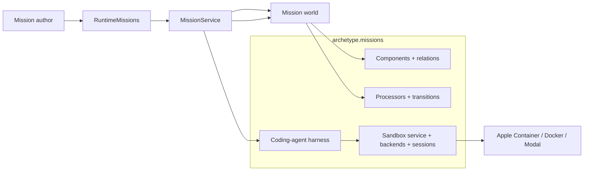
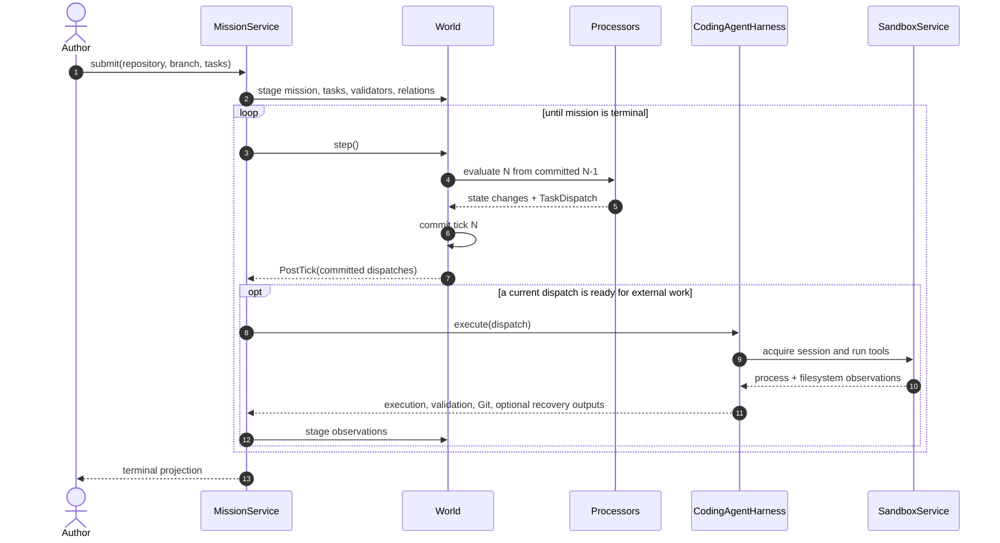
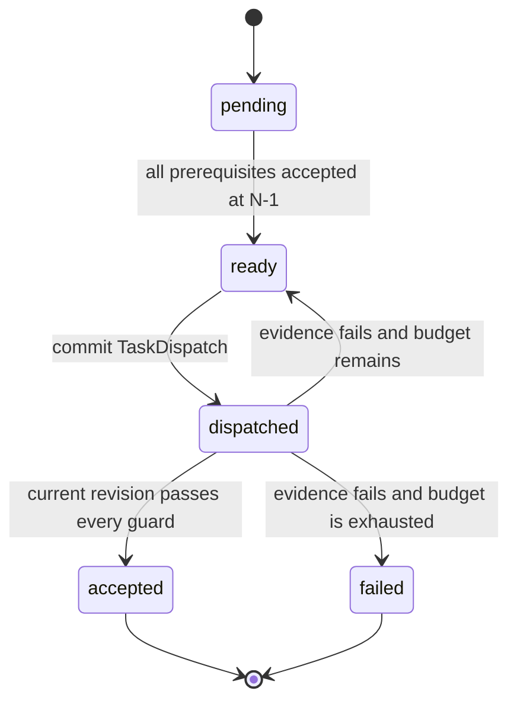

# Agent Missions V1

**Document type:** Normative V1 contract.

**Status:** Implemented.

Agent Missions is Archetype's first software factory. An author submits a
repository, a branch, and a graph of coding tasks guarded by the repository's
own validators. Archetype records the graph, commits every decision as world
state, and advances work only when current evidence permits the transition.

Archetype does not own how an agent writes code. It owns **when work may
start, which observations may advance it, and why every transition occurred**.

> **The V1 contract**
>
> Tasks and validators are entities. Dependencies are relations. Processors
> are the transition authority. A dispatch is committed intent. Agent and
> sandbox activity are observations. Only validator results bound to the
> current dispatch and repository revision can accept a task.

## 1. The contract in one view

| Primitive | Responsibility |
|---|---|
| World | The durable state machine for missions, tasks, relations, dispatches, executions, and outputs. |
| Mission | Names one repository objective and rolls its task graph into one result. |
| Task | Holds one atomic goal, workflow state, retry policy, and repository coordinates. |
| Validator | Describes one executable acceptance check; `Guards` relates it to a task. |
| Relations | Express membership, dependencies, execution placement, and provenance without serialized plans. |
| Processors | Decide readiness, dispatch, retry, failure, acceptance, and mission rollup. |
| `TaskDispatch` | Records committed permission to perform a particular task revision. It is intent, not an attempt object. |
| `AgentExecution` | Records what an agent process did for a dispatch. It never says whether the task was accepted. |
| Sandbox | Records the lifecycle of an isolated filesystem and process container. It never says whether the task was accepted. |
| Outputs | Record validator results, commits, checkpoints, manifests, friction, and published artifacts. |
| Sandbox service | Owns backend selection and live session lifetime; it has no workflow authority. |
| Application service | Materializes the graph, crosses committed I/O boundaries, stages observations, and returns projections. |

The governing separation is:

```text
Archetype owns transitions as data.
The sandbox owns isolated filesystem and process capabilities.
The agent execution records what happened.
The repository harness owns acceptance.
```

Daft evaluates state transforms and joins. It does not keep an agent process
alive or schedule a provider sandbox. External work begins only after the tick
containing its dispatch has committed.

## 2. Public authoring surface

Configuration happens once. Authors submit typed values; they do not construct
Components, wire processors, manage `GraphView`, or serialize a plan.

```python
import asyncio

from archetype import ArchetypeRuntime
from archetype.missions import AgentMissionConfig, AgentTask, CommandValidator
from archetype.missions.sandboxes import AppleContainerSandboxBackend


backend = AppleContainerSandboxBackend()
MISSION_CONFIG = AgentMissionConfig(
    sandbox_backend=backend,
    sandbox_environment=backend.environment,
    max_ticks=40,
)

TASKS = (
    AgentTask(
        name="regression",
        prompt="Add a deterministic regression test. Do not change production code.",
        validators=(
            CommandValidator(
                name="regression_is_red",
                command=("uv", "run", "pytest", "-q", "tests/app/test_bug.py"),
                expected_returncode=1,
            ),
        ),
    ),
    AgentTask(
        name="implementation",
        prompt="Make the regression pass with the smallest layer-correct fix.",
        validators=(
            CommandValidator(
                name="focused_contract",
                command=("uv", "run", "pytest", "-q", "tests/app/test_bug.py"),
            ),
            CommandValidator(
                name="architecture",
                command=("uv", "run", "python", "scripts/check_architecture.py"),
            ),
        ),
        depends_on=("regression",),
    ),
)


async def main() -> None:
    async with ArchetypeRuntime() as runtime:
        async with runtime.missions(
            "fix-bug",
            config=MISSION_CONFIG,
            storage=".context/agent-missions/data",
        ) as missions:
            mission = await missions.submit(
                repository="VangelisTech/archetype",
                branch="agent/fix-bug",
                tasks=TASKS,
            )
            result = await missions.run(mission)

    print(result.status)
    for task in result.tasks:
        print(task.name, task.status, task.dispatches, task.commit_shas)


asyncio.run(main())
```

Initialize the selected backend's Codex subscription volume once before the
first live run with `await backend.login_codex()`. This device login is not an
OpenAI API key and cannot implicitly reuse the credential of the Codex process
running on the host. The complete backend-selectable setup, including Modal
attach monitoring, is executable in
[`examples/11_coding_agent_mission.py`](https://github.com/VangelisTech/archetype/blob/main/examples/11_coding_agent_mission.py).

`CommandValidator` and `AgentTask` are authoring values. Submission compiles
them into Validator and Task entities plus relations. The convenient surface
does not turn validator definitions or task dependencies back into JSON blobs.

### Submission contract

`missions.submit(...)` accepts `list[AgentTask]` or any finite sequence of
tasks. V1 requires:

- non-empty repository, branch, base ref, and task sequence;
- unique, non-empty task and validator names;
- non-empty prompts and at least one validator per task;
- positive dispatch budgets;
- dependencies that name tasks in the same submission;
- an acyclic dependency graph; and
- a pinned sandbox environment plus an explicit publication policy.

The sequence is already the planner seam. A later planner may take one large
task and emit many tasks and relationships. Task decomposition is not part of
V1.

## 3. Architecture and ownership



`archetype.missions` owns the reusable family:

- mission, task, validator, sandbox, execution, and output Components;
- relations and pure DataFrame transition logic;
- built-in processors and projections;
- coding-agent protocols and harness behavior;
- sandbox Service, Backend, and Session contracts; and
- capability-scoped provider adapters such as Modal.

`archetype.app.missions` owns application composition:

- reserve identities and materialize submitted graphs;
- configure a world with the built-in mission behavior;
- step the state machine;
- cross the post-commit boundary and invoke the coding-agent harness;
- stage factual observations through the mutation path;
- compose mission trajectory reads and evaluation through a separate app service; and
- return supported mission projections.

The application service does not decide readiness, retry, acceptance, or
mission success. Those decisions remain visible in processors and persisted
state.

### World topology is not sandbox topology

A world is a state machine, not a sandbox. The same contract permits one world
with many sandboxes, many worktrees in one sandbox, several agents in separate
worktrees, or cooperating agents in one worktree. Placement policy may change
without changing task readiness.

V1 may choose one persistent repository session per mission and serialize
tasks that share its worktree. That is a provider policy, not an ECS invariant.

## 4. State and transition protocol



The PostTick boundary is a safety property: no sandbox sees speculative work.
If tick persistence fails, its dispatch cannot leak an external side effect.

### Task state



The built-in pipeline has four concerns:

| Order | Processor | Authority |
|---:|---|---|
| 10 | Task decision | Consume observations for the current dispatch and accept, retry, or exhaust. |
| 20 | Task readiness | Make a task ready only when every prerequisite was accepted in the previous committed tick. |
| 30 | Task dispatch | Convert ready state into one durable dispatch identity. |
| 40 | Mission rollup | Succeed only when every member task is accepted; fail when a member task is terminally failed. |

There is no durable `Attempt` aggregate. Retrying produces a new
`TaskDispatch`; history preserves every prior dispatch and observation.

### Intent, observation, decision

These concepts never collapse into one status field:

| Kind | Examples | May decide task state? |
|---|---|---:|
| Intent | `TaskDispatch` | No |
| Runtime observation | `Sandbox`, `AgentExecution` | No |
| Work output | `ValidationResult`, `Commit`, `FrictionLog`; reusable checkpoint, manifest, and artifact-reference Components | No |
| Decision | `TaskState` written by the task decision processor | Yes |

`TaskDispatch` identifies the committed dispatch and sequence. Together with
the task's workspace and policy Components, it projects the requested
repository base and publication policy. `AgentExecution` records process lifecycle such as
`starting`, `running`, `exited`, `errored`, or `interrupted`.

Sandbox lifecycle is separate: `provisioning`, `ready`, `errored`,
`interrupted`, or `closed`. A sandbox is never `accepted`, `rejected`, or
`completed`; it is a container that may host zero or many executions.

### Relations and previous-tick visibility

At minimum, V1 materializes:

```text
PartOfMission(source=task, target=mission)
DependsOn(source=task, target=prerequisite)
Guards(source=validator, target=task)
Executes(source=execution, target=task)
RunsIn(source=execution, target=sandbox)
ProducedBy(source=output, target=execution)
```

Readiness and rollup use `GraphView`, which is strictly previous-tick. If task
A is accepted at N, dependent task B may become ready no earlier than N+1.
Edges are temporal entities, so dependency, provenance, and fork inheritance
remain queryable without decoding a plan blob.

## 5. Sandbox and validator protocol

The sandbox vocabulary describes a resource, not a workflow:

```python
class SandboxBackend(Protocol):
    async def create(self, spec: SandboxSpec) -> SandboxSession: ...
    async def restore(
        self, spec: SandboxSpec, checkpoint: CheckpointRef
    ) -> SandboxSession: ...


class SandboxSession(Protocol):
    @property
    def identity(self) -> SandboxIdentity: ...

    @property
    def capabilities(self) -> SandboxCapabilities: ...

    async def status(self) -> SandboxStatus: ...
    async def exec(self, request: ProcessRequest) -> ProcessResult: ...
    async def checkpoint(self) -> CheckpointRef: ...
    async def close(self) -> None: ...


class SandboxService:
    async def acquire(self, key: SandboxKey, spec: SandboxSpec) -> SandboxSession: ...
    async def restore(
        self, key: SandboxKey, spec: SandboxSpec, checkpoint: CheckpointRef
    ) -> SandboxSession: ...
    async def close(self, key: SandboxKey) -> None: ...
    async def shutdown(self) -> None: ...
```

- Backend creates or restores provider resources.
- Session is the live handle for process and snapshot capabilities.
- Service selects a backend, reuses sessions according to policy, and owns
  shutdown.

Execution and checkpoint capabilities require a `READY` session. An
`ERRORED` or `INTERRUPTED` handle cannot run more work or capture another
checkpoint. The service keeps it registered until teardown succeeds: a later
acquisition may close and replace it, while a teardown failure retains the
handle for explicit restore or close retry instead of silently evicting a
possibly live provider resource. Close is single-flight per sandbox key and
continues if its caller is cancelled; concurrent acquisition waits for that
teardown and never receives the closing handle. A provider session returned
while shutdown is winning the race remains cleanup-owned until close succeeds,
and failed shutdown cleanup is reported and retryable. The runtime mission
handle becomes closed only after that cleanup and durable reconciliation
succeed, so a failed public `close()` can be retried while its mission world is
still available. If runtime-owned cleanup fails, public runtime admission stays
closed and a later serialized `runtime.shutdown()` retries the retained mission
before world handles or shared services are finalized. The runtime keeps a
strong ownership reference to that handle until cleanup succeeds, so dropping
the caller's reference cannot discard a still-live provider resource. Public
and runtime-owned close calls are single-flight on the handle; a public close
already in progress retains cleanup authority for its exact mission world while
runtime shutdown waits. That authority cannot admit operations against a
sibling world on the same runtime.

Durable lifecycle evidence follows physical ownership. A failed terminal close
projects the retained session's non-ready status and a `sandbox_teardown`
friction before the error returns. Once replacement or cleanup has closed a
sandbox, staging an earlier same-tick execution cannot move its durable status
backward from `closed`.

The coding-agent harness works through `SandboxSession`. It owns clone and
branch preparation, agent invocation, validator execution, Git publication,
and translation into factual Components. Provider adapters do not know task
state and do not return an acceptance verdict.

Checkpointing is optional resumability. A checkpoint is a lightweight,
provider-native reference to the session-owned writable filesystem, excluding
external and credential mounts. A filesystem manifest is a content-addressed,
queryable observation of selected state. Neither is required to accept a task.
After every dispatch, the application first persists execution, validation,
and commit evidence and commits the task decision. Only then does it ask a
checkpoint-capable session for a bounded, best-effort snapshot and record
either its reference or a `FrictionLog`. A slow or failed snapshot cannot delay
or change the valid task decision, and rejected work is still checkpointed.

Restore is deliberately explicit in V1:

```python
identity = await missions.restore_sandbox(submitted, checkpoint_ref)
result = await missions.run(submitted)
```

There is no background supervisor, fleet discovery, mission-attempt claim,
lease, fence, settlement, or automatic retry daemon. Explicit restore closes
and replaces any retained live session for that already-known mission; it never
silently ignores the supplied checkpoint. The reference must match provider,
environment, mission owner, locality, and expiry. The ordinary committed task
graph remains workflow authority. This is sandbox replacement, not a promise
of process-restart mission continuation.

### Supported sandbox backends

| Backend | Role | Checkpoint / restore | Authentication |
|---|---|---|---|
| Apple Container | Preferred macOS operational adapter by current operator policy; VM-grade isolation through the host `container` CLI. | Stops, exports the session root filesystem to an atomic content-addressed host-local archive, restarts in `finally`, verifies integrity, and rebuilds a restore image. | Dedicated Apple Container volume and broker VM. |
| Docker | Linux and CI reference adapter; never selected implicitly on macOS. | `docker commit`, followed by immutable image-ID inspection and same-provider restore. | Optional dedicated Docker volume and broker container. |
| Modal | Remote paid adapter. | Modal `snapshot_filesystem`, retained with recorded environment lineage and bounded TTL, and restore by exact `im-...` image ID. Expiration may also surface from Modal while resolving the image. | Dedicated Modal Volume and broker sandbox. |

Apple Container and Docker share one digest-pinned Linux base recipe. The
Codex tarball is fetched from the version inventory, verified against its
SHA-512 integrity value, and then installed. Startup fails closed unless the
running user, home, parent workdir, Codex version, and recipe digest match the
declared environment. Modal's generated image performs the same package check
and runtime attestation; a configured Modal image is selected only by its
provider-issued immutable `im-...` ID. The local adapters do not share host
directories with mission containers.
OAuth credentials are staged only around the Codex process, persisted back to
the broker, and removed before validators and checkpoints. GitHub credentials
are symbolic process capabilities exposed only to the push command; secret
values are never placed in provider command arguments.

Modal additionally records heartbeat, event, stdout, and stderr files under
the session-owned `/tmp/archetype-agent-missions/live/` spool, outside the
target repository. `on_sandbox_event` receives bounded `SandboxEvent` values
and exposes the provider identity as soon as acquisition completes, while
`ModalSandboxSession.monitor("sb-...")` can attach from another process with
byte-offset reads and bounded disconnect recovery. Each successfully captured
agent invocation is also copied to an execution-scoped spool path; only that
per-call success returns the exact `trace_uri` persisted on `AgentExecution`;
static live-output capability alone never proves a trace exists. A failed
best-effort trace setup leaves the URI empty instead of advertising a missing
or stale file. Raw trace URIs are ephemeral operational evidence: checkpoint
sanitization or teardown can make them unavailable, and snapshots remove both
current and execution-scoped raw output. The authoritative ECS copy of execution
and validator output is bounded and redacted before persistence.
Provider-native snapshots are recovery objects, not portable or sanitized
artifact bundles. The consolidated `ArtifactService` accepts explicit file
sources, but V1 intentionally does not crawl or publish arbitrary sandbox
outputs as hidden mission post-processing. A later provider-export handoff may
select declared files, sanitize or copy them into a valid `ArtifactSource`,
invoke `ArtifactService`, and only then stage `FilesystemManifest` or
`AgentArtifact` provenance. Provider checkpoints and live spools remain
operational recovery objects until that explicit handoff occurs.

### Repository validators are authority

Submission materializes each `CommandValidator` as an entity related to its
task. Every execution emits one `ValidationResult` per guard containing:

- validator, task, dispatch, execution, and repository-revision identity;
- the expected and observed return codes;
- bounded stdout and stderr observations.

`passed` is derived from `actual_returncode == expected_returncode`. It is
never trusted from a sandbox or agent response. Expected nonzero codes are
valid—for example, a predecessor can prove a regression test is red.

The task decision processor accepts only when all guards have a result for the
**current dispatch and exact final repository revision**. Evidence from a
prior dispatch or pre-repair tree is stale by construction.

Every validator process receives the harness-reserved
`ARCHETYPE_TASK_BASE_REVISION` environment variable. The harness resolves it
from `HEAD` immediately before the task's first agent turn and preserves that
same SHA across retries. This lets repository policy inspect the complete task
delta even when the agent created commits before validation. The variable is
context, not authority: acceptance still requires revision-bound validator and
publication evidence.

### Git and publication

Git is part of the coding contract:

1. the harness records the task's starting revision and preserves it across retries;
2. the agent may create commits during its work;
3. validators run against the final working tree;
4. if validated work remains dirty, the publisher creates one final commit;
5. every commit created during the dispatch is recorded; and
6. the configured branch policy publishes the validated final revision.

The publisher never resets valid agent-authored commits merely to manufacture
one synthetic result. Acceptance binds validation and publication evidence to
the same final revision.

### Friction and artifacts

`FrictionLog` is one timestamped observation entity, not an append-only JSON
field. It may reference a task, dispatch, execution, validator, path, or commit
so later analysis can group failure modes across sessions.

Large outputs use content-addressed artifact references: digest, media type,
size, and a storage hint. The mission application service may compose the
Artifacts family to persist or ingest them; the sandbox protocol does not
become a storage system.

## 6. Prefabs and planning

V1 submission directly materializes tasks, validators, and relations. That is
enough for correct execution order and remains the simplest dogfood surface.

A later mission prefab may author the same graph. Prefab instantiation does not
decide readiness or replace the processors. Registration code installs
Components and behavior; durable prefab library data describes the graph.
Manifests may declare allowlisted behavior-module requirements but never
auto-import executable code.

A planner will have the same output boundary: `list[AgentTask]` plus
relationships. HTN decomposition is useful, but is not a V1 correctness gate.

## 7. V1 boundary

### Included

- explicit task and validator entities;
- temporal membership, dependency, guard, placement, and provenance relations;
- previous-tick readiness joins;
- processor-owned acceptance, retry, exhaustion, and rollup;
- post-commit dispatch;
- separate sandbox and agent-process lifecycle;
- repository validators with expected nonzero support;
- revision-bound validation and Git publication evidence;
- first-class commits, friction, and post-decision checkpoint evidence plus
  reusable manifest and artifact-reference schemas;
- Apple Container, Docker, and Modal backends with checkpoint/restore parity;
- immediate sandbox identity observation and direct Modal live monitoring;
- best-effort post-dispatch checkpoint evidence plus explicit restore; and
- terminal result projection and cleanup.

### Deliberately not included

- task decomposition or HTN planning;
- prefab-driven readiness;
- claims, leases, fences, receipts, or a mission-specific control catalog;
- a second sandbox workflow kernel;
- an `Attempt` aggregate;
- PR creation, CI watching, review, merge, or deployment;
- a general relationship-to-sandbox placement scheduler; and
- a requirement that checkpoints or manifests gate acceptance.

The retired claim/fence/finalization subsystem is not a compatibility layer for
this contract. Cleanup stops creating or consuming its tables and routes while
leaving existing persisted tables inert; deleting historical operator data is
a separate, explicit migration decision.

### Current hardening gaps

| Gap | V1 treatment | Later seam |
|---|---|---|
| Cold process resume | Authors may explicitly replace a sandbox from a recorded checkpoint inside an already-known mission; no process-restart reconciliation, fleet claim, or automatic supervisor is implied. | Specify interrupted-dispatch reconciliation before exposing cold mission continuation. |
| Sandbox placement | Use a simple configured policy. | Add a scheduler only when multiple topologies require one. |
| Task decomposition | Authors submit the graph. | Planner emits the same typed graph. |
| Terminal interaction | `exec` is the required capability. | Add optional PTY/tmux/ttyd capabilities without widening workflow authority. |
| Trace/artifact ingestion | Keep bounded redacted tails in ECS. Use the consolidated `ArtifactService` explicitly for caller-selected file sources; do not auto-emit `AgentArtifact` or `FilesystemManifest` from sandbox contents. | Add a provider-export adapter that selects declared files, sanitizes them, ingests them, and stages provenance as one explicit application workflow. |
| Snapshot sanitization | Credentials are removed before capture; provider snapshots remain trusted recovery objects rather than published artifacts. | Quarantine/scan before any cross-provider or R2 publication. |
| Prefab mission libraries | Direct materialization remains authoritative. | Author reusable graphs after generic prefab registry contracts settle. |

## 8. File and responsibility map

The implementation follows this layout:

| File | Owns |
|---|---|
| `archetype/missions/contracts.py` | Supported authoring, configuration, and result values. |
| `archetype/missions/components.py` | Mission, task, validator, dispatch, sandbox, execution, and output Components. |
| `archetype/missions/relations.py` | Membership, dependency, guard, placement, and provenance Relations. |
| `archetype/missions/transitions.py` | Small persisted status vocabularies and transition tables. |
| `archetype/missions/processors.py` | Task decision, readiness, dispatch, and mission rollup authority. |
| `archetype/missions/projections.py` | Supported mission/task/execution result projections. |
| `archetype/missions/coding_agents/contracts.py` | Coding-agent request and driver protocols. |
| `archetype/missions/coding_agents/harness.py` | Repository preparation, agent invocation, validation, Git publication, and observation translation. |
| `archetype/missions/sandboxes/contracts.py` | Sandbox Backend, Session, process, status, and snapshot value contracts. |
| `archetype/missions/sandboxes/service.py` | Backend registry and live-session lifetime. |
| `archetype/missions/sandboxes/apple_container.py` | Operational macOS backend and atomic root-filesystem archive restore. |
| `archetype/missions/sandboxes/docker.py` | Linux/CI reference backend and immutable image restore. |
| `archetype/missions/sandboxes/modal.py` | Remote backend, device login, snapshots, and direct live monitor. |
| `archetype/app/missions/service.py` | Graph materialization, tick/I/O composition, cross-family workflows, and projections. |
| `archetype/runtime/missions.py` | Mission-author runtime handle and lifecycle. |
| `examples/11_coding_agent_mission.py` | Real typed dogfood script. |
| `tests/missions/` | Family contract, transition, sandbox, harness, and provider oracles. |
| `tests/integration/test_agent_mission_service.py` | End-to-end graph, retry, revision binding, and cleanup oracle. |

No author imports a Component, processor, `GraphView`, application service, or
provider SDK to run the built-in workflow.

## 9. Family direction after V1

Agent Missions establishes the repository convention: reusable state, pure
behavior, and capability-scoped resources live in the named family; the app
layer owns durable application authority and cross-family composition.

```text
archetype.missions
├── components.py
├── relations.py
├── transitions.py
├── processors.py
├── projections.py
├── coding_agents/
├── sandboxes/
├── planning/
└── trajectories/

archetype.app.missions
└── service.py
```

The orphan cleanup follows the same rule:

| Capability | Owner |
|---|---|
| Planning / former HTN | `archetype.missions.planning` |
| Mission trajectories | `archetype.missions.trajectories` with app query/evaluation composition |
| Artifact and transcript ingestion | `archetype.app.artifacts` consuming family-owned value contracts |
| Physical-AI state and behavior | `archetype.physical_ai` |
| Physical-AI workflows | `archetype.app.physical_ai` |
| Research state and pure decoding | `archetype.research` |
| Research workflows | `archetype.app.research` |
| Vendor-neutral observability vocabulary | `archetype._obs` |

Datasets, Experiments, Contrib, and a production RTS vocabulary are not
families. The Biome prefab remains an example; its reusable pattern belongs in
generic prefab machinery.

## 10. Verification

The credential-free contract lane must prove:

- graph materialization and cycle rejection;
- previous-tick dependency ordering;
- post-commit-only dispatch;
- retry with a new dispatch identity;
- stale-revision evidence rejection;
- expected-nonzero validator derivation;
- agent-authored and publisher-authored commit preservation;
- validators running after a nonzero agent exit when repository evidence exists;
- tracked, untracked, and `.context` filesystem state across checkpoint/restore;
- sandbox/agent/task lifecycle separation;
- terminal cleanup; and
- example dry-run execution.

The dedicated Docker parity lane builds the shared image and proves real
session-filesystem checkpoint/restore only when the dogfood example changes or
an operator dispatches it manually; it is not part of ordinary CI. The live
Modal dogfood must additionally prove real
repository preparation, agent execution, direct monitoring, validation,
commit/push publication, checkpoint/restore, and teardown. Modal is paid and
credentialed, so it remains an explicit operation rather than ordinary CI.

## Companion contracts

- [Runtime](runtime.md)
- [Application Architecture](application-architecture.md)
- [Service Protocols](service-protocols.md)
- [Repository Harness](repository-harness.md)
- [Prefab Libraries](prefab-libraries.md)
- [Graph system design](../design/graph-system.md)
