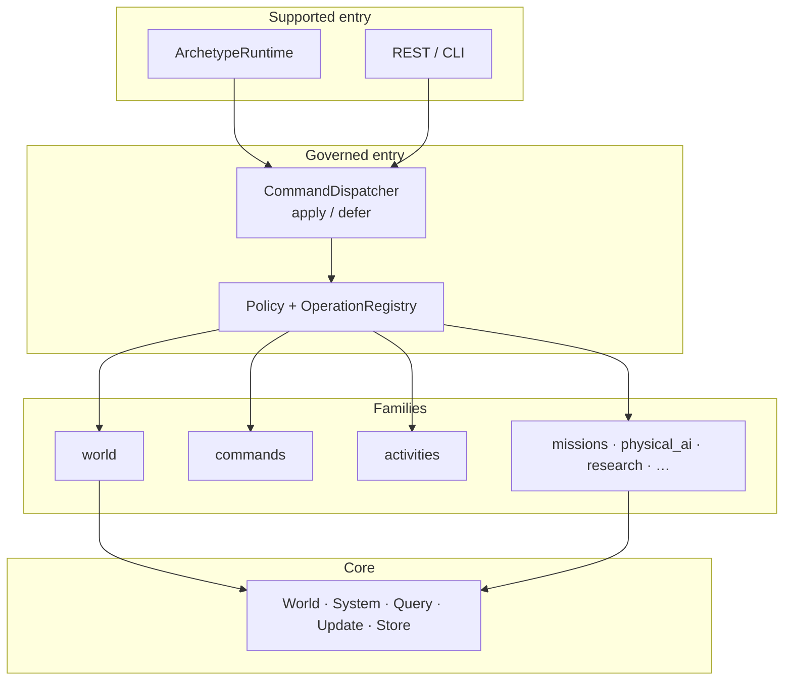
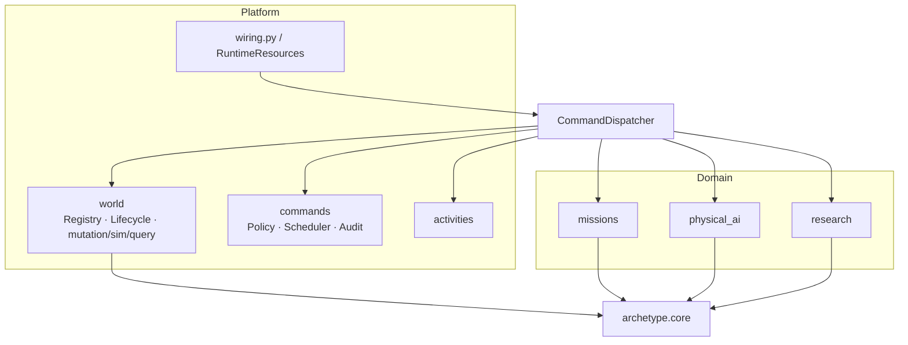
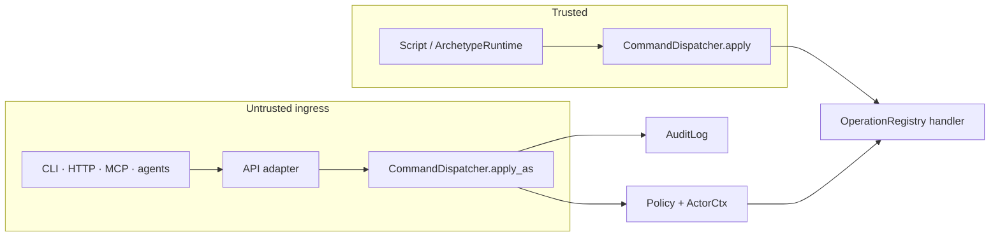
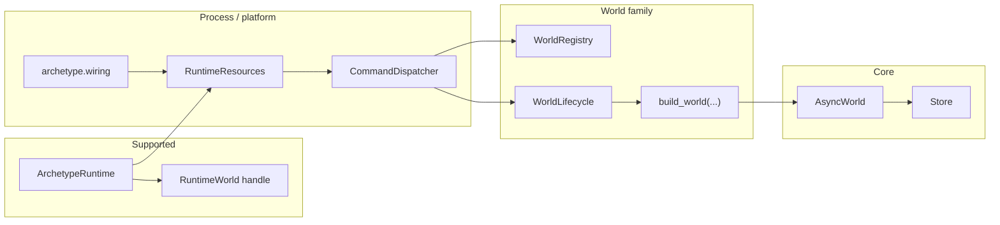
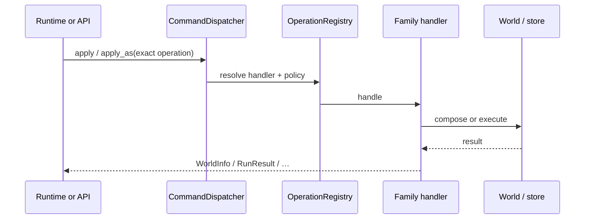
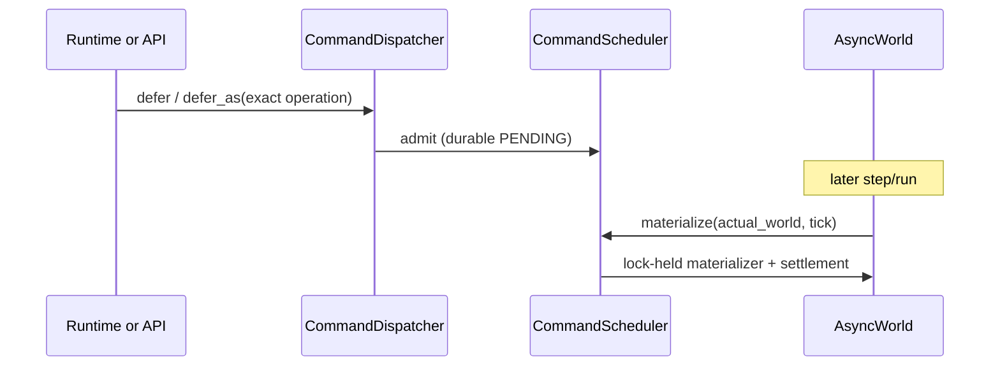
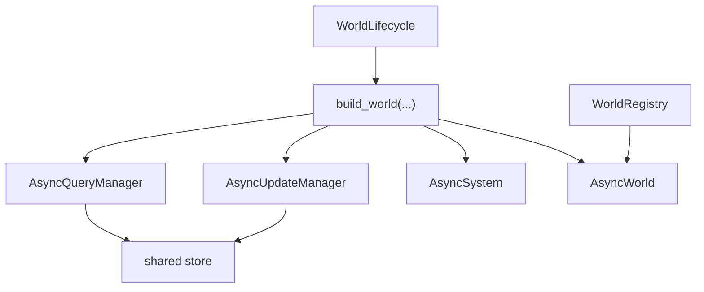

# Application Layer

## Purpose and Scope

The application layer composes workflows over the [core engine](core-architecture.md)
and the storage/world families. The commands family owns exact governed entry,
durable scheduling, policy, and audit projection. Domain families
(missions, physical AI, research, …) own their components, processors, and
workflows. The API layer exposes actor-aware dispatcher entry over HTTP.

This page is the **map of that layer**. Normative ownership and dependency
rules live in [Application Architecture](application-architecture.md). Active
ports live in [Service Protocols](service-protocols.md). Concrete services and
process wiring are internal.



Core does not know about actors, roles, HTTP, or multi-tenant policy. Those
concerns start at the dispatcher and the families above core.

## Key Capabilities

| Capability | What the layer adds |
|---|---|
| **Runtime facade** | `ArchetypeRuntime` / world handles over process-owned `RuntimeResources` |
| **Exact operations** | Registered models via `CommandDispatcher.apply` / `apply_as` |
| **Deferred work** | `defer` / `defer_as` → scheduler → tick materialization |
| **Activities** | Between-tick durable work admitted from one committed tick, observed on a later one |
| **World lifecycle** | Registry, lifecycle, fork/resume/close through `archetype.world` |
| **Product families** | Missions, physical AI, autoresearch, artifacts, evaluation, … |

## System architecture

### Families around the dispatcher



`CommandDispatcher` owns no domain meaning. Each exact operation routes to the
family handler that owns it. Families talk to core through world/storage ports
— they do not reimplement ECS.

## Trust boundary



| Path | Authorization | Entry |
|---|---|---|
| Local script | Trusted — no `ActorCtx` | `ArchetypeRuntime` → `apply(exact operation)` |
| Server | Roles on actor-aware entry | API → `apply_as(ctx, exact operation)` |

The dispatcher authorizes (when actor-aware) and records bounded access
evidence. It does not implement domain workflows. See
[Command Gate](command-gate.md).

## Code entity mapping



Applications do not assemble process wiring or call concrete family services.
Repository tests and composition modules may, because those are internal seams.

## Request and tick paths

### Direct operation



### Tick-deferred command



### Activity (between ticks)

```mermaid
sequenceDiagram
    participant T as Tick T
    participant Act as Activity
    participant U as Tick U

    T->>T: commit intent / receipt
    T->>Act: admit durable work
    Act->>Act: execute or reconcile outside world lock
    Act->>U: stage factual observation + result ref
    U->>U: commit facts; processors decide meaning
```

Details: [Data flow](data-flow.md) · [Activities](activities.md) ·
[Durable commands](durable-commands.md).

## World family boundary

`archetype.world` owns managed world state and behavior.

- `WorldRegistry` — live identities, storage coordinates, exact-world locks,
  close leases, unacknowledged post-commit receipts
- `WorldLifecycle` — create, discover, cold-open, mutable resume, fork,
  retryable close
- Module-level mutation, simulation, query, and handler functions — stateless
  family behavior over those owners

`build_world(...)` is the single module-level construction seam into core. It
wires the shared store, query/update managers, system, resources, hooks,
construction-injected command materializer, and optional required projector.



The factory constructs. The core executes.

## Family posters

Higher-level modules deserve the same diagram-first treatment as the core.
Start here:

| Family | Poster |
|---|---|
| Activities | [Activities](activities.md) |
| Agent Missions | [Agent Missions](agent-missions.md) |
| Physical AI | [Physical AI](physical-ai.md) |
| AutoResearch | [AutoResearch](autoresearch.md) |
| Trajectories | [Trajectories](trajectories.md) |
| Prefab libraries | [Prefab Libraries](prefab-libraries.md) |
| Access control | [Command Gate](command-gate.md) |
| HTTP hosting | [API Layer](api-layer.md) |

## Creating a world

```text
Runtime handle or authorized API
  -> construct CreateWorld(...)
  -> CommandDispatcher.apply / apply_as
  -> WorldLifecycle / build_world
  -> WorldRegistry.insert
  -> WorldInfo
```

Runtime activation then stages processors, resources, and hooks through their
registered operations.

## Source reference

- World state and behavior: `packages/archetype-ecs/src/archetype/world/`
- Process composition: `packages/archetype-ecs/src/archetype/wiring.py`
- Process lifetime: `packages/archetype-ecs/src/archetype/runtime_resources.py`
- Governed entry, scheduler, policy, and audit: `packages/archetype-ecs/src/archetype/commands/`
- Generic between-tick delivery: `packages/archetype-ecs/src/archetype/activities/`
- Agent Mission workflow authority: `packages/archetype-missions/src/archetype/missions/`
- Physical-AI models, state, views, and handlers: `packages/archetype-physical-ai/src/archetype/physical_ai/`
- Family protocols: `packages/archetype-ecs/src/archetype/<family>/interfaces.py` or another focused family module
- World ports: `packages/archetype-ecs/src/archetype/world/interfaces.py`
- Storage port: `packages/archetype-ecs/src/archetype/storage/interfaces.py`
- Core interfaces: `packages/archetype-ecs/src/archetype/core/interfaces.py`

The framework wheel is complete without a domain library. Agent Missions,
Physical AI, and Research are separate distributions installed through their
private trusted extension adapters; ordinary domain modules do not gain
framework composition authority.

## Next steps

- [Core architecture](core-architecture.md) — engine boxes under this layer
- [Architecture Overview](architecture.md) — mental model, Activities, authority
- [Application Architecture](application-architecture.md) — normative rules
- [World Libraries](world-libraries.md) — distribution and installation contract
- [Agent Missions](agent-missions.md) — software-factory family poster
