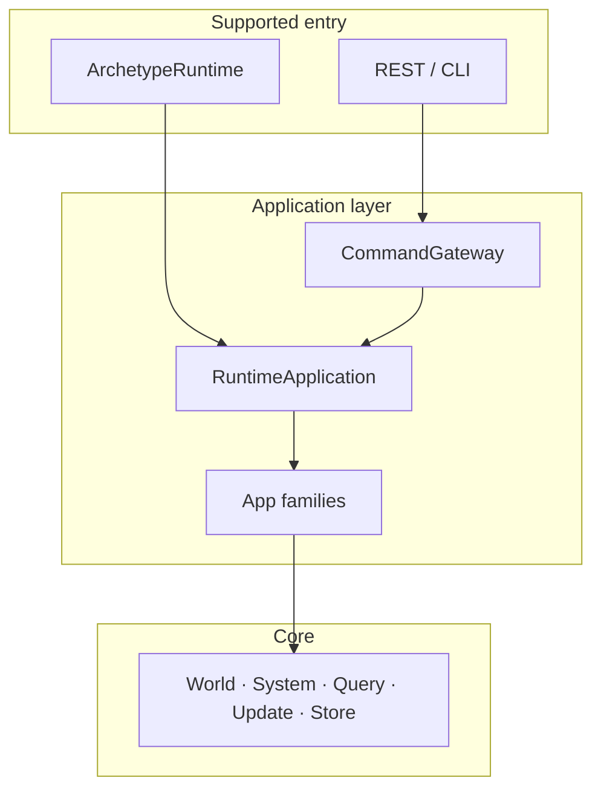
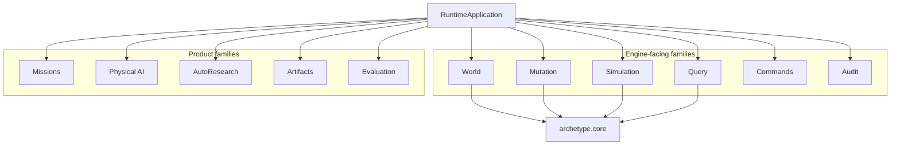
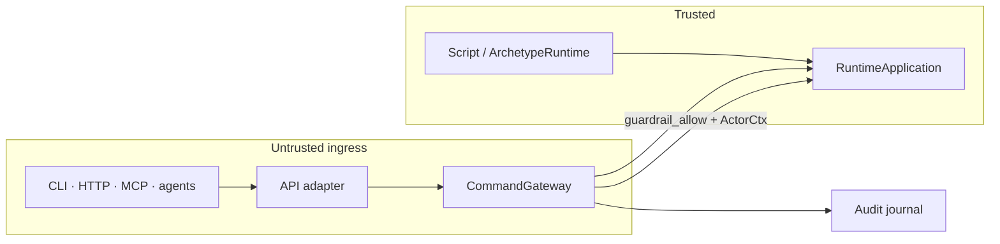
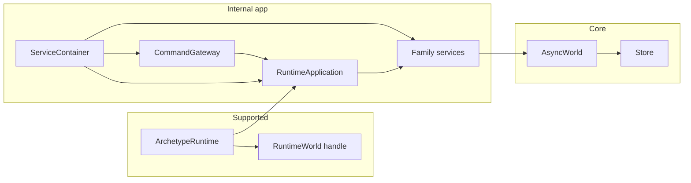
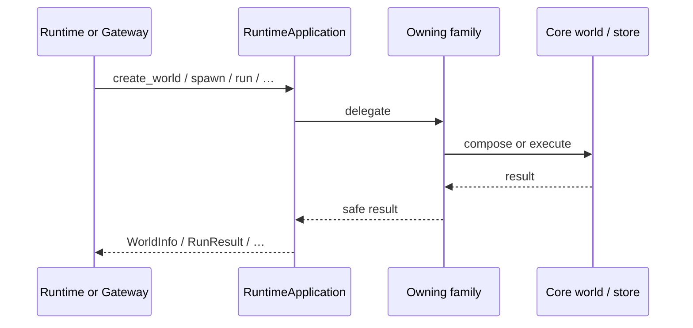
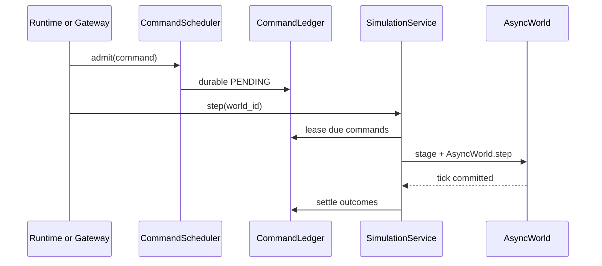
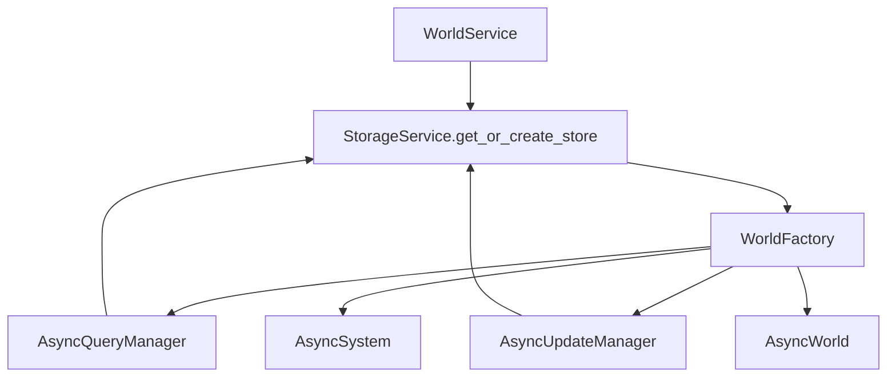

# Application Layer

## Purpose and Scope

The application layer wraps the [core engine](core-architecture.md) with
product workflows: world lifecycle, mutations, simulation control, authorized
ingress, audit, and higher-level families (missions, physical AI,
autoresearch, artifacts, evaluation).

This page is the **map of that layer**. Normative ownership and dependency
rules live in [Application Architecture](application-architecture.md). Active
ports live in [Service Protocols](service-protocols.md). Concrete services and
`ServiceContainer` are internal.



Core does not know about actors, roles, HTTP, or multi-tenant policy. Those
concerns start here.

## Key Capabilities

| Capability | What the layer adds |
|---|---|
| **Runtime facade** | `ArchetypeRuntime` / world handles over actor-free `RuntimeApplication` |
| **Authorized ingress** | `CommandGateway` + roles for untrusted callers |
| **World lifecycle** | Create, fork, destroy, attach — identity and live registry |
| **Tick-deferred commands** | Durable admit → lease → stage → settle across ticks |
| **Audit** | Access evidence, outbox, analytical projection |
| **Product families** | Missions, physical AI, autoresearch, artifacts, evaluation, … |

## System architecture

**Families around the runtime**



`RuntimeApplication` owns no storage backend and no transport. Each workflow
delegates to the family that owns it. Families talk to core through world /
storage ports — they do not reimplement ECS.

## Trust boundary



| Path | Authorization | Entry |
|---|---|---|
| Local script | Trusted — no `ActorCtx` | `ArchetypeRuntime` → `RuntimeApplication` |
| Server | Roles on the gateway | API → `CommandGateway` → `RuntimeApplication` |

The gateway authorizes and records access. It does not implement domain
workflows. See [Command Gate](command-gate.md).

## Code entity mapping



Applications do not construct `ServiceContainer` or call concrete services.
Repository tests and composition modules may, because those are internal seams.

## Request and tick paths

**Direct operation**



**Tick-deferred command**



Details: [Data flow](data-flow.md) · [Durable commands](durable-commands.md).

## WorldFactory boundary

`WorldFactory` is where a store resolved by `WorldService` becomes a core
world: the same store is given to `AsyncQueryManager` and
`AsyncUpdateManager`, then system, resources, and hooks are attached.



The factory constructs. The core executes.

## Family posters

Higher-level modules deserve the same diagram-first treatment as the core.
Start here:

| Family | Poster |
|---|---|
| Agent Missions | [Agent Missions](agent-missions.md) |
| Physical AI | [Physical AI](physical-ai.md) |
| AutoResearch | [AutoResearch](autoresearch.md) |
| Trajectories | [Trajectories](trajectories.md) |
| Prefab libraries | [Prefab Libraries](prefab-libraries.md) |
| Access control | [Command Gate](command-gate.md) |
| HTTP hosting | [API Layer](api-layer.md) |

## Roles

Roles are flat:

| Role | Intent |
|---|---|
| `viewer` | Read-only operations |
| `player` | Entity participation: spawn, despawn, update, message, custom |
| `operator` | Schema, processors, hooks, resources, simulation control, fork, destroy |
| `admin` | All commands, including world creation |

Combine roles explicitly. `operator` is not implicitly `viewer`.

## Creating a world

```text
Runtime handle or authorized API
  -> RuntimeApplication.create_world(...)
  -> WorldService / WorldFactory
  -> StorageService + AsyncWorld
  -> WorldInfo
```

Runtime activation then stages processors, resources, and hooks through their
application operations.

## Source reference

- Container: `src/archetype/app/container.py`
- Wiring note: `src/archetype/app/wiring.md`
- Family protocols: `src/archetype/app/<family>/interfaces.py`
- Core interfaces: `src/archetype/core/interfaces.py`

## Next steps

- [Core architecture](core-architecture.md) — engine boxes under this layer
- [Architecture Overview](architecture.md) — tick lifecycle and contracts
- [Application Architecture](application-architecture.md) — normative rules
- [Agent Missions](agent-missions.md) — software-factory family poster
