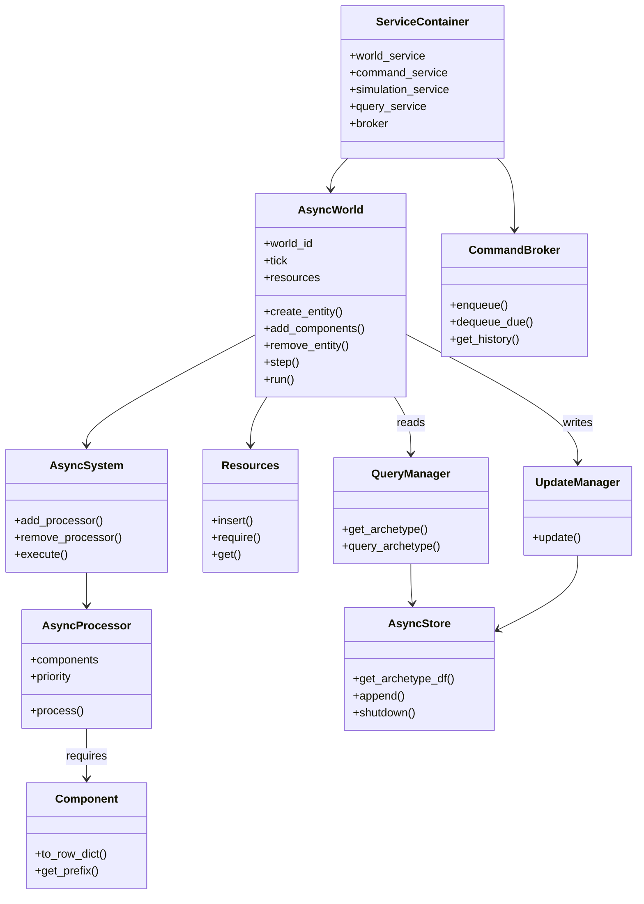

# Overview

Archetype is a data-centric Entity-Component-System (ECS) simulation engine. World state is stored as columnar DataFrames. Every tick appends new rows to storage without overwriting previous state, which enables time-travel queries, world forking, and replay.

## Core Abstractions



## Layers

```text
archetype.api / cli          External interface (REST + HTTP client)
       |
archetype.app                Services, RBAC, CommandBroker, WorldRegistry
       |
archetype.core               AsyncWorld, AsyncProcessor, Resources, Storage
```

The system runs as a single `archetype serve` process. The CLI is a thin HTTP client.

## Service Layer

The service layer mediates all access to worlds.

### ServiceContainer

Instantiates and exposes all service-layer subsystems:

```python
from archetype.app.container import ServiceContainer

container = ServiceContainer()
# container.world_service     -- world lifecycle
# container.command_service   -- command submission
# container.simulation_service -- tick stepping
# container.query_service     -- read path
# container.broker            -- command queue
# container.storage_service   -- storage backends
```

### Command Flow

All mutations from external actors flow through the command pipeline:

1. **CommandService.submit()** -- accepts a `Command` with type, payload, tick, priority
2. **CommandBroker.enqueue()** -- validates RBAC via `ActorCtx`, enforces quotas, queues by priority
3. **SimulationService.step()** -- drains due commands, applies them to the world, steps processors
4. **QueryService** -- reads world state (current or historical)

### RBAC

Every command submission requires an `ActorCtx` specifying the actor's roles:

| Role | Permissions |
|------|-------------|
| `viewer` | Read-only (query, get state, get world) |
| `player` | spawn, despawn, update, message, custom |
| `coder` | add/remove components, update |
| `operator` | trajectory ingestion and labeling |
| `maintainer` | spawn, despawn, components, processors, update |
| `admin` | All commands (wildcard) |

Quotas: 500 commands per tick, 200k token budget per day. See [Token Costs and Quotas](token-quotas.md) for details.

## Deep Dives

The Architecture section covers each subsystem in detail:

- [Archetype](archetype.md) -- signatures, naming, schemas, entity-to-table mapping
- [Components](components.md) -- Pydantic models with Arrow serialization, column prefixing, field types
- [Processors](processors.md) -- DataFrame transforms, resource injection, LLM integration
- [Systems](system-execution.md) -- subset rule, priority ordering, per-archetype parallelism
- [Worlds](worlds.md) -- tick lifecycle, deferred mutations, hooks, forking
- [Stores](stores.md) -- Daft catalog-backed persistence, append-only storage model
- [Querier](querier.md) -- filtered reads by tick, entity, and component projection
- [Updater](updater.md) -- metadata stamping before append
