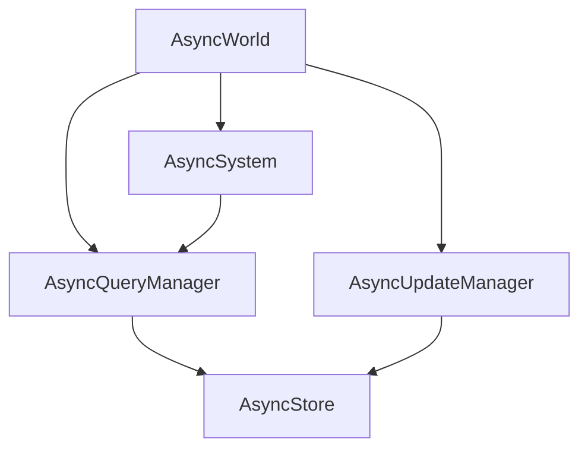
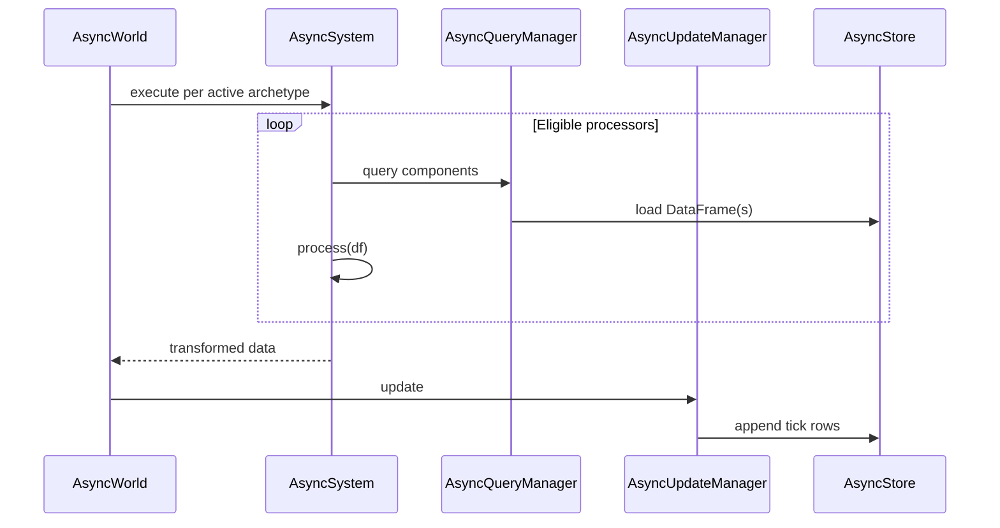
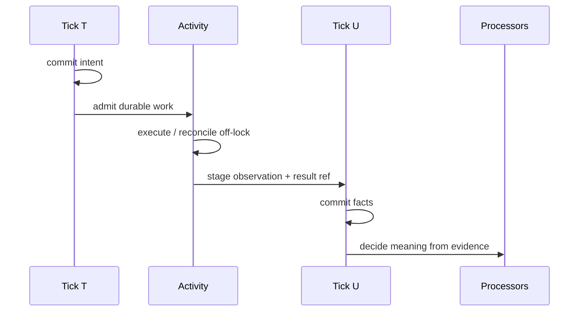

# Archetype in one page

Archetype lets a world library define a domain once—as typed Components,
Relations, Prefabs, and Processors—and use those same definitions to run,
persist, query, fork, compare, and improve it. Simulation or workflow code and
the data model used to understand its results do not drift into separate
systems.

The durable thing Archetype creates is a **World**: an append-only, queryable,
forkable history of typed facts. A fork shares committed history and creates an
independent future. This is the system's identity; Daft, ECS, and Iceberg are
the mechanisms that make it practical.

The [docs home](../index.md) and [Core architecture](core-architecture.md) are
the visual maps of the **engine boxes**. This page is the product mental model
that sits on that engine. Normative ownership rules live in
[Application Architecture](application-architecture.md); visual layout is not
law.

## Core engine (the tick path)

Before Activities, the dispatcher, and domain families, a tick still moves
through these boxes:





`AsyncQueryManager` reads. `AsyncUpdateManager` appends. `AsyncWorld`
orchestrates. `AsyncSystem` runs processors whose declared components are a
subset of the archetype signature. Product features compose around this path;
they do not replace it.

## The mental model

| Concept | Meaning |
|---|---|
| Component / Relation | A typed fact the World remembers about an entity |
| Processor | An ordered DataFrame transformation over every matching population; the family-owned authority for recurring semantic transitions |
| Tick | The user-chosen durable causal boundary between one World state and the next |
| Resource | A capability available during a tick; correctness does not depend on the Python object surviving |
| Activity | Durable work admitted from one committed tick and observed as facts by a later committed tick |
| View / Evaluation | A read or interpretation of committed World evidence |
| Episode | One persistently identified bounded domain execution; a trajectory is a derived view of its evidence |

An ordinary tick is deliberately small:

```text
materialize admitted changes
    -> read the current committed state
    -> run matching processors
    -> append candidate rows
    -> publish one visible tick
    -> return its receipt
```

A processor failure does not advance the World. Rows from a managed tick become
visible only when that tick's exact manifest is published.

Consequential work crosses two committed states:

```text
tick T commits intent
    -> Activity executes or reconciles outside the World lock
    -> durable result reference + digest
    -> stage factual observations
    -> tick U commits those facts
    -> later processors decide what they mean
```



Activity execution does not declare domain success or advance a workflow
directly. It delivers evidence for a later committed decision. Lease expiry
cannot prove an external effect did not happen; a provider-bound attempt must
reconcile or fail closed.

## Where authority lives

| Owner | Authority |
|---|---|
| Domain family (`missions`, `physical_ai`, `research`, …) | Components, processors, values, provider meaning, and family workflows |
| `activities` | Generic admission, attempt, fence, result-reference, and exact-receipt settlement mechanics |
| `world` | Live state, tick execution, lineage, fork/resume/destroy meaning, and committed receipts |
| `storage` | Physical tables, control catalogs, commit coordination, and durable world/run envelopes |
| `commands` | Registered operation admission, authorization, deferred command delivery, and access evidence |
| `wiring.py` / `RuntimeResources` | Concrete composition and process-owned admission, workers, and teardown |
| `runtime` / API / CLI | Supported trusted and authenticated entry points |

Dependencies point downward. Families do not import the runtime, API, CLI,
wiring, or concrete process owner. Package placement does not create public
API.

## What the substrates do

- **Daft** evaluates lazy, columnar population transforms and queries. Archetype
  preserves that lazy boundary; Daft does not own workflow durability.
- **Iceberg** stores scalable, immutable history with optimistic table commits.
  Archetype's control catalog and manifest-last protocol decide which managed
  rows form a visible World tick.
- **Modal or another provider** may place and execute work. The owning family
  and Activity contract decide identity, reconciliation, and the meaning of its
  result.

Use `ArchetypeRuntime` for scripts. Define domain state with Components,
behavior with Processors, and let the World make the resulting history
queryable. Use a Resource for safe tick-time capability; use an Activity when a
committed decision authorizes work whose outcome must survive process loss.

Archetype is therefore not merely an ECS engine, a DataFrame wrapper, or a
workflow scheduler. It is durable execution that leaves a queryable World
instead of only a log: forkable history, with the receipts.

Deep contracts: [Runtime](runtime.md), [World lifecycle](world-lifecycle.md),
[Atomic visibility](atomic-visibility.md), [Resources](resources.md),
[Activities](activities.md), [Application architecture](application-architecture.md),
[Application layer](app-overview.md), and [Command gate](command-gate.md).
