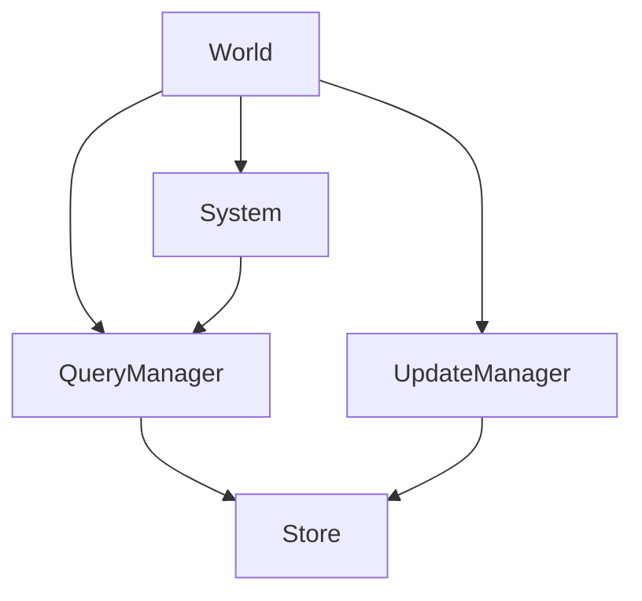
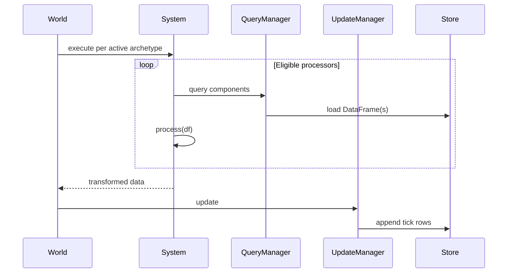

# Overview

Archetype is a data-centric Entity-Component-System simulation engine. World
state is stored as columnar DataFrames, and each tick appends new rows instead
of overwriting previous state. That storage model supports time-travel queries,
forking, replay, and audit.

The [docs home](../index.md) is the visual map of the **core primitives**.
This page explains how the **application layer** sits on that core. The written
rules and dependency tables in
[Application Architecture](application-architecture.md) are normative; visual
layout is not.

## Core engine (the mental model)

Before the runtime, gateway, and families, a tick still moves through these
boxes:





`QueryManager` reads. `UpdateManager` appends. `World` orchestrates.
`System` runs processors whose declared components are a subset of the
archetype signature. Product features (forks, missions, HTTP) compose around
this path; they do not replace it.

## Layers

```text
application code -> ArchetypeRuntime -> RuntimeApplication
CLI              -> REST API -> CommandGateway -> RuntimeApplication
RuntimeApplication -> internal app-family capabilities -> archetype.core
```

The trusted runtime bypasses authorization; the API authenticates and enters
through the gateway. Both converge on the actor-free `RuntimeApplication`.
`ServiceContainer` and concrete app services are internal machinery.

`ArchetypeRuntime` is the recommended script boundary. It owns process lifetime,
returns lazy actor-free world handles, and forwards operations through
`iRuntimeApplication`.

```python
from archetype import ArchetypeRuntime, Component


class Position(Component):
    x: float = 0.0
    y: float = 0.0


async with ArchetypeRuntime() as runtime:
    world = runtime.world("demo")
    entity_id = await world.spawn(Position(x=0, y=0))
    await world.run(steps=10)
```

Applications do not construct `ServiceContainer` or call concrete services.
Repository composition modules and focused implementation tests may use them
because they are internal seams.

## Command Gate

All untrusted operations flow through `iCommandGateway`, the policy
enforcement point.

```text
API / untrusted caller
  -> iCommandGateway
  -> guardrail_allow
  -> iRuntimeApplication
  -> iAuditJournal.record_access
  -> return result
```

The durable ledger/dispatcher belongs to the commands family. Audit owns the
journal, transactional outbox, and analytical projection. The gateway consumes
narrow admission/application/audit ports but owns none of that state.

## Roles

Roles are flat:

| Role | Intent |
|---|---|
| `viewer` | Read-only operations |
| `player` | Entity participation: spawn, despawn, update, message, custom |
| `operator` | Schema, processors, hooks, resources, simulation control, fork, destroy |
| `admin` | All commands, including world creation |

To combine capabilities, give an actor multiple roles. `operator` is not implicitly `viewer` unless both roles are present in the actor context.

See [Command Gate](command-gate.md).

## Execution

The simulation hierarchy is:

```text
step     one tick
run      N steps, no termination, no fork
episode  step until termination/cap on the supplied world
rollout  N forked episodes from a base world
```

See [Execution Hierarchy](execution-hierarchy.md).

## Tick Lifecycle

A tick has two service-level phases:

```text
SimulationService.step(world_id, run_config)
  |
  1. CommandDispatcher.lease_and_stage_due(world_id, tick)
  |    CommandLedger leases in durable order
  |    MutationService stages due commands
  |
  2. AsyncWorld.step(run_config)
       |
       a. Query previous state
       b. Materialize pending structural mutations
       c. Execute matching processors
       d. Persist appended rows
       e. Publish manifest + settle command outcomes
       f. Refresh live state and hooks
```

Processors are trusted internal code once registered. External callers do not bypass the gate.

A tick is a world execution and commit boundary. It does not necessarily imply
a task, mission, or physical-workflow state transition.

## World Lifecycle

World lifecycle has three operations:

- `create_world`: admin-only identity creation.
- `fork_world`: create a new world from the source snapshot.
- `destroy_world`: remove the live in-memory world; storage and audit rows remain.

Forks receive a new `world_id`, a new `run_id`, the source tick, copied pending mutation caches, copied hook registrations, and shared processor/resource instances by default.

See [World Lifecycle](world-lifecycle.md).

## Deep Dives

### Specifications

- [Application Architecture](application-architecture.md)
- [Runtime](runtime.md)
- [Service Protocols](service-protocols.md)
- [Command Gate](command-gate.md)
- [Execution Hierarchy](execution-hierarchy.md)
- [World Lifecycle](world-lifecycle.md)
- [Audit Log](audit-log.md)

### Core

- [Archetype](archetype.md)
- [Components](components.md)
- [Processors](processors.md)
- [Systems](system-execution.md)
- [Worlds](worlds.md)
- [Lifecycle Hooks](hooks.md)
- [Resources](resources.md)
- [Stores](stores.md)
- [Querier](querier.md)
- [Updater](updater.md)
- [Configuration](run-config.md)

### App

- [App Overview](app-overview.md)
- [Services](services.md)
- [Durable Commands](durable-commands.md)
- [API Layer](api-layer.md)
- [Data Flow](data-flow.md)
