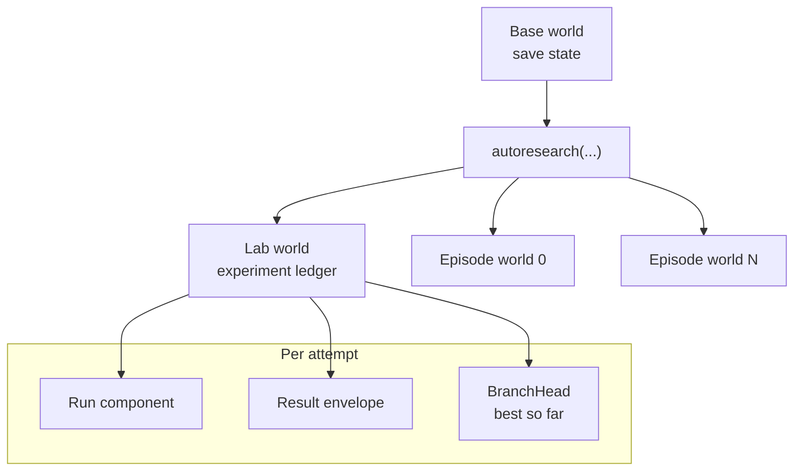

# AutoResearch

## Purpose and Scope

AutoResearch is a minimal world-library pattern for autonomous optimization:
track one candidate frontier, evaluate forked world lines against it, and
advance the head only when a run improves a user-defined metric. The shape —
experiment, run, result, keep / discard / fail — applies whether the candidate
is code, a policy, a prompt, or another world-library configuration.

It is a separately installed [application-layer](app-overview.md) loop.
Experiments and runs are ordinary components in a world; scoring stays in user
code. Coding-agent sessions, transcripts, and trajectories remain owned by
[Agent Missions](agent-missions.md).

**Document type:** Contract and user guide.

**Status: attempts run on the ledger.** The research-family handler records a
`RUNNING` row before candidate preparation or rollout, then records `SUCCEEDED`
with an evaluation or `FAILED` with failure metadata. The loop is itself an
archetype simulation.



## Key Capabilities

| Capability | Implementation |
|---|---|
| **Worlds as save states** | Fork / attach episode worlds; inspect any attempt afterward |
| **Ledgered attempts** | `RUNNING` → `SUCCEEDED` / `FAILED` rows before and after work |
| **User-defined better** | `Result` and `BranchHead` stay opaque; your eval scores |
| **Runtime entry** | `Research(world).autoresearch(...)` — not assembling internal services |
| **Governed admission** | Registered `AutoResearch` model through `CommandDispatcher` |

## Runtime quick path

Install the Research world library with `uv add archetype-research` (or
`pip install archetype-research`). Think of worlds as save states.
`Research(world).autoresearch(...)` replays candidate lines from a base save,
scores each one, and keeps the best route; every attempt — including crashes —
lands on the experiment's own ledger. Episode worlds are kept by default so
you can load any of them afterward and inspect what actually happened.

The 0.6 ledger is a clean generic schema. Pre-0.6 Research ledgers are not
migrated or opened as 0.6 experiments; see [Archetype 0.6](release-0.6.md).

```python
from archetype import ArchetypeRuntime
from archetype.research import AutoResearchConfig, EvaluationResult, Research

async with ArchetypeRuntime() as runtime:
    base = runtime.world("base", storage="./data")
    # ... spawn initial state, run once ...

    result = await Research(base).autoresearch(
        config,
        evaluate,
        prepare_candidate=prepare,
    )

    lab = runtime.attach(result.lab_world_id)     # the experiment's ledger
    episode = runtime.attach(result.iterations[0].rollout.episodes[0].world_id)
    outputs = await episode.grade(MyComponent, graders=[my_grader])
```

`examples/10_autoresearch.py` is the full runnable version. The typed Research
adapter is the supported interface. Its installed manifest registers the frozen
`archetype.research.models.AutoResearch` model once under the exact name
`autoresearch`. Trusted `CommandDispatcher.apply` and actor-aware immediate
`apply_as` reach the same family-owned free handler. The actor-aware
registration requires `operator`, uses `live_world` quota scope, and charges
`200 * max(max_iterations, 1)` tokens. There is no dedicated REST route, and
the live evaluator, preparer, and iteration callback make the operation
immediate-only: `defer` and `defer_as` reject it before any scheduler or
control-catalog write.

## What's Implemented

`archetype.research` models lifecycle state as ordinary Components, so runs
become entities in an archetype world—forkable, time-travelable, and queryable
with the same tools as any other simulation state. It owns the reusable ledger
schema, configuration and result values, storage-backed views, experiment
admission, and directly awaited free workflow handler. Its reviewed family
edges are `research → storage, world`;
there is no application research facade, service protocol, or missions-owned
research state.

| Component | Role |
|---|---|
| `Experiment` | Stable identity and semantic configuration for a family of candidate runs. |
| `Run` | One candidate preparation, rollout, and evaluation attempt. |
| `Result` | Opaque eval envelope attached to a `Run`. User code decides the metric. |
| `BranchHead` | Persisted current-best descriptor and score, advanced by the loop. |

The library deliberately does not define what "better" means. `Result.outputs_json` and `BranchHead.descriptor_json` are free-form — a scalar metric, a Pareto point, an LLM judge verdict, a pytest report, a tournament record. The library persists; the user's eval code scores.

### Coding-agent evidence is not Research state

Repository sessions, VM and harness identity, workspaces, transcripts,
trajectories, and produced commits belong to Agent Missions. Research may use a
Missions-backed evaluator or store a bounded evidence reference in an opaque
result, but it does not ingest coding-agent session registries or duplicate
their schema. This keeps the minimal optimization loop useful without Missions
and lets a richer software-research application compose the two libraries
above their public adapters.

## The Loop

The registered handler delegates to
`archetype.research.handlers.run_autoresearch(...)`. A caller supplies a stable
`experiment_id`; the human-readable
`experiment_name` is not used as an identity key. The caller also supplies
stable evaluator and rollout contract IDs; callable names are recorded only as
diagnostics, not treated as semantic identities. Each iteration optionally
prepares a candidate world, runs a rollout from that world, hands the result to
the caller's evaluator, and advances the head when the finite score beats the
incumbent.

Evaluators should return `EvaluationResult`, which carries a score, evaluator
identity, evidence metadata, and optional additional metadata. The result's
evaluator must equal the config's stable `evaluator_id`, so scores from
different contracts cannot be compared. Returning a plain `float` remains
supported and is persisted with the configured evaluator identity.

**The loop's own state lives on the ledger.** Each experiment gets a lab
world named `autoresearch:{experiment_id}`, sharing the base world's
storage:

- **tick 0** — genesis: the `Experiment`, semantic configuration digest, and a
  seed `BranchHead`, persisted as raw initial conditions
- **first attempt tick** — a `Run` in `RUNNING` state, written before candidate
  preparation or rollout
- **terminal attempt tick** — the same `Run` transitions to `SUCCEEDED` or
  `FAILED`; a successful attempt adds the typed `Result` and any `BranchHead`
  advance
- **resume validates identity** — the stored experiment id, base world, display
  name, evaluator contract, and semantic configuration must match before
  another attempt is recorded; `max_iterations` is invocation-local and may
  change when extending an experiment; an active attempt must be reconciled
  before resume

```python
from archetype import ArchetypeRuntime
from archetype.research import (
    AutoResearchConfig,
    BranchHead,
    EvaluationResult,
    Research,
)

def evaluate(rollout):
    return EvaluationResult(
        score=my_score(rollout),
        evaluator="task-success-v1",
        evidence={"manifest": "sha256:..."},
    )


config = AutoResearchConfig(
    experiment_id="exp-2026-001",
    experiment_name="exp",
    evaluator_id="task-success-v1",
    rollout_contract_id="candidate-rollout-v1",
    max_iterations=10,
)

async with ArchetypeRuntime() as runtime:
    base = runtime.attach(base_world_id)
    research = Research(base)

    async def prepare_candidate(context):
        source = runtime.attach(context.base_world_id)
        candidate = await source.fork(name=f"candidate-{context.iteration}")
        # Apply this iteration's candidate changes to the fork here.
        return candidate.world_id

    result = await research.autoresearch(
        config,
        evaluate,
        prepare_candidate=prepare_candidate,
    )

    lab = runtime.attach(result.lab_world_id)
    heads = await lab.query(BranchHead)  # append-only head history

    # Explicitly reattach the same lab instead of relying on name lookup.
    resumed = await research.autoresearch(
        config,
        evaluate,
        lab_world_id=result.lab_world_id,
    )
```

`prepare_candidate` receives a `ResearchCandidateContext` with deterministic
experiment, iteration, and run identities. Returning `None` evaluates the
original base world. Candidate worlds remain caller-owned.
The transient callback value is distinct from the persisted
`archetype.missions.Candidate` review subject: it has no
candidate/head/diff/validator/critic receipt identity and does not share the
mission component schema or relations.

Because the lab world is an ordinary world, the experiment itself is forkable:
fork the lab at any tick and replay "what if a different run had advanced the
head." Contract tests:
`tests/research/test_autoresearch_ledger.py`,
`tests/research/test_autoresearch_admission.py`, and
`tests/research/test_runtime_autoresearch.py`.

### Admission, locks, and process lifetime

Wiring constructs one process-shared `AutoResearchAdmissions` and closes the
registered handler over it. With `record_to_ledger=True`, the handler holds the
family key `autoresearch:{experiment_id}` across identity validation and all
iterations. Calls for the same experiment therefore serialize in one process;
unrelated experiment IDs remain independent. With
`record_to_ledger=False`, no shared experiment ledger exists, so the workflow
bypasses that keyed admission and includes an invocation-unique token in every
rollout name. Concurrent ledgerless calls cannot collide merely because they
reuse an experiment ID.

The task that owns a ledgered experiment cannot recursively admit that same
experiment. A direct `await Research(world).autoresearch(...)` from its `on_iteration`
callback fails with `RuntimeError` instead of waiting on itself. The callback
may use ordinary world operations or run an unrelated experiment. A separately
scheduled same-experiment task remains an ordinary serialized waiter, so the
callback must return before awaiting that task; a sync callback likewise must
not call the same experiment recursively. Resume it only after the current
workflow returns. This preserves normal concurrent waiters without granting
callback descendants inherited lock authority.

The experiment key is not a substitute for world synchronization. Every
base, lab, candidate, and rollout state boundary uses the named lock owned by
`WorldRegistry`; the workflow does not carry a handler-wide world lock across
callbacks or smuggle dynamically created fork locks through `ContextVar`
reentrancy. The current loop holds at most one existing world lock itself. Any
future boundary that truly needs two existing worlds must use the registry's
sorted world-ID acquisition.

One `AutoResearch` dispatch is one admission and access-decision unit. The
outer dispatcher synchronously awaits the family handler; inner fork, rollout,
evaluation, and ledger operations call their owning families directly and do
not recursively dispatch. The research family creates no detached task, extra
owner reservation, or finalizer. Consequently, `RuntimeResources` shutdown
first rejects new process admission and then joins an already admitted
AutoResearch call before closing the registry, storage, or other shared
dependencies.

### Boundary

The family workflow does not generate candidates, mutate Git, merge or promote
a winner, or coordinate messages. Its keyed admission is process-local
serialization, not distributed exactly-once execution or recovery of an
in-flight attempt after process loss. `lab_world_id` reattaches a world already
registered with the current `WorldRegistry`; it does not cold-open a world that
is absent from the current process. Those are outer orchestration concerns. A
float comparison and a `BranchHead` update mean only that this caller's
configured evaluator selected a better recorded result.

## Why ECS-Native

Modeling experiments as ECS state means:

- **Forking** — replay what would have happened if a different run had advanced the head
- **Time-travel queries** — inspect an experiment's state at any historical tick
- **Concurrency** — process many experiments as separate archetypes on the same engine
- **Audit** — every state transition is an appended row, not a mutation

Experiment state gets the same operational properties as any other simulation in Archetype, without a parallel storage layer.

## LIBERO on the ledger

The same lab-world pattern extends to robotics benchmarks. The external
`everettVT/robot-evals` harness supplies LIBERO environment and policy
providers to Archetype's typed [Physical AI](physical-ai.md) runtime workflow:

- **One control-plane world per task, N trial entities** keyed by `env_key`. The env
  client batches by `env_key`, so one tick steps every live trial at once; finished
  trials freeze on the ledger (`done` latches). Every trial's episode evidence is
  addressable by the single `(world_id, run_id)` and sliced by `ManipTask`.
- Termination is the value-based "all entities done" contract
  (`EpisodeConfig(terminal_component=ManipStatus, terminal_field="done")`) — no
  hand-rolled episode loop.
- Success and episode length are **projected from raw `ManipStatus` rows by the
  physical-AI handler**, not computed in the driver, so there is no summary
  component to drift from the ledger. (The old `eval_driver.py` /
  `EvalTrialResult` stack had exactly that drift problem and was removed.)
- In robot-evals, `src/robot_evals/in_process.py` runs LIBERO envs in-process,
  and `src/robot_evals/in_process_policy.py` colocates a VLA policy with the
  env. Archetype owns the provider-neutral world/episode/ledger workflow.

The [robot-evals extraction record](../reports/2026-07-16-robot-evals-extraction.md)
preserves the historical boundary and retained Archetype interfaces. The large benchmark sweeps are **user-triggered actions**
(GPU cost); never run them in CI.

## References

- Autonomous optimization and branch-frontier research workflows
- `packages/archetype-research/src/archetype/research/` — research values, ledger Components, views, and free workflow handler
- [Agent Missions](agent-missions.md) — coding-agent sessions, transcripts, trajectories, and repository evidence
- `packages/archetype-physical-ai/src/archetype/physical_ai/` — supported models, state, views, provider contracts, free workflow handlers, and their internal provider processors
- `everettVT/robot-evals` — external LIBERO harness, GPU entrypoints, and run ledgers
- `docs/reports/2026-07-16-robot-evals-extraction.md` — historical extraction boundary
