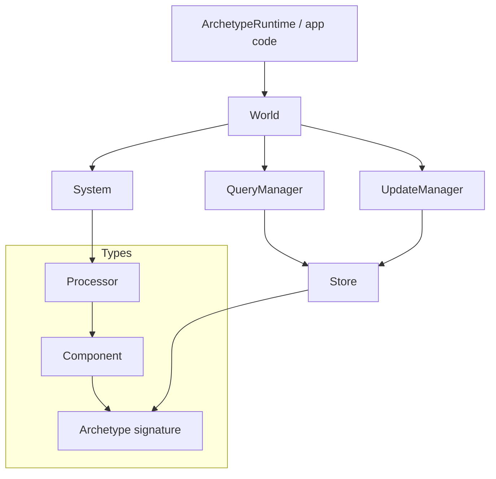
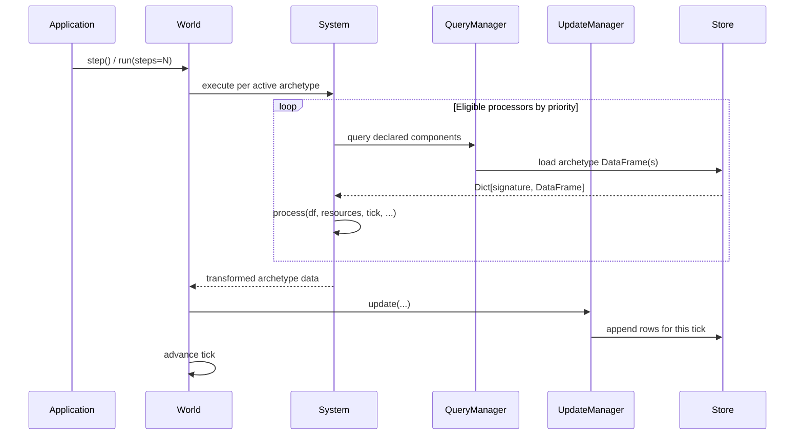
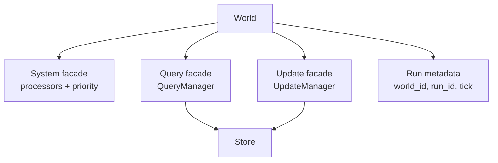
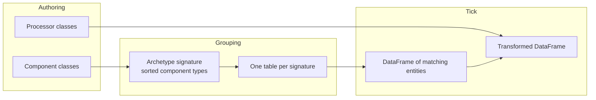
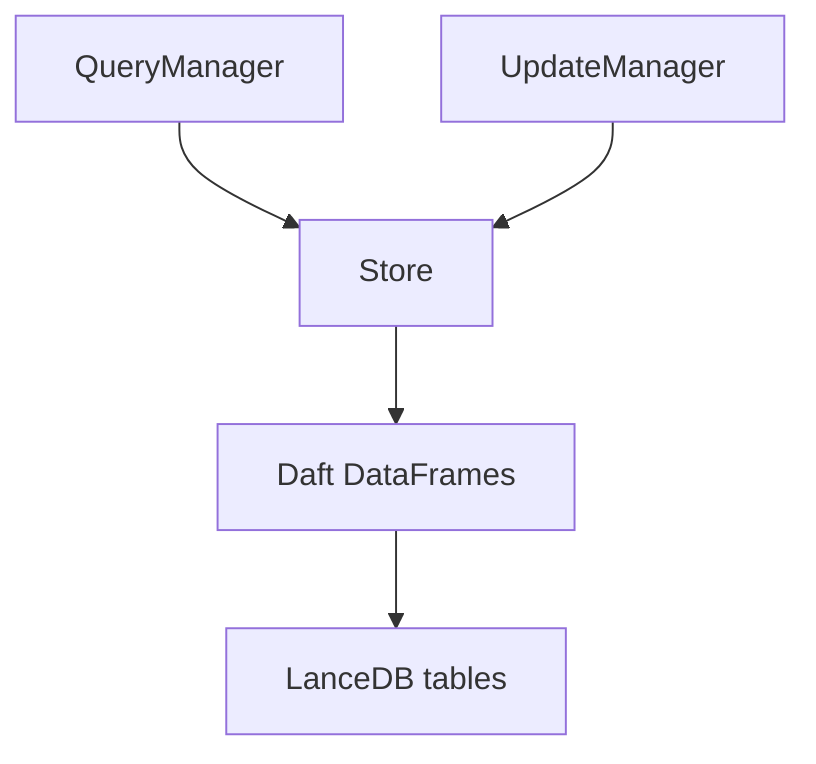
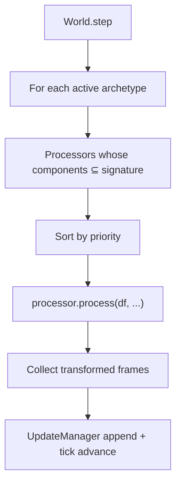
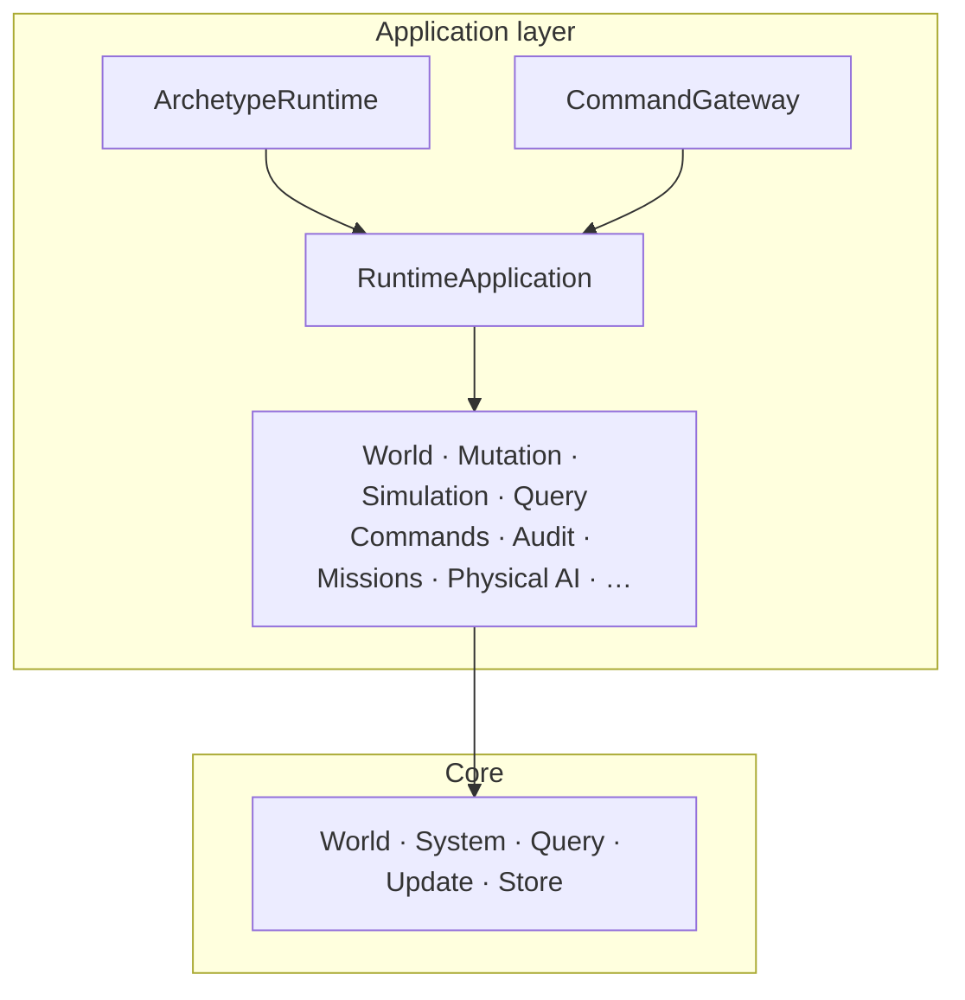

# Core Architecture

## Purpose and Scope

This page is the hub for Archetype's **engine**. It is the same mental model as
the [Overview](../index.md), expanded so you can drill into each box.

Product features — HTTP hosting, command gate, agent missions, physical AI,
prefabs — live in the [Application layer](app-overview.md). They compose on
top of this core; they are not a second storage model.

Normative application ownership rules live in
[Application Architecture](application-architecture.md). Visual layout here is
explanatory, not law.

## System component overview

| Box | Owns | Does not own |
|---|---|---|
| **World** | Tick orchestration, entity identity, live run | Auth, HTTP, multi-tenant policy |
| **System** | Processor ordering and eligibility | Persistence |
| **Processor** | DataFrame transforms for a component set | Spawning other entities as a side channel |
| **QueryManager** | Reads from the store | Writes |
| **UpdateManager** | Appends to the store | Reads |
| **Store** | Physical archetype tables | Simulation policy |
| **Archetype** | Component-set → schema grouping | Runtime product workflows |

## Simulation execution pipeline

Teaching model: **query → transform → append → advance**. The async world fans
work out per active archetype table; the read/write split stays fixed.

## World and simulation management

The world is the orchestrator. Facades keep concerns apart:

- **Spawn / despawn / update** change which entities exist and which components
  they carry; structural changes land on tick boundaries.
- **Step / run** advance time and persist history.
- **Fork** keeps shared past rows and opens a new future run.

Deeper pages: [Working with worlds](working-with-worlds.md) ·
[World internals](worlds.md) · [World lifecycle](world-lifecycle.md) ·
[History and forks](history-and-forks.md)

## Entity-component-system

Entities that share a component set share an archetype table. A processor runs
only when its declared components are a **subset** of that signature — so the
columns it needs are guaranteed to exist.

Deeper pages: [Components](components.md) · [Processors](processors.md) ·
[Systems](system-execution.md) · [Archetypes](archetype.md)

## Data storage and persistence

Every tick **appends**. Past state is a filter on `tick` (and `world_id` /
`run_id`), not a destructive overwrite. That is why forks and audits are the
same storage model as the live run.

Deeper pages: [Storage](stores.md) · [Queries](querier.md) ·
[Updates](updater.md) · [Data flow](data-flow.md)

## Processing framework

Processors are trusted once registered. They transform populations. They are
not the authorization boundary — that lives in the application layer's command
gate.

Deeper pages: [Processors](processors.md) · [System execution](system-execution.md) ·
[Resources](resources.md) · [Lifecycle hooks](hooks.md)

## Where the application layer starts

When you are ready for hosting, roles, missions, or eval workflows, leave this
hub and read the [Application layer](app-overview.md).

## Next steps

- [Quickstart](quickstart.md) — hands-on first world
- [Building simulations](building-simulations.md) — end-to-end authoring pattern
- [Application layer](app-overview.md) — families above the engine
- [Architecture Overview](architecture.md) — app contracts and tick lifecycle
- [Agent Missions](agent-missions.md) · [Physical AI](physical-ai.md) · [AutoResearch](autoresearch.md)
