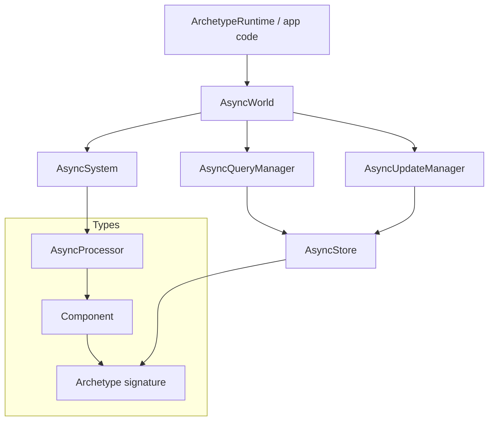
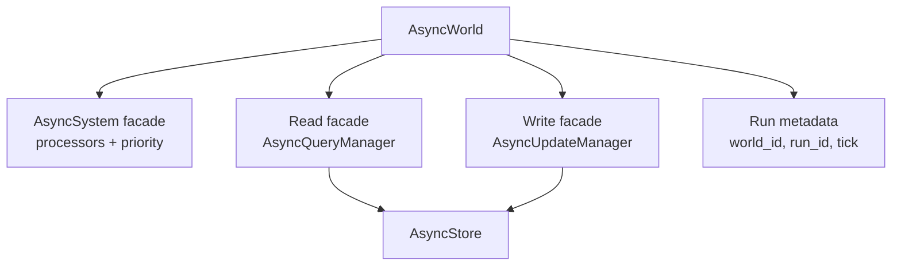
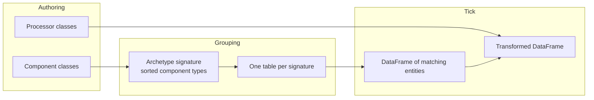
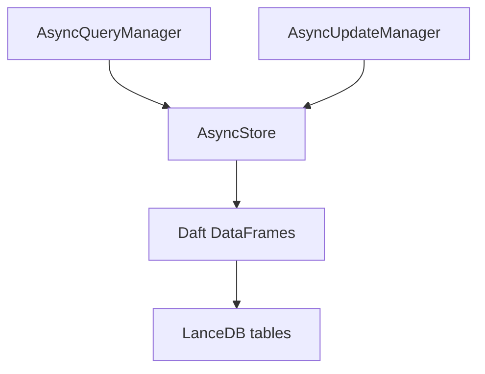
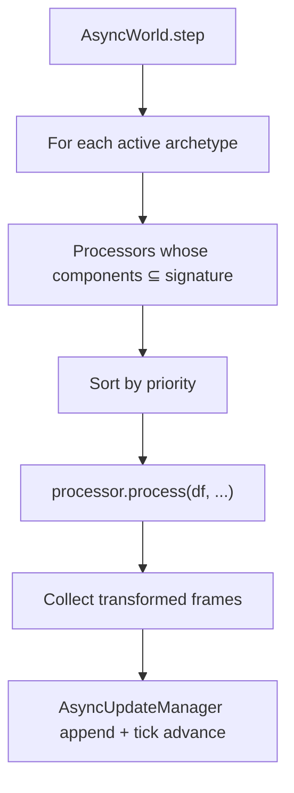
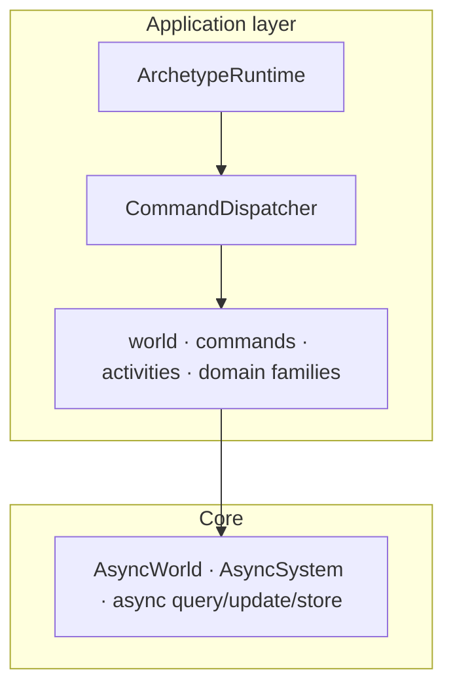

# Core Architecture

## Purpose and Scope

This page is the hub for Archetype's **engine**. Start with the
[Runtime guide](runtime.md) for the supported application handles, then use
this page to drill into each box.

Product features — HTTP hosting, command gate, agent missions, physical AI,
prefabs — live in the [Application layer](app-overview.md). They compose on
top of this core; they are not a second storage model.

Normative application ownership rules live in
[Application Architecture](application-architecture.md). Visual layout here is
explanatory, not law.

## System component overview



| Box | Owns | Does not own |
|---|---|---|
| **AsyncWorld** | Tick orchestration, entity identity, live run | Auth, HTTP, multi-tenant policy |
| **AsyncSystem** | Processor ordering and eligibility | Persistence |
| **AsyncProcessor** | DataFrame transforms for a component set | Spawning other entities as a side channel |
| **AsyncQueryManager** | Reads from the store | Writes |
| **AsyncUpdateManager** | Appends to the store | Reads |
| **AsyncStore** | Physical archetype tables | Simulation policy |
| **Archetype** | Component-set → schema grouping | Runtime product workflows |

## Simulation execution pipeline

```mermaid
sequenceDiagram
    participant App as Application
    participant World as AsyncWorld
    participant System as AsyncSystem
    participant QM as AsyncQueryManager
    participant UM as AsyncUpdateManager
    participant Store as AsyncStore
    participant Commit as CommitCoordinator

    App->>World: step() / run(steps=N)
    World->>QM: query prior frame per active archetype
    QM->>Store: load archetype DataFrame
    Store-->>World: prior DataFrame
    World->>System: execute(prior DataFrame)
    loop Eligible processors by priority
        System->>System: process(df, resources, tick, ...)
    end
    System-->>World: transformed archetype data
    World->>UM: update(...)
    UM->>Store: append rows under tick commit token
    World->>Store: flush all staged appends
    World->>Commit: publish tick manifest last
    Commit-->>World: durable visibility receipt
    World->>World: consume mutation caches; advance tick
```

Teaching model: **query → transform → append → flush → publish → advance**.
The async world fans work out per active archetype table; the read/write split
stays fixed. For runtime-managed worlds, appended rows remain invisible until
the manifest publishes, and mutation caches are consumed only after that
durable visibility boundary.

## World and simulation management

`AsyncWorld` is the engine orchestrator. Facades keep concerns apart:



- **Spawn / despawn / update** change which entities exist and which components
  they carry; structural changes land on tick boundaries.
- **Step / run** advance time and persist history.
- **Fork** keeps shared past rows and opens a new future run.

Deeper pages: [Working with worlds](working-with-worlds.md) ·
[World internals](worlds.md) · [World lifecycle](world-lifecycle.md) ·
[History and forks](history-and-forks.md)

## Entity-component-system



Entities that share a component set share an archetype table. A processor runs
only when its declared components are a **subset** of that signature — so the
columns it needs are guaranteed to exist.

Deeper pages: [Components](components.md) · [Processors](processors.md) ·
[Systems](system-execution.md) · [Archetypes](archetype.md)

## Data storage and persistence



Every tick **appends**. Past state is a filter on `tick` (and `world_id` /
`run_id`), not a destructive overwrite. That is why forks and audits are the
same storage model as the live run.

Deeper pages: [Storage](stores.md) · [Queries](querier.md) ·
[Updates](updater.md) · [Data flow](data-flow.md)

## Processing framework



Processors are trusted once registered. They transform populations. They are
not the authorization boundary — that lives in the application layer's command
gate.

Deeper pages: [Processors](processors.md) · [System execution](system-execution.md) ·
[Resources](resources.md) · [Lifecycle hooks](hooks.md)

## Where the application layer starts



When you are ready for hosting, roles, missions, or eval workflows, leave this
hub and read the [Application layer](app-overview.md).

## Next steps

- [Quickstart](quickstart.md) — hands-on first world
- [Building simulations](building-simulations.md) — end-to-end authoring pattern
- [Application layer](app-overview.md) — families above the engine
- [Architecture Overview](architecture.md) — app contracts and tick lifecycle
- [Agent Missions](agent-missions.md) · [Physical AI](physical-ai.md) · [AutoResearch](autoresearch.md)
