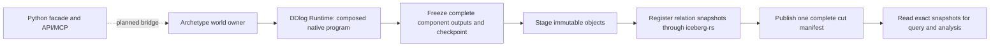

# DDlog execution migration

Archetype remains an active simulation project. This page describes the new
execution boundary and separates the working Rust slice from the migration
that remains. The published 0.6 Python runtime still uses Daft for execution.
Do not describe that runtime as DDlog-backed yet.

## Ownership

DDlog Runtime owns native rule execution and composition. Archetype owns ECS
component declarations, world and run identity, completed ticks, history,
simulation management, and world-context artifacts. Python is the intended
public facade and transport. Daft is intended for queries and analysis outside
the live tick loop. Archetype must not add another rule evaluator, native
operator scheduler, or competing execution engine.

Missions and Physical AI evaluation products are removed from the intended
Archetype surface. X0 owns agent memory, prompts, tools, and budgets. Independent
repositories and existing stored histories are outside this migration.



The Rust crate `archetype-ddlog` implements the path from the world owner through
the cut manifest and pinned reads. The Python bridge and API/MCP route migration
are not implemented by this slice.

## Persistent relations become components

A simulation supplies an immutable DDlog composition manifest and an explicit
list of persistent public outputs. Each declaration names a component, a public
output, its ordered fields, and the position of `entity_id`. Undeclared outputs
and internal relations remain execution state; they are not published as ECS
tables. Inputs are admitted only through the composition's public input ports.

The current DDlog schema supports non-null signed 64-bit integers and strings.
The adapter maps these to Arrow Int64/Utf8 and Iceberg long/string. It rejects
unsupported types, nulls, duplicate field names, and multiple component records
for one entity. This is a bounded type bridge, not support for every Arrow type.

The entity key remains `entity_id`. Other analytical column names are
`<component>__<field>`. The adapter assigns stable Iceberg field IDs in declared
order. The schema digest binds component name, public output, field order,
entity-key position, and types; fields are always required in this version.
Schema changes select a new physical table rather than silently changing an
old table's meaning.

Program identity binds exact processor versions, resolved dependencies, public
ports, the composition, generated source digest, lowering version, persistent
declarations, the pinned DDlog Runtime revision, and the Archetype adapter ABI.
The native compiler is an operator-installed prerequisite. Upstream exposes its
native executable digest internally; a public activation-bound provenance port
is still needed before claiming exact native binary identity in every receipt.

## A tick becomes visible once

One outer tick admits one input transaction. DDlog acknowledges its completed
inner fixed point before Archetype reads outputs. No Daft work executes on this
path. Exclusive mutable ownership prevents another transaction from changing
the world while the adapter reads paginated output snapshots.

Each cut stores **full component state**, not DDlog deltas. Empty relations are
explicit inventory entries. A retracted entity disappears from that cut, while
older cuts remain readable. Consumers must not merge old and new cuts with a
latest-row rule, which would resurrect deleted entities.

The publication sequence is:

1. Freeze every declared output and a separate DDlog checkpoint.
2. Save a checksummed immutable local cut journal.
3. Stage immutable Parquet objects, then verify and register them through
   `iceberg-rs` in the component tables.
4. Publish one final Iceberg cut-manifest row with all table UUIDs, snapshot
   IDs, object hashes, row counts, schemas, and checkpoint identity.
5. Advance the Archetype tick and release its staged inputs only after exact
   catalog readback confirms the cut.

Component registration is not a multi-table Iceberg transaction. The final cut
manifest is the visibility authority. `CutStore.read` requires that manifest,
pins each component snapshot, and filters the selected full cut. Raw latest-table
reads are not sanctioned world reads. Future Daft query adapters must preserve
this same selection rule.

Publication failure blocks further world mutations. A retry reuses frozen
outputs and the exact journal; it does not rerun DDlog or host effects. A failed
input application cannot become a successful snapshot merely because the native
process remains healthy. That owner requires explicit recovery from its last
published state. V1 accepts pure composed programs only.

## Recovery and limits

`CutStore.retry` can finish publication after a process restart using the local
journal. Analytical output tables do not reconstruct DDlog input or operator
state. The separate DDlog checkpoint retains source, schemas, complete input
inventory, revision, and bound world/run/tick metadata. `World.restore` uses a
fresh candidate Backend and activates it only after successful upstream restore.

The store uses a local SQLite Iceberg catalog and local immutable objects, with
one cooperative process owner and serialized publication. Different native
worlds can execute concurrently. Keep the catalog, objects, journals, and pinned
snapshots together. This version does not claim distributed fencing, remote
checkpoint recovery, automatic garbage collection, or recovery of an input
transaction that crashed before its frozen journal was saved. The last published
checkpoint remains the recovery boundary. Output snapshots are limited to one
million rows per component; upstream transport and checkpoint bounds also apply.

## Run the evidence

Rust 1.95 and an installed DDlog native build driver are required. No model
credentials or paid services are needed.

```sh
cargo +1.95.0 test -p archetype-ddlog --locked
ARCHETYPE_DDLOG_DRIVER=/absolute/path/to/native-driver \
  cargo +1.95.0 test -p archetype-ddlog --locked --test native_cut -- --ignored
cargo +1.95.0 run -p archetype-ddlog --locked --example persistent_simulation \
  -- /new/data/directory /absolute/path/to/native-driver
```

The ordinary suite tests real local Iceberg registration and visibility with
synthetic storage fixtures. The separately invoked native test runs two composed
programs, concurrent worlds, publication retry, retraction history, checkpoint
restore, and invalid-input rejection against the actual DDlog compiler. A skipped
native test is not evidence of native execution.

## Remaining migration

The next public boundary is one DDlog-backed world manager with thin Python,
HTTP, and MCP adapters. Generic tools should cover simulation submission,
status, step/run, history, fork, query, and artifact registration. The removed
Mission MCP server is not a simulation interface. Admission, authentication,
and cancellation need focused tests at that shared boundary.

Other remaining work includes the broader Arrow type bridge, sanctioned Daft
queries over published cuts, fork lineage, world-context artifact registration
against exact cut receipts, and removal of Daft from the old Python live loop.
Do not switch existing consumers to the new engine until those contracts have
executable evidence. Gateway currently pins 0.5 and Holocron pins 0.6.3; they
need explicit versioned migration, especially for authentication and world-bound
artifact receipts. Their checkouts are not changed here.
