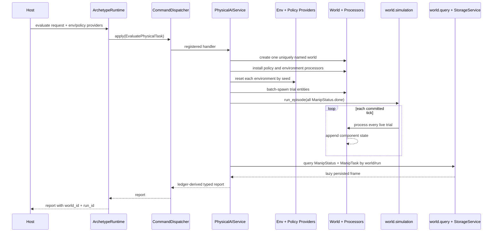

# Physical AI

**Document type:** Contract and user guide.

Archetype treats a physical-policy evaluation as one durable world containing
many trial entities. The runtime submits a typed request; the physical-AI
application service creates the world, installs the standard processors, runs
the episode, and derives a report from persisted state.

```text
one evaluation request
        │
        ▼
one control-plane world ── one durable (world_id, run_id)
        │
        ├── trial entity 0 ── ManipTask + observation + action + status
        ├── trial entity 1 ── ManipTask + observation + action + status
        └── trial entity N ── ManipTask + observation + action + status
```

The world is the evidence. A report is a typed projection of its terminal
`ManipStatus` rows, not a second summary component that can drift away from
the ledger.

## Run one task evaluation

Use `ArchetypeRuntime`; do not assemble world, mutation, simulation, and
evaluation services in application code.

```python
from archetype import ArchetypeRuntime, PhysicalTaskEvalConfig, StorageConfig
from archetype.physical_ai.manipulation import (
    ManipStatus,
    ManipTask,
    ScriptedReachEnv,
)
from archetype.physical_ai.policy import ScriptedReachPolicy

storage = StorageConfig(uri="./data", namespace="physical-evals")
targets = {
    0: (0.10, 0.0, 0.5),
    1: (0.20, 0.0, 0.5),
}

env = ScriptedReachEnv(targets=targets, tolerance=0.02)
policy = ScriptedReachPolicy(targets=targets, gain=0.5, max_step=0.05)

async with ArchetypeRuntime() as runtime:
    report = await runtime.evaluate_physical_task(
        PhysicalTaskEvalConfig(
            suite="scripted-reach",
            task_id=0,
            trials=2,
            max_steps=40,
            storage=storage,
        ),
        env_client=env,
        policy_client=policy,
    )

    print(report.success_rate, report.mean_length)

    # The report points back to the evidence that produced it.
    world = runtime.attach(report.world_id, storage=storage)
    rows = await world.query(ManipStatus, ManipTask)
```

`env_client.task_language()` supplies the instruction when the provider offers
it. Otherwise `PhysicalTaskEvalConfig.instruction` is used. Omitting the policy
client leaves the spawned default `ManipAction` in place, which is useful for
an environment-only baseline.

The synchronous facade has the same operation without `await`:

```python
with ArchetypeRuntime.sync() as runtime:
    report = runtime.evaluate_physical_task(
        config,
        env_client=env,
        policy_client=policy,
    )
```

## Compare instructions on paired seeds

An instruction sweep changes only the language supplied to the policy. Every
variant receives the same seed slots, making the comparison paired instead of
confounding the instruction with different initial states.

```python
from archetype import InstructionSweepConfig

config = InstructionSweepConfig(
    suite="scripted-reach",
    task_id=0,
    variants=(
        "reach",
        "reach the red block",
        "reach the red block precisely",
    ),
    seeds_per_variant=5,
    max_steps=40,
    storage=storage,
)

async with ArchetypeRuntime() as runtime:
    report = await runtime.sweep_physical_instructions(
        config,
        env_client=env,
        policy_client=policy,
    )

print(report.scores)
print(report.best)
```

For task `T` and seed slot `S`, the seed is `T * 1000 + S`. `env_key` remains
unique because it routes processor rows to a particular environment instance;
it does not choose the initial state. Reordering variants therefore cannot
change the seeds used to grade one instruction. Duplicate instruction strings
collapse to one condition.

`max_steps` includes the raw reset-observation tick. A budget of `N` therefore
permits at most `N - 1` policy-controlled environment steps.

## Execution sequence



## Ownership

| Location | Responsibility |
| --- | --- |
| `archetype.physical_ai.contracts` | Supported request, outcome, and report values |
| `archetype.physical_ai.manipulation` | ECS Components, environment boundary, and environment-step processors |
| `archetype.physical_ai.policy` | Policy boundary and action processor |
| `archetype.physical_ai.optimization` | Pure, callback-driven instruction search |
| `archetype.app.physical_ai` | Internal world/process/episode/query orchestration |
| `CommandDispatcher` | Exact-operation admission and registered handler dispatch |
| `ArchetypeRuntime` | Supported trusted Python entry point and sync parity |
| world/simulation/storage families | Lifecycle, tick execution, and persisted reads |

The separation is intentional:

- Components and processors decide per-tick state transitions.
- `archetype.world.simulation` owns episode execution and value-based
  termination.
- `PhysicalAIService` owns the multi-service workflow but no component schema.
- External simulator and model implementations own provider resources, not ECS
  transition authority.
- The runtime exposes the capability without exposing a concrete service or
  live `AsyncWorld`.

There is currently no REST operation for physical evaluation. The Python
runtime is a trusted in-process host; an untrusted host must not reach the
concrete service directly. A future remote surface must add an explicit
actor-aware operation registration and API contract rather than treating the
runtime method as an authentication boundary.

## Instruction optimization

`optimize_instruction` is pure orchestration over an injected evaluator:

```python
from archetype.physical_ai.optimization import (
    TemplatePerturbation,
    optimize_instruction,
)

async def evaluate(instructions: list[str]) -> dict[str, float]:
    config = InstructionSweepConfig(
        suite="scripted-reach",
        task_id=0,
        variants=tuple(instructions),
        seeds_per_variant=5,
        max_steps=40,
        storage=storage,
    )
    report = await runtime.sweep_physical_instructions(
        config,
        env_client=env,
        policy_client=policy,
    )
    return report.scores

result = await optimize_instruction(
    evaluate=evaluate,
    base="reach",
    strategy=TemplatePerturbation(("red", "block", "precisely")),
    rounds=4,
    neighbors=3,
)
```

The callback is the boundary. It can execute real paired rollouts, or a future
model-based scorer can evaluate candidates without changing the search
algorithm. The deterministic template strategy exists to verify the mechanism;
it is not evidence that language optimization improves a real policy.

## Evidence invariants

The workflow enforces these contracts:

1. One request produces one control-plane world and one active run identity.
2. Every requested trial must have a terminal ledger row before a report is
   returned; a reduced denominator fails loudly.
3. Task evaluation seeds are deterministic by trial index.
4. Sweep seeds are paired by seed slot and independent of variant position.
5. Stateful policy clients are reset at each evaluation boundary when they
   expose `reset()`.
6. Success and episode length come from the latest persisted `ManipStatus` row.
7. The workflow never destroys its world after grading, so evidence remains
   addressable by the returned identifiers.

The credential-free contracts live under `tests/app/physical_ai/`. Real LIBERO,
VLA, GPU, and Modal adapters remain external provider implementations and paid
dogfoods; the application workflow does not import them.
