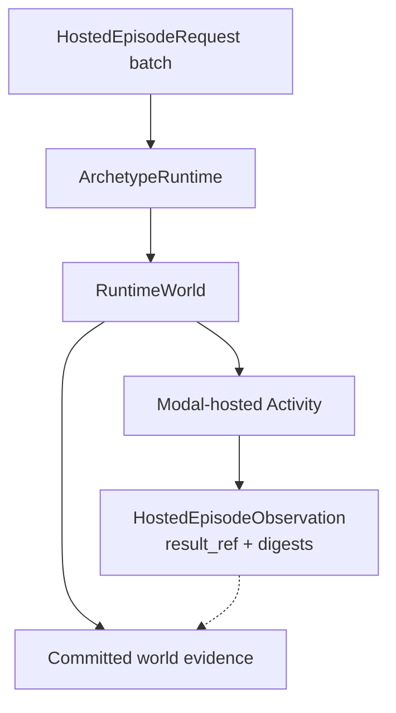

# Physical AI

**Document type:** Contract and user guide.

## Purpose and Scope

Physical AI is an [application-layer](app-overview.md) family for evaluating
embodied policies against environments. Archetype supports two deliberately
different execution shapes:

- pure in-process processors, such as the MuJoCo cart-pole example; and
- one public distributed operation: a complete episode batch executed through
  a Modal-hosted [Activity](activities.md).

Remote environment and policy clients are not installed in retryable ticks.
The hosted contract crosses committed World state as immutable episode intent
and returns only complete, content-addressed episode evidence.



## Key Capabilities

| Capability | Implementation |
|---|---|
| **In-process evals** | Processors + env/policy resources inside ordinary ticks |
| **Hosted episodes** | Activity admits intent at tick T; observation commits at tick U |
| **Stable activity IDs** | Caller-stable within a world; content mismatch fails closed |
| **Fork-safe identity** | Provider identity includes `world_id`; parent/child stay independent |
| **Ledger evidence** | Complete payloads referenced by digest, not live attachable clients |

## Run a hosted episode

Create a world from `ArchetypeRuntime`, supply explicit durable storage, and
wrap it with the typed `PhysicalAI` adapter:

```python
from archetype import ArchetypeRuntime, StorageConfig
from archetype.physical_ai import (
    HostedEpisodeRequest,
    ModalHostedEpisodeConfig,
    PhysicalAI,
)

storage = StorageConfig(uri="./data", namespace="physical-evals")
provider = ModalHostedEpisodeConfig(
    workspace_name="my-workspace",
    environment_name="main",
    app_name="physical-ai",
    function_name="run-episode",
    result_dict_name="physical-ai-results",
    result_volume_name="physical-ai-values",
)

request = HostedEpisodeRequest(
    trial_id=0,
    suite="libero",
    task_id=7,
    seed=100,
    instruction="place the red block in the bowl",
    max_transitions=200,
    environment_id="libero@v1",
    policy_id="openvla@v1",
    config_json="{}",
)

async with ArchetypeRuntime() as runtime:
    world = runtime.world("physical-eval", storage=storage)
    observation = await PhysicalAI(world).run_hosted_episode(
        [request],
        provider=provider,
        activity_id="evaluation-7-seed-100",
    )
    print(observation.result_ref, observation.success_count)
```

Installing `archetype-physical-ai` registers the operation; it does not add a
method to generic async or sync world handles. The typed adapter is async.

`activity_id` is caller-stable within a World. Repeating it with the same
canonical request reconciles the same durable Activity. Reusing it with a
different request content fails closed. A fork may reuse the family-local ID:
provider operation identity includes `world_id`, so parent and child execution
remain independent.

For an embedded host that supplies a custom provider factory or lease duration,
pass `PhysicalAIExtensionConfig` through the generic runtime composition seam:

```python
from archetype import ArchetypeRuntime
from archetype.physical_ai import PhysicalAIExtensionConfig

runtime = ArchetypeRuntime(
    world_library_configs={
        "physical-ai": PhysicalAIExtensionConfig(
            hosted_activity_lease_seconds=600,
        )
    }
)
```

This is trusted process-host configuration, not per-world state.

## Committed-state sequence

```text
tick T commits HostedEpisodeIntent
    -> required projection admits the exact receipt
    -> Modal provider executes or reconciles outside the World lock
    -> complete request, trajectory, episode-results, and manifest payloads
    -> generic Activity records their bounded result reference and digest
    -> HostedEpisodeObservation is staged
    -> tick U commits the observation
    -> required projection settles the exact result digest to tick U
```

`RuntimeResources` owns the world-scoped hosted binding and worker for the
process lifetime. Required projection uses deterministic consumer-name order,
so Mission and Physical-AI Activities can be bound to the same World without
one replacing the other.

The provider adapter owns Modal recovery meaning:

- a complete first result is recovered and never re-executed;
- confirmed absence permits a fresh attempt only behind the exact
  provider-side retry guard; and
- a permanent start without a complete result remains unknown and fails
  closed.

The release profile additionally runs one paid seeded episode on a real Modal
T4 while the World's committed intent and observation rows use a unique
Cloudflare R2 prefix. A fresh runtime cold-resumes that R2-backed World,
reconstructs the exact result digest, and reconciles the same Activity without
a second provider completion. The job deletes its unique Modal Dict, Modal
Volume, and R2 prefix on both success and failure.

Lease expiry by itself never authorizes provider replay.

## Canonical episode contract

One request row identifies one trial and seed. A batch has one stable provider
operation ID and unique `trial_id` values. Reset is trajectory row zero and
does not consume a transition; `max_transitions` counts only applied actions.

Provider completion requires all four canonical Arrow payloads to agree:

- the admitted request;
- the complete trajectory;
- one derived result row per episode; and
- one manifest binding their identities, digests, and completeness counts.

Partial trajectories and provider-local paths are not successful results.
Credentials, placement, attempt metadata, and timings are excluded from replay
identity.

## Ownership

| Location | Responsibility |
|---|---|
| `archetype.physical_ai` | Public `PhysicalAI` adapter, request, Modal configuration, and observation values |
| `archetype.physical_ai.models` | Definitions for those values plus the internal exact operation model |
| `archetype.physical_ai.hosted_episode` | Canonical Arrow schemas, codecs, identities, digests, and completeness validation |
| `archetype.physical_ai.hosted_activity_contracts` | Intent/observation Components, bounded references, and provider reconciliation protocol |
| `archetype.physical_ai.hosted_activities` | Exact-receipt projector, Activity adapter, fenced worker, redelivery, and settlement |
| `archetype.physical_ai.hosted_activity_values` | Content-addressed values and local deterministic proof provider |
| `archetype.physical_ai.hosted_activity_world` | Storage reader, idempotent observation stager, and world binding |
| `archetype.physical_ai.hosted_workflow` | Intent tick, out-of-lock worker call, and observation tick |
| `archetype.physical_ai.hosted_modal` | Modal namespace, atomic start, Volume-first publication, and reconciliation |
| `archetype.world.projectors` | Deterministic multi-family required-projector fan-out |
| `wiring.py` / `RuntimeResources` | Concrete construction, process ownership, operation registration, and teardown |

The generic `activities` family knows admissions, attempts, fences, result
references, and settlement receipts. It does not know whether a Modal episode
is complete or safe to repeat.

## Pure in-process paths

`archetype.physical_ai.mujoco_cartpole` remains a local DataFrame processor
example. Its worker-local MuJoCo model and data are in-memory scratch, not a
remote provider session. Internal environment/policy processor protocols are
available for explicit in-process composition, but they are not a public
distributed runtime operation.

See [Activities](activities.md) for the generic durability contract and
[Architecture](architecture.md) for the ownership map.
