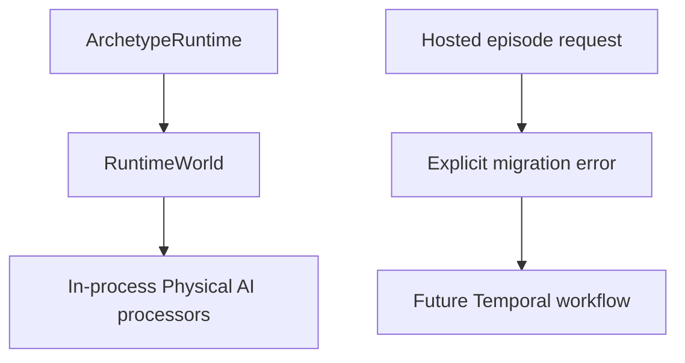

# Physical AI

**Document type:** Contract and user guide.

## Purpose and Scope

Physical AI is an [application-layer](app-overview.md) family for evaluating
embodied policies against environments. Pure in-process processors, such as
the MuJoCo cart-pole example, remain supported.

The former hosted-episode route is deliberately disabled by the Temporal
cutover. It depended on Archetype's removed SQLite Activity claim, lease,
fence, and attempt machinery. Calling `run_hosted_episode` now fails explicitly
instead of silently using a second durability authority.



## Key Capabilities

| Capability | Current implementation |
|---|---|
| **In-process evals** | Processors plus environment and policy resources inside ordinary ticks |
| **Hosted episodes** | Disabled until migrated to a dedicated Temporal workflow |
| **Canonical evidence** | Episode request, trajectory, results, and manifest schemas remain reusable |
| **Modal provider integration** | Provider contracts remain available for the future Temporal adapter |

## Hosted episode migration

Installing `archetype-physical-ai` continues to register the public operation
so callers receive a clear migration error. It no longer constructs a hosted
Activity worker or SQLite-backed workflow. There is no compatibility mode and
no configurable Activity lease.

The replacement must use the same architecture as Temporal-backed Missions:

```text
tick T commits HostedEpisodeIntent
    -> required projection admits exact receipt-bound settlement intent
    -> Temporal starts or reattaches to one stable Modal operation
    -> complete canonical payloads become durable
    -> HostedEpisodeObservation is staged
    -> tick U commits the observation
    -> settlement index binds the exact result digest to tick U
```

Temporal will own workflow history, scheduling, retries, cancellation, and
worker recovery. The provider adapter will own stable Modal call identity,
reattachment, cleanup, and complete-result publication. Archetype will retain
only semantic intent and observation Components, canonical evidence, exact
receipt projection, and settlement.

Until that workflow exists, a hosted request fails before provider work. This
breaking behavior prevents the removed SQLite durability path from remaining
as a hidden second authority.

## Canonical episode contract

One request row identifies one trial and seed. A batch has one stable provider
operation ID and unique `trial_id` values. Reset is trajectory row zero and
does not consume a transition; `max_transitions` counts only applied actions.

Provider completion requires all four canonical Arrow payloads to agree:

- the admitted request;
- the complete trajectory;
- one derived result row per episode; and
- one manifest binding their identities, digests, and completeness counts.

Partial trajectories and provider-local paths are not successful results.
Credentials, placement, timings, and orchestration metadata are excluded from
replay identity.

## Ownership

| Location | Responsibility |
|---|---|
| `archetype.physical_ai` | Public adapter, request, Modal configuration, and observation values |
| `archetype.physical_ai.models` | Public values and exact operation model |
| `archetype.physical_ai.hosted_episode` | Canonical Arrow schemas, codecs, identities, digests, and completeness validation |
| `archetype.physical_ai.hosted_activity_contracts` | Retained intent and observation domain values for a future Temporal workflow |
| `archetype.physical_ai.hosted_activity_values` | Content-addressed episode values |
| `archetype.physical_ai.hosted_modal` | Modal provider integration available to the future workflow |
| `archetype.physical_ai._extension` | Operation registration and explicit hosted-route migration failure |

Deleted modules such as `hosted_activities`, `hosted_activity_world`, and
`hosted_workflow` are not compatibility surfaces. Their orchestration belonged
to the retired SQLite durability implementation.

## Pure in-process paths

`archetype.physical_ai.mujoco_cartpole` remains a local DataFrame processor
example. Its worker-local MuJoCo model and data are in-memory scratch, not a
remote provider session. Internal environment and policy processor protocols
remain available for explicit in-process composition.

See [Activities](activities.md) for the settlement boundary and
[Architecture](architecture.md) for the ownership map.
