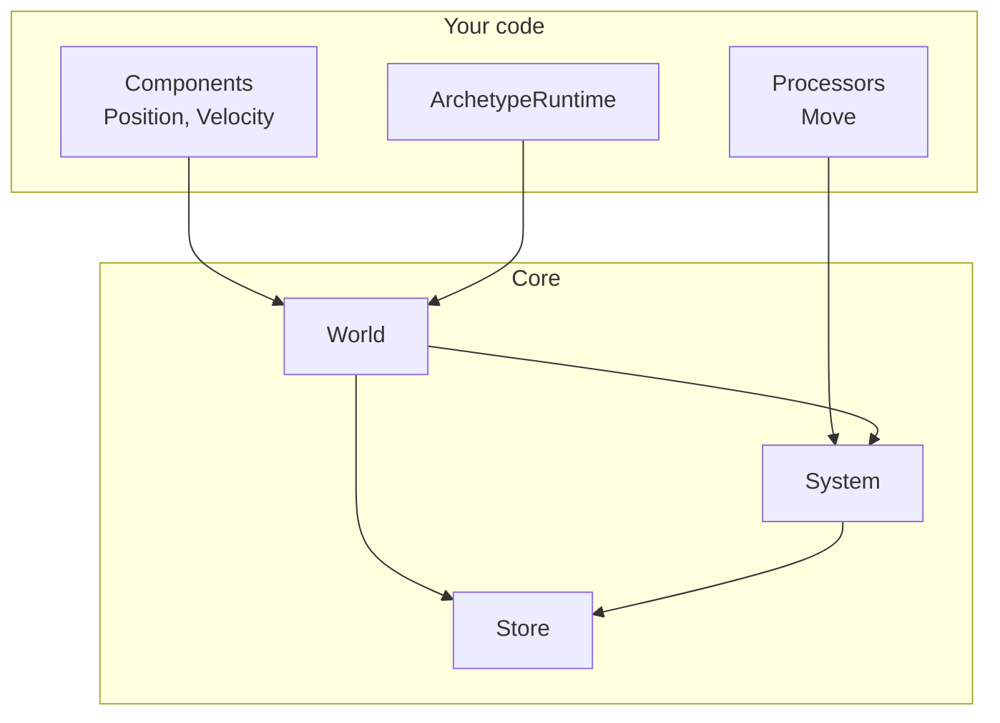
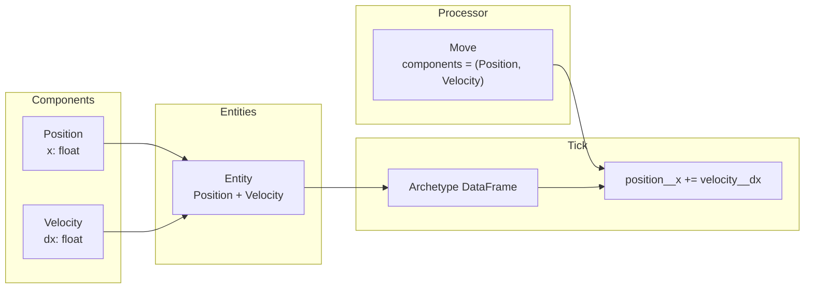
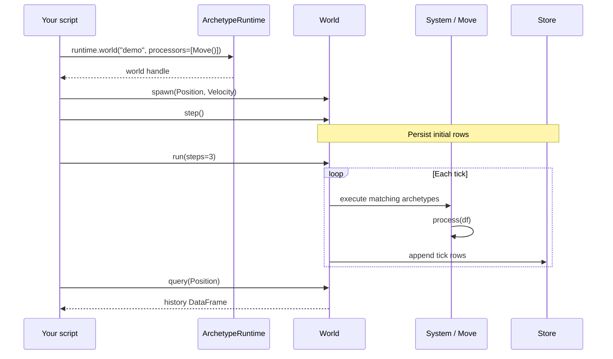
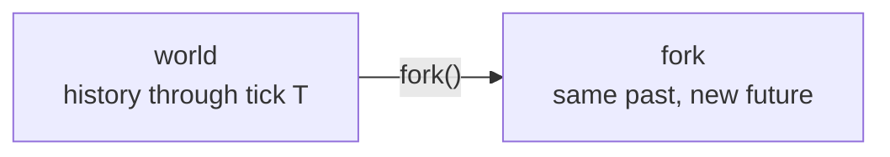

# Quickstart

## Purpose and Scope

Use `ArchetypeRuntime` for a Python script. It owns one process resource graph,
then gives you a lazy handle for each world.

This page gets you from install to a running world. It uses the same core
primitives as the [Overview](../index.md): components, processors, world,
query, update, store.

For a copy-and-run script, see
[`examples/00_quickstart.py`](https://github.com/VangelisTech/archetype/blob/main/examples/00_quickstart.py).
For the fuller workflow, see [Building simulations](building-simulations.md).

## Install

```bash
pip install archetype-ecs
```

From a checkout, run `make sync-dev` instead.

## Core concepts

Before the code: what you are about to wire.



| You define | The engine does |
|---|---|
| `Component` classes | Packs matching entities into archetype tables |
| `AsyncProcessor` classes | Runs them each tick as DataFrame transforms |
| `runtime.world(...)` | Owns ticks, history, and the query/update path |

## Entity-Component-System pattern



## Define state and behavior

```python
import asyncio

from daft import DataFrame, col

from archetype import ArchetypeRuntime, AsyncProcessor, Component


class Position(Component):
    x: float = 0.0


class Velocity(Component):
    dx: float = 0.0


class Move(AsyncProcessor):
    components = (Position, Velocity)

    async def process(self, df: DataFrame, **_) -> DataFrame:
        return df.with_columns(
            {"position__x": col("position__x") + col("velocity__dx")}
        )
```

## Create a world and run it

```python
async def main() -> None:
    async with ArchetypeRuntime() as runtime:
        world = runtime.world("demo", processors=[Move()])

        entity_id = await world.spawn(Position(), Velocity(dx=2))
        await world.step()  # Persist the initial component values.
        await world.run(steps=3)

        history = await world.query(Position)
        print(entity_id)
        print(history.collect().to_pylist())


asyncio.run(main())
```

What that call sequence does:



`spawn()` reserves a real entity ID immediately. The first `step()` persists
the initial component values; processors apply on the three subsequent ticks.
`query()` returns a lazy Daft DataFrame of the full append-only history for the
requested components.

## Read the current tick

Filter history by its `tick` column when you need the most recent rows:

```python
from daft import col

info = await world.info()
current = (await world.query(Position)).where(col("tick") == info.tick - 1)
current.show()
```

## Fork a world

Forks retain their source history and receive their own future writes:

```python
branch = await world.fork("alternative")
await branch.update(entity_id, Velocity(dx=10))
await branch.run(steps=3)
```



See [History and forks](history-and-forks.md) for the details.

## Synchronous scripts

The sync facade has the same operations without `await`:

```python
with ArchetypeRuntime.sync() as runtime:
    world = runtime.world("demo", processors=[Move()])
    world.spawn(Position(), Velocity(dx=2))
    world.step()  # Persist the initial component values.
    world.run(steps=3)
```

## Next steps

- [Core architecture](core-architecture.md) — map of the engine boxes
- [Build a simulation](building-simulations.md)
- [Components](components.md) · [Processors](processors.md) · [Worlds](working-with-worlds.md)
- [Application layer](app-overview.md) — runtime, gateway, families above the core
- [Agent Missions](agent-missions.md) · [Examples](examples.md)
