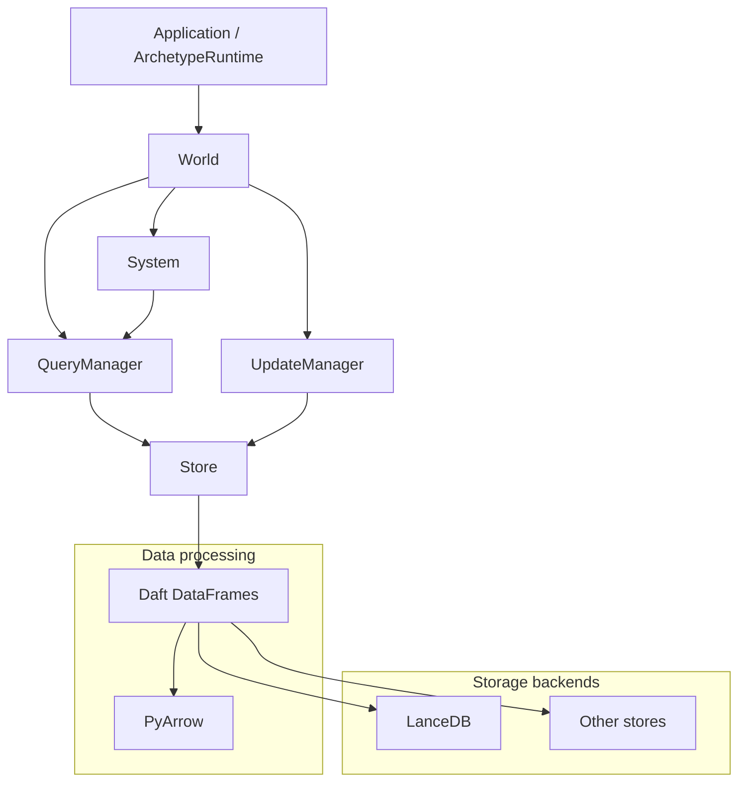
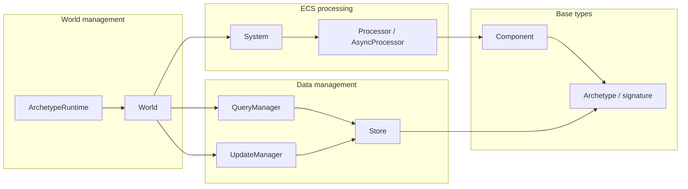
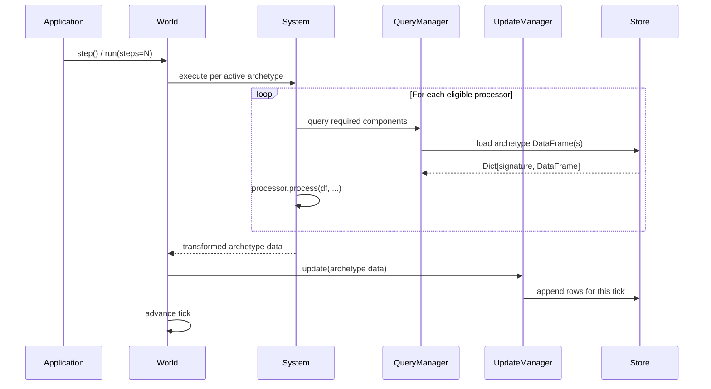
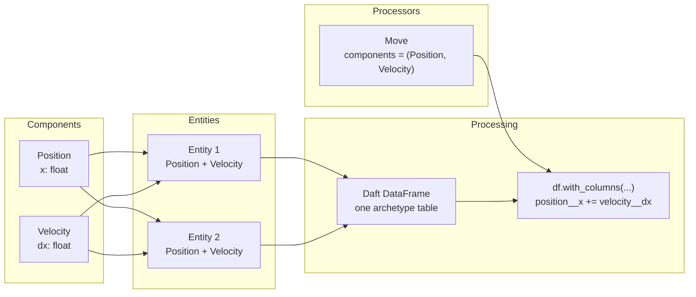
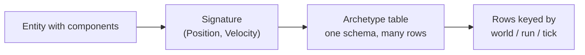
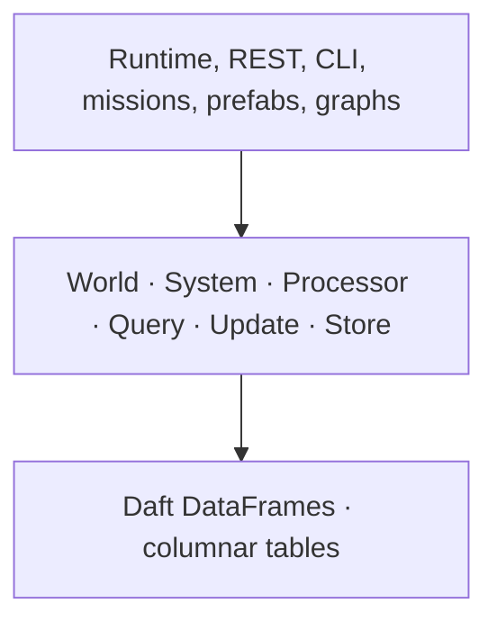

# Overview

## Purpose and Scope

Archetype is a dataframe-first Entity-Component-System (ECS) simulation
engine. Components hold typed state. Processors transform matching entities as
Daft DataFrames. A world runs ticks and appends each result to columnar
storage, so history, forks, and audit come from the same write path as the
simulation.

This page is the map of the **core primitives**. Everything else in the
project — `ArchetypeRuntime`, the HTTP service, command gate, agent missions,
prefabs, graphs — sits on top of this model. Learn the core first; the product
layers are easier once the boxes below are solid.

For installation and a first run, see [Quickstart](guide/quickstart.md).
For the normative application contracts, see
[Architecture Overview](guide/architecture.md).

## Key Capabilities

| Capability | What it means |
|---|---|
| **Columnar ECS** | Entities that share a component set live in one archetype table |
| **Lazy DataFrames** | Processors are Daft transforms over populations, not per-entity loops |
| **Append-only history** | Each tick writes new rows; past state is a query, not a replay hack |
| **Read/write split** | `QueryManager` reads; `UpdateManager` appends; the world orchestrates |
| **Pluggable storage** | Stores sit under the same query/update facades (LanceDB by default) |

## System Architecture

### High-level component relationships

The world is the orchestrator. It does not touch tables directly: reads go
through `QueryManager`, writes through `UpdateManager`, and behavior through
`System` + processors.

## Core ECS Components

### Code entity mapping

| Primitive | Role |
|---|---|
| `Component` | Typed fields on an entity (`Position`, `Velocity`, …) |
| `Processor` | Declares required components; transforms their DataFrame |
| `System` | Runs eligible processors in priority order for an archetype |
| `World` | Spawns entities, steps/runs ticks, owns the live simulation |
| `QueryManager` | Read facade over the store |
| `UpdateManager` | Append facade over the store |
| `Store` | Physical tables keyed by archetype signature |
| `Archetype` | The component-set → table schema grouping |

`ArchetypeRuntime` is the usual script entry point: it owns process lifetime
and returns lazy world handles. The boxes above are still what a tick
actually moves through.

## Processing Pipeline

### One simulation step

Teaching model: query → transform → append → advance. The async world fans
this out per active archetype table; the read/write split stays the same.

## Entity-Component-System Pattern

Entities are IDs. Components are data. Processors are bulk transforms over
every entity that has the declared component set.

## Archetypes

Entities that share the same component types share an **archetype** — and
therefore one table schema.

Different component sets → different signatures → different tables. That is
why processors can assume their columns exist: the system only runs a
processor when its components are a subset of the archetype signature.

## Above the core

The rest of Archetype layers product semantics on this engine:

When docs talk about command gates, forks, or agent missions, they are
describing what sits on the top box — not a different storage model.

## Next Steps

- [Quickstart](guide/quickstart.md) — install and run your first world
- [Core architecture](guide/core-architecture.md) — drill into each engine box
- [Building simulations](guide/building-simulations.md) — components, processors, worlds in practice
- [Application layer](guide/app-overview.md) — runtime, gateway, and product families
- [Agent Missions](guide/agent-missions.md) — software-factory workflow on the same core
- [Examples](guide/examples.md) — copy-and-run scripts
- [History and forks](guide/history-and-forks.md) — query past ticks and branch a run
