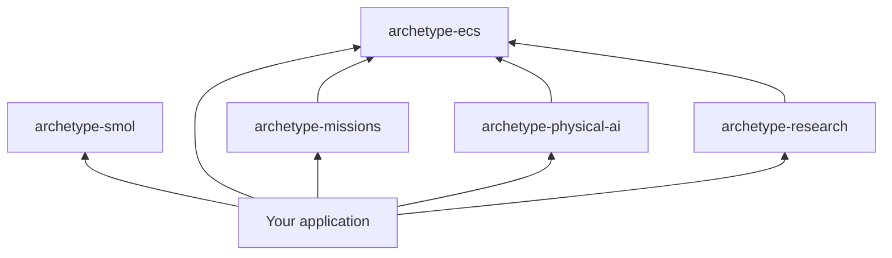

# Archetype

Archetype is a DataFrame-first ECS framework with separately installed world
libraries for coding-agent missions, physical-AI episodes, and AutoResearch.
Choose the smallest distribution that owns the behavior you need, then compose
libraries through their typed adapters.

## Choose a package

| Package | Import | Use it for |
|---|---|---|
| [Framework](framework/index.md) | `archetype-ecs` / `archetype` | Worlds, ticks, storage, commands, Activities, artifacts, evaluation, API, and CLI hosting |
| [Smol](smol/index.md) | `archetype-smol` / `archetype.smol` | A tiny synchronous, in-memory DataFrame ECS for education and experimentation |
| [Missions](missions/index.md) | `archetype-missions` / `archetype.missions` | Coding-agent missions, sandboxes, sessions, transcripts, and trajectory evidence |
| [Physical AI](physical-ai/index.md) | `archetype-physical-ai` / `archetype.physical_ai` | Physical state, policies, hosted episodes, and provider recovery |
| [Research](research/index.md) | `archetype-research` / `archetype.research` | Generic AutoResearch candidates, evaluators, experiments, and ledger state |

The three world libraries depend on `archetype-ecs`, never on one another. An
application may compose any combination through their public adapters. Smol is
independent of that graph and does not load world libraries.



## Install

<!-- markdownlint-disable MD046 -->

=== "uv"

    ```bash
    # Framework only
    uv add archetype-ecs

    # Small educational engine instead of the production framework
    uv add archetype-smol

    # One world library; it installs a compatible framework
    uv add archetype-missions
    uv add archetype-physical-ai
    uv add archetype-research

    # Complete world-library stack
    uv add "archetype-ecs[all]"
    ```

=== "pip"

    ```bash
    # Framework only
    pip install archetype-ecs

    # Small educational engine instead of the production framework
    pip install archetype-smol

    # One world library; it installs a compatible framework
    pip install archetype-missions
    pip install archetype-physical-ai
    pip install archetype-research

    # Complete world-library stack
    pip install "archetype-ecs[all]"
    ```

<!-- markdownlint-enable MD046 -->

For selective extras, trust boundaries, and composition behavior, see
[World libraries](guide/world-libraries.md).

## Start here

- New to Archetype: follow the [Framework quickstart](guide/quickstart.md).
- Choosing distributions: read [World libraries](guide/world-libraries.md).
- Upgrading across the clean break: read [Archetype 0.6](guide/release-0.6.md).
- Looking for runnable code: browse [Examples](guide/examples.md).
- Contributing or reviewing contracts: enter the [Maintainers](maintainers/index.md)
  section.

## One runtime, explicit domain adapters

The framework owns process and world lifetime:

```python
import asyncio

from archetype import ArchetypeRuntime
from archetype.research import Research


async def main() -> None:
    async with ArchetypeRuntime() as runtime:
        world = runtime.world("experiment")
        research = Research(world)


asyncio.run(main())
```

Installed libraries add typed adapters without adding domain methods to the
generic runtime or world.

Installing a world library authorizes its trusted Python extension code to run
during process composition. The framework remains useful with no world library
installed.
