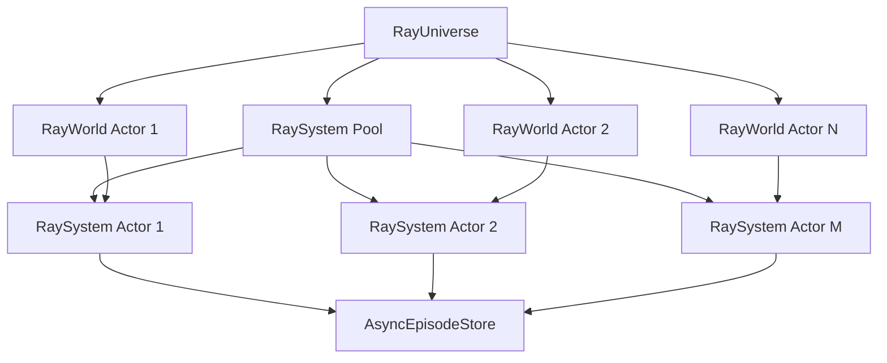

# Ray Implementation Guide

## Overview

The Ray implementation extends Archetype's ECS simulation engine with distributed computing capabilities. It provides horizontal scaling across multiple machines while maintaining the same declarative API and episode caching functionality.

## Architecture

### Key Components

#### 1. RayUniverse
- **Purpose**: Central orchestrator managing distributed world actors and system actor pools
- **Features**:
  - Distributed world actors across Ray cluster
  - Shared system actor pools for efficient resource utilization
  - Automatic scaling based on workload
  - Episode cache integration at store level

#### 2. RayWorld (Actor)
- **Purpose**: Stateful Ray actor representing a single simulation world
- **Features**:
  - Maintains world state (entities, spawn cache)
  - Delegates processing to shared RaySystem pool
  - Configurable resource allocation (CPU, GPU, memory)
  - Concurrent entity management

#### 3. RaySystem (Actor Pool)
- **Purpose**: Shared processing actors handling archetype transformations
- **Features**:
  - Stateless actors that can process any archetype for any world
  - Pool-based resource sharing across multiple worlds
  - Support for both sync and async processors
  - Graceful error handling in distributed context

### Distributed Processing Flow



## Usage

### Basic Setup

```python
import archetype as arch

# Initialize Ray cluster
arch.init_ray()

# Create Ray universe with episode caching
universe = await arch.create_ray_universe(
    store_uri="lance://simulation.db",
    system_pool_size=8  # 8 system actors in pool
)
```

### Creating Worlds

```python
# Create world with resource allocation
world_id = await universe.create_world(
    processors=[MovementProcessor(), CollisionProcessor()],
    world_id="physics_world",
    num_cpus=2.0,        # 2 CPU cores
    num_gpus=0.5,        # Half GPU
    memory=1024          # 1GB memory
)
```

### Running Simulations

```python
# Single world simulation
result = await universe.run_simulation(
    world_id="physics_world",
    steps=1000,
    flush_every=50
)

# Multi-world concurrent simulation
result = await universe.step_all_worlds()
print(f"Stepped {result['worlds_stepped']} worlds in {result['total_time']:.3f}s")
```

### Configuration Options

#### RayWorldConfig
```python
from archetype import RayWorldConfig

config = RayWorldConfig(
    processors=[MyProcessor()],
    world_id="custom_world",
    num_cpus=4.0,
    num_gpus=1.0,
    memory=2048,  # MB
    debug=True
)

world_id = await universe.create_world(config)
```

## Performance Characteristics

### Scaling Benefits

1. **Horizontal Scaling**: Add more Ray nodes to increase capacity
2. **Resource Isolation**: Each world can have dedicated resources
3. **Fault Tolerance**: Actor failures don't affect other worlds
4. **Load Distribution**: System pool shares processing load

### When to Use Ray

**Good for:**
- Large-scale simulations (1000+ entities)
- Multiple concurrent worlds
- CPU/GPU intensive processors
- Distributed cluster deployments
- Fault-tolerant requirements

**Consider alternatives for:**
- Small simulations (<100 entities)
- Single world scenarios
- Memory-constrained environments
- Simple processor logic

### Performance Tuning

#### System Pool Size
```python
# CPU-bound workloads
system_pool_size = num_cpu_cores

# I/O-bound workloads  
system_pool_size = num_cpu_cores * 2

# Mixed workloads
system_pool_size = num_cpu_cores * 1.5
```

#### World Resource Allocation
```python
# Balanced allocation
num_cpus = 1.0          # 1 core per world
memory = 512            # 512MB per world

# CPU-intensive worlds
num_cpus = 4.0          # 4 cores for heavy computation
memory = 2048           # 2GB for large datasets

# GPU-accelerated worlds
num_cpus = 2.0
num_gpus = 1.0          # Dedicated GPU
memory = 4096           # 4GB for GPU memory
```

## Advanced Features

### Custom Ray Configuration

```python
# Initialize Ray with custom settings
arch.init_ray(
    address="ray://head-node:10001",  # Connect to cluster
    runtime_env={
        "pip": ["daft", "lance"],
        "env_vars": {"CUDA_VISIBLE_DEVICES": "0,1"}
    }
)
```

### Monitoring and Observability

```python
# Universe statistics
stats = universe.get_stats()
print(f"Active worlds: {stats['active_worlds']}")
print(f"System pool utilization: {stats['system_pool_size']}")
print(f"Ray resources: {stats['ray_cluster_resources']}")

# World-specific statistics
world_stats = await universe.get_world_stats("physics_world")
print(f"Entities: {world_stats['active_entities']}")
print(f"Current step: {world_stats['current_step']}")

# Episode cache statistics
cache_stats = stats['store_cache_stats']
print(f"Cached records: {cache_stats['cached_records']}")
print(f"Episodes flushed: {cache_stats['episode_count']}")
```

### Error Handling

```python
try:
    result = await universe.step_world("physics_world")
except Exception as e:
    print(f"Simulation error: {e}")
    
    # Get world status
    world_stats = await universe.get_world_stats("physics_world")
    if world_stats['current_step'] == 0:
        print("World may have crashed, restarting...")
        await universe.remove_world("physics_world")
        # Recreate world logic here
```

## Deployment Patterns

### Single Machine Deployment

```python
# Use all local cores
arch.init_ray()

universe = await arch.create_ray_universe(
    store_uri="lance://local_simulation.db",
    system_pool_size=os.cpu_count()
)
```

### Cluster Deployment

```bash
# Head node
ray start --head --port=6379

# Worker nodes
ray start --address=head-node:6379
```

```python
# Connect to cluster
arch.init_ray(address="ray://head-node:10001")

universe = await arch.create_ray_universe(
    store_uri="lance://shared_storage/simulation.db",
    system_pool_size=32  # Scale to cluster size
)
```

### Kubernetes Deployment

```yaml
apiVersion: ray.io/v1alpha1
kind: RayCluster
metadata:
  name: archetype-cluster
spec:
  rayVersion: '2.8.0'
  headGroupSpec:
    replicas: 1
    rayStartParams:
      port: '6379'
    template:
      spec:
        containers:
        - name: ray-head
          image: rayproject/ray:2.8.0-py310
          resources:
            requests:
              cpu: 2
              memory: 4Gi
  workerGroupSpecs:
  - replicas: 4
    minReplicas: 2
    maxReplicas: 10
    rayStartParams: {}
    template:
      spec:
        containers:
        - name: ray-worker
          image: rayproject/ray:2.8.0-py310
          resources:
            requests:
              cpu: 4
              memory: 8Gi
```

## Best Practices

### 1. Resource Management

```python
# Monitor resource usage
cluster_resources = ray.cluster_resources()
available_cpus = cluster_resources.get('CPU', 0)

# Don't over-allocate
total_world_cpus = sum(world.num_cpus for world in world_configs)
assert total_world_cpus <= available_cpus * 0.8  # Leave 20% buffer
```

### 2. Episode Cache Tuning

```python
# Adjust cache size based on simulation scale
cache_size_mb = max(500, num_entities * 0.1)  # ~0.1MB per entity

episode_store = arch.create_episode_store(
    base_store,
    max_cache_size_mb=cache_size_mb
)
```

### 3. Graceful Shutdown

```python
async def graceful_shutdown(universe):
    """Properly shutdown Ray universe."""
    try:
        # Flush any remaining data
        await universe.flush_episodes()
        
        # Shutdown universe (kills actors)
        await universe.shutdown()
        
    finally:
        # Always shutdown Ray
        arch.shutdown_ray()
```

### 4. Error Recovery

```python
async def robust_simulation(universe, world_id, steps):
    """Run simulation with error recovery."""
    completed_steps = 0
    
    while completed_steps < steps:
        try:
            await universe.step_world(world_id)
            completed_steps += 1
            
        except Exception as e:
            print(f"Step {completed_steps} failed: {e}")
            
            # Check if world is still alive
            try:
                stats = await universe.get_world_stats(world_id)
                print(f"World still active at step {stats['current_step']}")
            except:
                print("World crashed, recreation needed")
                break
```

## Troubleshooting

### Common Issues

#### 1. Ray Initialization Failures
```python
# Check Ray status
if not ray.is_initialized():
    print("Ray not initialized")
    arch.init_ray()

# Verify cluster connection
print(f"Ray cluster: {ray.cluster_resources()}")
```

#### 2. Resource Allocation Errors
```python
# Check available resources before creating worlds
cluster_resources = ray.cluster_resources()
if cluster_resources.get('CPU', 0) < required_cpus:
    raise RuntimeError(f"Not enough CPUs: need {required_cpus}, have {cluster_resources.get('CPU', 0)}")
```

#### 3. Actor Communication Failures
```python
# Add timeout to actor calls
try:
    result = ray.get(actor.method.remote(), timeout=30)
except ray.exceptions.GetTimeoutError:
    print("Actor call timed out")
    # Handle timeout
```

#### 4. Memory Issues
```python
# Monitor memory usage
import psutil
memory_percent = psutil.virtual_memory().percent
if memory_percent > 85:
    print("High memory usage, consider flushing episodes")
    await universe.flush_episodes()
```

### Debugging

#### Enable Ray Logging
```python
import logging
logging.basicConfig(level=logging.INFO)

# Ray-specific logging
ray.init(logging_level=logging.INFO)
```

#### Monitor Ray Dashboard
```bash
# Ray dashboard available at http://localhost:8265
ray start --head --include-dashboard=true
```

#### Profile Performance
```python
import time

# Time individual operations
start = time.time()
await universe.step_world(world_id)
step_time = time.time() - start

print(f"Step time: {step_time:.3f}s")
```

## Migration Guide

### From AsyncWorld to RayWorld

```python
# Before (AsyncWorld)
from archetype.core.aio import AsyncWorld, AsyncSystem

system = AsyncSystem()
world = AsyncWorld(querier, updater, system)

# After (RayUniverse)
import archetype as arch

universe = await arch.create_ray_universe("lance://simulation.db")
world_id = await universe.create_world(processors)
```

### Processor Compatibility

Most existing processors work unchanged with Ray:

```python
# Existing processor
class MyProcessor(AsyncProcessor):
    async def process(self, df, semaphore, *args, **kwargs):
        # Same implementation
        return df

# Works with Ray automatically
universe = await arch.create_ray_universe("lance://db")
world_id = await universe.create_world([MyProcessor()])
```

## Future Enhancements

### Planned Features

1. **Auto-scaling**: Dynamic system pool resizing based on load
2. **GPU Acceleration**: Direct GPU processing support
3. **Streaming**: Real-time data streaming between actors
4. **Checkpointing**: Automatic simulation state checkpoints
5. **Load Balancing**: Intelligent work distribution algorithms

### Contributing

To contribute to the Ray implementation:

1. Fork the repository
2. Create feature branch: `git checkout -b ray-feature`
3. Add tests for Ray functionality
4. Submit pull request with performance benchmarks

## References

- [Ray Documentation](https://docs.ray.io/)
- [Daft DataFrame Documentation](https://getdaft.io/)
- [Lance Columnar Format](https://lancedb.github.io/lance/)
- [Archetype Core Documentation](../README.md) 