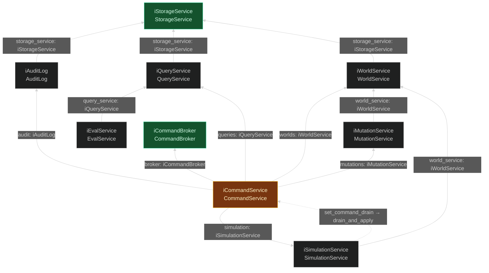
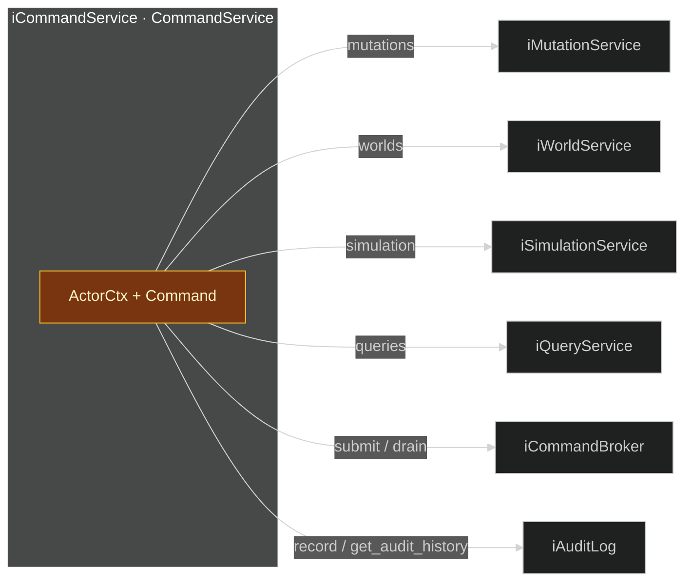
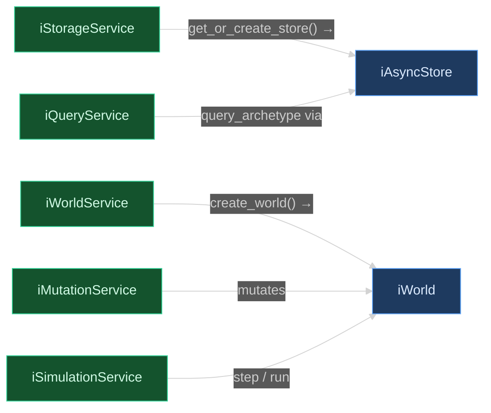
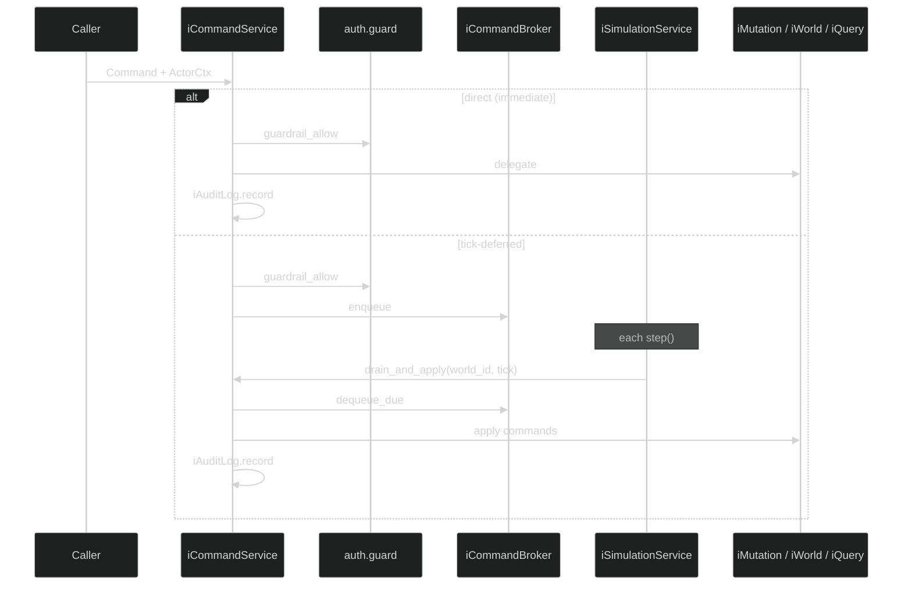

# App layer wiring

How the app layer is wired **across interfaces**. Each arrow is a constructor parameter whose type is a `Protocol` in [`interfaces.py`](interfaces.py). The container passes concrete implementations that satisfy those protocols.

Construction lives in [`container.py`](container.py). Normative signatures live in [`interfaces.py`](interfaces.py) and [`docs/guide/service-protocols.md`](../../../docs/guide/service-protocols.md).

**Keep this file in sync with `ServiceContainer.__init__` and `interfaces.py`.**

---

## Protocol registry

| Protocol | Implementation | Module | Wired via (param → type) |
|----------|----------------|--------|--------------------------|
| `iStorageService` | `StorageService` | `storage_service.py` | — (leaf) |
| `iCommandBroker` | `CommandBroker` | `broker.py` | — (leaf) |
| `iWorldService` | `WorldService` | `world_service.py` | `storage_service` → `iStorageService` |
| `iAuditLog` | `AuditLog` | `audit_log.py` | `storage_service` → `iStorageService` |
| `iQueryService` | `QueryService` | `query_service.py` | `storage_service` → `iStorageService` |
| `iEvalService` | `EvalService` | `eval_service.py` | `query_service` → `iQueryService` |
| `iMutationService` | `MutationService` | `mutation_service.py` | `world_service` → `iWorldService` |
| `iSimulationService` | `SimulationService` | `simulation_service.py` | `world_service` → `iWorldService` |
| `iCommandService` | `CommandService` | `command_service.py` | see [gate wiring](#gate-wiring-icommandservice) |

**No protocol yet:** `AutoResearchService` — wired on the container as concrete types (`WorldService`, `SimulationService`), not behind the gate.

**Implementation note:** `QueryService.__init__` also accepts an optional `audit: iAuditLog` for history helpers; that param is not on `iQueryService` today.

---

## Interface wiring graph

Node label = **`Protocol`** / `Implementation`. Edge label = **constructor param** and its **protocol type**. Arrows point from consumer → dependency.



**Tier rule:** a protocol may depend only on protocols strictly below it. The dashed edge is a post-init callback (`SimulationService.set_command_drain`) — not part of `iSimulationService.__init__`, but required to drain tick-deferred commands through `iCommandService.drain_and_apply`.

---

## Literal container wiring

Annotated excerpt from `ServiceContainer.__init__` — param names match `interfaces.py`:

```python
self.broker = CommandBroker()                          # → iCommandBroker
self._owns_storage_service = storage_service is None
self.storage_service = (                               # → iStorageService
    storage_service if storage_service is not None else StorageService()
)

self.world_service = WorldService(                     # → iWorldService
    self.storage_service,                              #   storage_service: iStorageService
)
self.audit_log = AuditLog(                             # → iAuditLog
    self.storage_service,                              #   storage_service: iStorageService
    audit_storage_config,                              #   explicit Iceberg table location
)
self.query_service = QueryService(                      # → iQueryService
    self.storage_service,                              #   storage_service: iStorageService
    self.audit_log,                                    #   (impl-only)
)
self.eval_service = EvalService(                        # → iEvalService
    self.query_service,                                #   query_service: iQueryService
)

self.mutation_service = MutationService(               # → iMutationService
    self.world_service,                                #   world_service: iWorldService
)
self.simulation_service = SimulationService(           # → iSimulationService
    self.world_service,                                #   world_service: iWorldService
)

self.command_service = CommandService(                 # → iCommandService
    mutations=self.mutation_service,                   #   mutations: iMutationService
    worlds=self.world_service,                         #   worlds: iWorldService
    simulation=self.simulation_service,                #   simulation: iSimulationService
    queries=self.query_service,                        #   queries: iQueryService
    broker=self.broker,                                #   broker: iCommandBroker
    audit=self.audit_log,                              #   audit: iAuditLog
)
self.simulation_service.set_command_drain(
    self.command_service.drain_and_apply,              #   callback, not in Protocol
)

self.autoresearch_service = AutoResearchService(       # no Protocol
    self.world_service,
    self.simulation_service,
)
```

---

## Gate wiring (`iCommandService`)

The gate is the only protocol that accepts `ActorCtx`. It delegates to the protocols below — never to core directly.



Hosts (`ArchetypeRuntime`, FastAPI) hold a `ServiceContainer` and call **`iCommandService`** methods on `container.command_service`. They do not reach `iWorldService` or `iMutationService` directly.

| Host | Path | Typed as |
|------|------|----------|
| `ArchetypeRuntime` | `runtime/runtime.py` | `iCommandService` |
| FastAPI | `api/deps.py` | `iCommandService` |
| Tests / lower-level scripts | `ServiceContainer(storage_service=...)` | any protocol, as needed |

`iEvalService` and `AutoResearchService` sit on the container but **outside** the gate — callers use them directly for grading loops and experiment orchestration.

---

## Core boundary

Protocols stop at the app layer. Implementations cross into [`core/interfaces.py`](../core/interfaces.py):



`iWorldService` internally composes `WorldFactory`, `WorldRegistry`, and `WorldOrchestrator` (not protocols — implementation detail in `world_service.py`). Each `iWorld` is built with `AsyncQueryManager`, `AsyncUpdateManager`, `AsyncSystem`, `Resources`, and `HookRegistry` from core.

---

## Internal composition (non-protocol)

These types are **not** container-visible protocols — they live inside implementations:

| Implementation | Internal pieces |
|----------------|-----------------|
| `WorldService` | `WorldFactory`, `WorldRegistry`, `WorldOrchestrator`, `_storage_configs` |
| `StorageService` | store pool (multiton), `create_async_store`, configured Iceberg context |
| `CommandService` | `auth.guard.guardrail_allow`, delegate routing, audit emit |
| `CommandBroker` | per-world priority heaps, pending/history |
| `AuditLog` | bounded batch → Iceberg `audit_rows` table |

---

## Command flow (across protocols)



Reads (`query_*`, `get_audit_history`) go through `iCommandService` for authorization but do not use `iCommandBroker`.

---

## Auth layer

RBAC is not a container protocol. It is a library at enforcement points on `iCommandService` and `iCommandBroker`:

| Module | Used by | Role |
|--------|---------|------|
| `auth.models.ActorCtx` | `iCommandService`, `iCommandBroker`, runtime | identity + roles |
| `auth.guard` | `iCommandService`, `iCommandBroker` | allow / check / commit |
| `auth.permissions` | `auth.guard` | role → permission map |

Only `iCommandService` accepts `ActorCtx` on its public surface. All other protocols are identity-agnostic.

---

## Shutdown order

`ServiceContainer.shutdown()`:

1. `iAuditLog.shutdown()` — flush pending rows
2. `iCommandBroker.clear()` — drop queued commands
3. `iWorldService.shutdown()` — close pooled stores only when the container created the `StorageService`; injected storage remains caller-owned

---

## Related docs

- [`docs/guide/service-protocols.md`](../../../docs/guide/service-protocols.md) — protocol signatures and tier rules
- [`docs/guide/command-gate.md`](../../../docs/guide/command-gate.md) — gate semantics, roles, audit
- [`docs/guide/runtime.md`](../../../docs/guide/runtime.md) — script boundary over `iCommandService`
- [`AGENTS.md`](../../../AGENTS.md) — command flow overview
